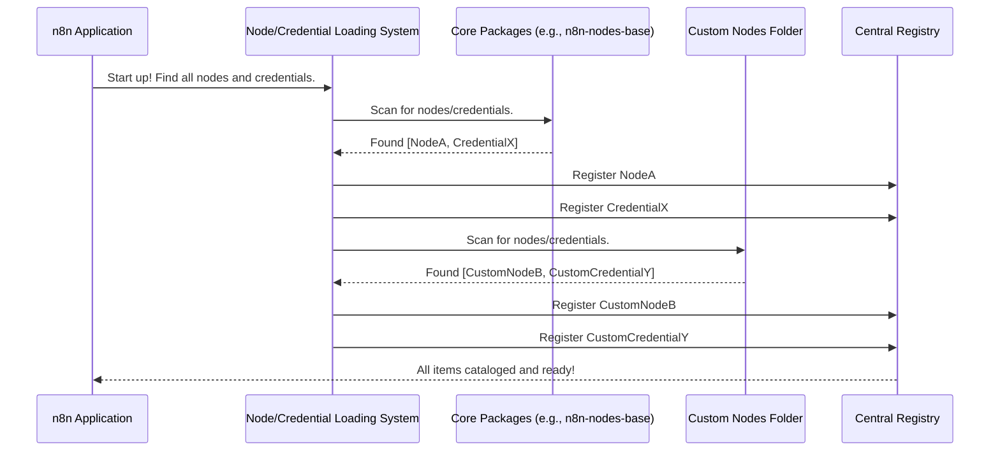

# Chapter 1: Node and Credential Loading

Welcome to the n8n `core` project! If you've ever wondered how n8n knows about all the different services it can connect to, or all the different actions it can perform, you're in the right place. This chapter dives into the very first step: how n8n discovers and makes available all its building blocks.

## What's the Big Deal with Loading Nodes and Credentials?

Imagine n8n as a giant workshop, and you're there to build an amazing automated machine (your workflow). To build anything, you need tools and access badges.

*   **Nodes are your tools**: Think of a "Read Email" tool, a "Send Slack Message" tool, or a "Filter Data" tool. Each specific action or service integration in n8n is a "node".
*   **Credentials are your access badges**: To use the "Read Email" tool with your Gmail account, you need an access badge (a credential) that proves you have permission to access that Gmail account.

So, the central problem this system solves is: **How does n8n gather all these "tools" (nodes) and "access badge templates" (credential types) and make them ready for you to use?**

When n8n starts up, it doesn't magically know about every possible tool or badge. It needs a system to:
1.  **Discover:** Find out where these tools and badge templates are located.
2.  **Load:** Read their descriptions and understand what they do.
3.  **Register:** Keep a catalog of everything it found, so you can pick them from the n8n interface.

This system makes n8n incredibly **extensible**. It means new tools and badge templates can be added easily, whether they come from the main n8n team, the wider community, or even your own custom creations!

## Key Concepts: Tools, Badges, and Where to Find Them

Let's break down the main ideas:

1.  **Nodes (The Tools):**
    *   These are the fundamental building blocks of your automation workflows. Each node performs a specific task, like fetching data, sending a message, or manipulating information.
    *   Examples: `Google Sheets Node`, `HTTP Request Node`, `IF Node`.

2.  **Credential Types (The Access Badge Templates):**
    *   These define *how* n8n should authenticate with different services. Think of them as templates for creating specific access badges. For instance, a `Google OAuth2 API` credential type defines the method to connect to Google services. You then use this template to create *your specific* Google credential with your own account.
    *   Examples: `Generic OAuth2 API`, `API Key Auth`, `AWS Credentials`.

3.  **Sources of Nodes and Credentials:**
    *   **Core Packages:** These are the nodes and credentials built and maintained by the n8n team (e.g., `n8n-nodes-base`).
    *   **Community Packages:** Nodes developed by the n8n community (e.g., `n8n-nodes-my-cool-service`).
    *   **Custom Directories:** You can create your own nodes and credentials and tell n8n where to find them (e.g., in a folder like `~/.n8n/custom`).

4.  **Loading Strategies:**
    *   **Eager Loading:** Load everything immediately when n8n starts.
    *   **Lazy Loading:** Load only the basic information (like names) at startup, and then load the full details of a node or credential only when it's actually needed (e.g., when you add it to a workflow). This can make n8n start up faster.

## How n8n Gathers Its Tools and Badges

When n8n starts, it's like a librarian preparing a library for the day:

1.  **Check the Map:** n8n knows certain places to look for nodes and credentials. These include its own internal packages, any community packages you've installed, and any custom directories you've configured.
2.  **Scan the Shelves:** It goes to each of these locations and looks for files that define nodes (typically ending in `.node.js`) and credentials (typically ending in `.credentials.js`).
3.  **Catalog Everything:** For each node and credential type it finds, it reads its properties (name, description, parameters it needs, etc.) and adds it to an internal catalog.
4.  **Open for Business:** Once cataloged, these nodes and credential types appear in the n8n editor, ready for you to drag, drop, and configure in your workflows.

Let's visualize this process:



## Under the Hood: A Peek at the Code

The magic of discovering and loading nodes and credentials primarily happens within classes that extend `DirectoryLoader`. This base class provides the common logic for scanning a directory, identifying node and credential files, and loading them.

### The `DirectoryLoader` (The Master Blueprint)

Think of `DirectoryLoader` as the master blueprint for how to scan any folder for n8n's building blocks.

File: `src/nodes-loader/directory-loader.ts`

```typescript
// Simplified for clarity
export abstract class DirectoryLoader {
	// ... other properties ...
	nodeTypes: INodeTypeData = {}; // Stores loaded node definitions
	credentialTypes: ICredentialTypeData = {}; // Stores loaded credential definitions
	known: KnownNodesAndCredentials = { nodes: {}, credentials: {} }; // Info for lazy loading

	constructor(readonly directory: string) {
		// 'directory' is where this loader will look for items
	}

	// Each specific loader (like for custom nodes) will implement this
	abstract loadAll(): Promise<void>;

	// ... more methods ...
}
```
This abstract class defines common properties like `nodeTypes` (where fully loaded nodes go) and `credentialTypes`. The `constructor` takes the `directory` it's responsible for. The `loadAll` method is where the actual scanning and loading will be initiated by concrete implementations.

### Loading a Single Node File

When a potential node file is found (e.g., `MyNode.node.js`), the `loadNodeFromFile` method in `DirectoryLoader` is crucial.

File: `src/nodes-loader/directory-loader.ts`

```typescript
// Simplified: Inside DirectoryLoader class
loadNodeFromFile(filePath: string) {
	// 1. Load the class from the file
	const tempNode = this.loadClass<INodeType | IVersionedNodeType>(filePath);
	// ... (icon fixing, version handling, etc. happens here) ...

	const nodeType = tempNode.description.name;

	// 2. Store for quick access if lazy loading
	this.known.nodes[nodeType] = {
		className: tempNode.constructor.name,
		sourcePath: filePath,
	};

	// 3. Store the actual loaded node data
	this.nodeTypes[nodeType] = {
		type: tempNode,
		sourcePath: filePath,
	};
	// ... (add to other lists for discoverability) ...
}
```
**What's happening here?**
1.  `this.loadClass()`: This dynamically loads the JavaScript class defined in `filePath`. This class contains the node's logic and description.
2.  `this.known.nodes`: Information about the node (like its file path) is stored. This is especially useful for lazy loading – n8n knows *where* the node is, even if it hasn't fully loaded its details yet.
3.  `this.nodeTypes`: The fully loaded node object (`tempNode`) is stored here, making it ready for use.

Loading a credential file (`loadCredentialFromFile`) follows a very similar pattern.

### Special Loaders for Different Sources

n8n uses specialized versions of `DirectoryLoader` for different sources:

1.  **`CustomDirectoryLoader` (For Your Own Creations)**

    This loader is specifically for nodes and credentials you (or your team) create and place in a designated custom folder (e.g., `~/.n8n/custom`).

    File: `src/nodes-loader/custom-directory-loader.ts`
    ```typescript
    export class CustomDirectoryLoader extends DirectoryLoader {
        packageName = 'CUSTOM'; // Identifies these as custom

        override async loadAll() {
            // Find all files ending with .node.js
            const nodes = await glob('**/*.node.js', { /* ... options ... */ });
            for (const nodePath of nodes) {
                this.loadNodeFromFile(nodePath); // Use DirectoryLoader's method
            }

            // Find all files ending with .credentials.js
            const credentials = await glob('**/*.credentials.js', { /* ... */ });
            for (const credentialPath of credentials) {
                this.loadCredentialFromFile(credentialPath); // Use method
            }
        }
    }
    ```
    The `loadAll` method uses a library called `glob` to find all files matching `*.node.js` and `*.credentials.js` within its assigned directory. Then, it calls the `loadNodeFromFile` and `loadCredentialFromFile` methods (inherited from `DirectoryLoader`) for each file found.

2.  **`PackageDirectoryLoader` (For Core and Community Nodes)**

    This loader handles nodes and credentials that come bundled in packages (like `n8n-nodes-base` or community node packages). These packages list their nodes and credentials in their `package.json` file.

    File: `src/nodes-loader/package-directory-loader.ts`
    ```typescript
    export class PackageDirectoryLoader extends DirectoryLoader {
        packageJson: n8n.PackageJson; // Holds package.json content

        constructor(directory: string, /* ... */) {
            super(directory, /* ... */);
            this.packageJson = this.readJSONSync('package.json'); // Load package.json
            this.packageName = this.packageJson.name;
        }

        override async loadAll() {
            const { n8n } = this.packageJson; // Get the 'n8n' section
            if (!n8n) return;

            // Load nodes listed in package.json
            if (Array.isArray(n8n.nodes)) {
                for (const nodePath of n8n.nodes) {
                    this.loadNodeFromFile(nodePath);
                }
            }
            // Load credentials listed in package.json
            // ... (similar loop for n8n.credentials) ...
        }
    }
    ```
    Instead of scanning the whole directory with `glob`, `PackageDirectoryLoader` reads the `package.json` file of the node package. Inside `package.json`, there's an `n8n` section that explicitly lists the paths to its node and credential files.

3.  **`LazyPackageDirectoryLoader` (For Faster Startups)**

    This is a clever optimization. For packages that support it, this loader tries to load pre-compiled lists of node and credential *descriptions* first. These are lightweight JSON files. The full code for a node is only loaded if and when you actually use that node in a workflow.

    File: `src/nodes-loader/lazy-package-directory-loader.ts`
    ```typescript
    export class LazyPackageDirectoryLoader extends PackageDirectoryLoader {
        override async loadAll() {
            try {
                // Try to load pre-compiled lists first
                this.known.nodes = await this.readJSON('dist/known/nodes.json');
                this.types.nodes = await this.readJSON('dist/types/nodes.json');
                // ... similar for credentials ...
                this.isLazyLoaded = true; // Mark as successfully lazy-loaded
                return; // Done! No need for full scan if successful
            } catch {
                // If pre-compiled files are missing or fail, fall back
                this.logger.debug("Can't enable lazy-loading, doing full load.");
                await super.loadAll(); // Do the regular full load
            }
        }
    }
    ```
    If it finds files like `dist/known/nodes.json` (containing basic info) and `dist/types/nodes.json` (containing descriptions), it loads these much faster. If not, it falls back to the `PackageDirectoryLoader`'s way of loading everything.

### Common Properties for Nodes

You might have noticed some nodes share common settings, like polling intervals for trigger nodes or CORS settings for webhook nodes. These are defined centrally and can be automatically added to relevant nodes.

File: `src/nodes-loader/constants.ts`
```typescript
// Example of common parameters for nodes that poll for data
export const commonPollingParameters: INodeProperties[] = [
	{
		displayName: 'Poll Times',
		name: 'pollTimes',
		type: 'fixedCollection',
		// ... other configuration ...
		default: { item: [{ mode: 'everyMinute' }] },
		description: 'Time at which polling should occur',
	},
];
```
When a node description indicates it supports `polling` (like `nodeType.description.polling`), the `DirectoryLoader` automatically adds these `commonPollingParameters` to that node's properties. This avoids repetition and ensures consistency.

## Tying It All Together

So, when n8n starts:
1.  It sets up different "loaders" (`CustomDirectoryLoader`, `PackageDirectoryLoader`, `LazyPackageDirectoryLoader`) for each place it needs to look for nodes/credentials.
2.  Each loader calls its `loadAll()` method.
3.  They scan their respective directories or `package.json` files.
4.  For each node/credential file found or listed:
    *   `loadNodeFromFile()` or `loadCredentialFromFile()` is called.
    *   The class is loaded.
    *   Its information is stored in `nodeTypes`/`credentialTypes` and `known` structures.
    *   Common parameters (like polling or CORS) might be added automatically.
5.  All discovered nodes and credential types are now registered and available for you to build workflows!

This system is like a well-organized librarian who not only knows where every book (node/credential) is but can also quickly fetch a summary or the full book when needed. It's the foundation that makes n8n's vast library of integrations and functionalities accessible and expandable.

## Conclusion

You've now seen how n8n discovers, loads, and registers all the available "automation tools" (nodes) and "access badge templates" (credential types). This "Node and Credential Loading" system is crucial for n8n's extensibility, allowing it to incorporate tools from its core, the community, or your custom folders. It ensures that when n8n starts, it catalogs every available component, making them ready for you to build powerful workflows.

With this understanding of how n8n gathers its building blocks, we can now explore how these blocks are actually connected to form a workflow.

Next up, we'll dive into how workflows themselves are structured internally in [Chapter 2: Workflow Graph Representation (DirectedGraph)](02_workflow_graph_representation__directedgraph__.md).

---

Generated by [AI Codebase Knowledge Builder](https://github.com/The-Pocket/Tutorial-Codebase-Knowledge)