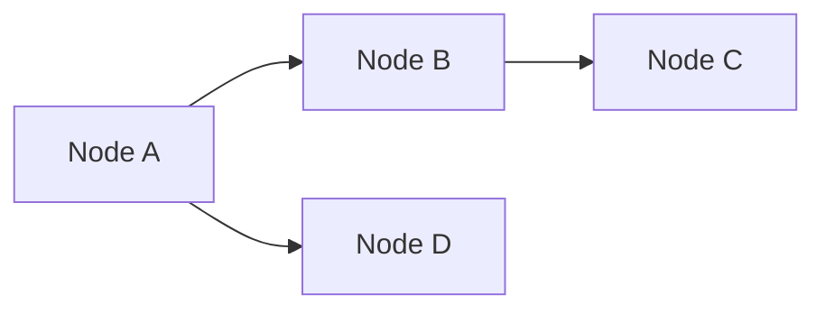
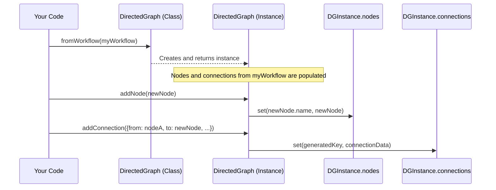

# Chapter 2: Workflow Graph Representation (DirectedGraph)

Welcome back! In [Chapter 1: Node and Credential Loading](01_node_and_credential_loading_.md), we saw how n8n gathers all its "tools" (nodes) and "access badge templates" (credential types). Now that n8n knows what building blocks are available, the next question is: how does it understand the way you've connected these blocks to create your automation? That's where the `DirectedGraph` comes in.

## The Blueprint of Your Automation: Why Do We Need It?

Imagine you've designed a complex assembly line in a factory. You have many machines, and they are connected in a specific order.
*   Machine A processes raw materials.
*   Machine B takes output from A and shapes it.
*   Machine C takes output from B and paints it.

If you just have a list like "1. Process, 2. Shape, 3. Paint," it's okay for a simple line. But what if Machine B breaks down and you need to restart the process only from Machine B, using the already processed materials from Machine A? Or what if you accidentally create a loop where Machine C sends its output back to Machine B, causing a jam?

A simple list of steps won't help you easily figure these things out. You need a **detailed blueprint**.

This is precisely the problem the `DirectedGraph` solves for n8n workflows. It provides an internal, structured representation of your workflow, not just as a list of nodes, but as a graph showing:
*   **Nodes**: The individual processing steps (your "machines").
*   **Connections (Edges)**: How data flows between these nodes (the "conveyor belts" and their direction).

This "blueprint" is crucial for:
1.  **Understanding the structure (topology)**: How are nodes interconnected? Are there any isolated parts?
2.  **Enabling smart features**:
    *   **Partial workflow execution**: If you only want to re-run a part of your workflow, the graph helps n8n understand which nodes need to run. For example, if you want to re-run "Machine C", n8n needs to know it depends on "Machine B".
    *   **Identifying complex patterns**: Like loops, where data might circle back, which could be intentional or an error.

The `DirectedGraph` is like having an interactive, detailed schematic of your assembly line.

## What is a "Directed Graph" Anyway?

Let's break this term down:

*   **Graph**: In computer science, a graph is a way to represent relationships between objects. It consists of:
    *   **Vertices (or Nodes)**: These are the "objects" themselves. In n8n, these are your workflow nodes (e.g., "Read Email", "Filter Data").
    *   **Edges (or Connections)**: These represent the relationships or links between the nodes. In n8n, these are the connections you draw between nodes, showing how data passes from one to another.

*   **Directed**: This means the connections have a *direction*. Data flows from an output of one node to an input of another. It's a one-way street.

Here's a simple way to visualize it:


In this diagram:
*   `Node A`, `Node B`, `Node C`, `Node D` are the nodes.
*   The arrows (`-->`) are the directed connections, showing data flows from `A` to `B`, `B` to `C`, and `A` to `D`.

## Meet the `DirectedGraph` Class in n8n

n8n's `core` project has a specific class called `DirectedGraph` to manage this blueprint. You can find its definition in `src/execution-engine/partial-execution-utils/directed-graph.ts`.

While a standard n8n `Workflow` object (which you might get from saving your workflow) *does* contain all the nodes and connections, it stores them in a format that's great for storage and basic execution but not always easy for complex analysis or modification. The `DirectedGraph` class provides a more convenient structure for these advanced tasks.

### From Workflow to `DirectedGraph` (and Back!)

You usually start with an existing n8n workflow. The `DirectedGraph` class can "import" this workflow.

**1. Creating a `DirectedGraph` from a Workflow:**

Let's say you have a `workflow` object.
```typescript
// Simplified INode and Workflow for example
interface INode { name: string; /* ... other properties */ }
interface Workflow { nodes: INode[]; connections: any; /* ... */ getNode: (name: string) => INode | undefined; connectionsBySourceNode: any; }

// Imagine 'myExistingWorkflow' is your loaded n8n workflow
const myExistingWorkflow: Workflow = { /* ... details of your workflow ... */ };

// Convert it to a DirectedGraph
const graph = DirectedGraph.fromWorkflow(myExistingWorkflow);
```
After this, `graph` is an instance of `DirectedGraph` representing `myExistingWorkflow`. It's now easier to "query" this blueprint.

**2. Looking Inside the Graph:**

Once you have a `DirectedGraph` object, you can inspect its structure.

```typescript
// Get all nodes in the graph
const allNodes = graph.getNodes(); // Returns a Map of node names to INode objects
console.log(`This graph has ${allNodes.size} nodes.`);

// Get all connections
const allConnections = graph.getConnections(); // Returns an array of GraphConnection objects
console.log(`This graph has ${allConnections.length} connections.`);
```
This allows you to easily iterate over all nodes or connections for analysis.

**3. Making Changes (Adding Nodes and Connections):**

The `DirectedGraph` also makes it easy to modify the workflow structure programmatically.

```typescript
// Let's create a new node (simplified)
const newNode: INode = { name: 'New Node', type: 'n8n-nodes-base.set', /* ... other properties */ };
const existingNode: INode = graph.getNodes().get('Node A')!; // Assume 'Node A' exists

// Add the new node to the graph
graph.addNode(newNode);

// Add a connection from 'Node A' to 'New Node'
if (existingNode) {
  graph.addConnection({
    from: existingNode,    // The node data is coming from
    to: newNode,           // The node data is going to
    // type, outputIndex, inputIndex can often use defaults
  });
}
```
This is like adding a new machine to your assembly line and connecting its input conveyor belt.

**4. Removing a Node:**

You can also remove nodes. A cool feature is that `removeNode` can try to automatically reconnect the "parent" and "child" nodes of the node being removed.

```typescript
const nodeToRemove: INode = graph.getNodes().get('Node B')!; // Assume 'Node B' exists

if (nodeToRemove) {
  // Option 1: Just remove the node and its connections
  // graph.removeNode(nodeToRemove);

  // Option 2: Remove 'Node B' and try to connect its parents to its children
  const newConnections = graph.removeNode(nodeToRemove, { reconnectConnections: true });
  console.log('New connections made:', newConnections);
}
```
Imagine removing a machine from your assembly line. `reconnectConnections: true` is like trying to directly link the machine *before* the removed one to the machine *after* it.

**5. Getting Back to a Usable Workflow:**

After you've analyzed or modified your `DirectedGraph`, you can convert it back into the standard `Workflow` format.

```typescript
// Convert the DirectedGraph instance back to a Workflow object
// You'd pass other workflow parameters like name, active status, etc.
const updatedWorkflow = graph.toWorkflow({
  name: 'My Updated Workflow',
  active: false,
  settings: {},
  meta: null,
  // ... other parameters
});
```
Now `updatedWorkflow` can be used by n8n, perhaps to be saved or executed.

## The Power of the Blueprint: What Can We Do With It?

Having this `DirectedGraph` representation opens up powerful capabilities:

*   **Partial Execution**:
    Imagine you want to re-run your workflow starting from "Node C". The graph helps determine this:
    *   What nodes come *before* "Node C" and provide its input? (`getParentConnections`)
    *   What nodes come *after* "Node C" and depend on its output? (`getChildren`)
    The `DirectedGraph` is a key tool used by utilities like `findStartNodes` and `findSubgraph` (from `src/execution-engine/partial-execution-utils/`) to figure out the exact "slice" of the workflow that needs to run. (We won't dive deep into those utilities here, but know that `DirectedGraph` is their foundation).

*   **Analyzing Connections**:
    You can find out exactly how one node is connected to others.
    ```typescript
    const nodeA = graph.getNodes().get('Node A')!;
    if (nodeA) {
      const childrenConnections = graph.getDirectChildConnections(nodeA);
      console.log(`${nodeA.name} sends data to ${childrenConnections.length} other nodes.`);
    }
    ```

*   **Detecting Cycles (Loops)**:
    Sometimes, especially in complex workflows, nodes can be connected in a way that creates a loop (e.g., Node A -> Node B -> Node C -> Node A). The `DirectedGraph` class has a method called `getStronglyConnectedComponents()`. This method uses an algorithm (Tarjan's algorithm) to find sets of nodes where every node in the set can reach every other node in the same set – these are your loops or more complex cyclical structures!
    ```typescript
    const sccs = graph.getStronglyConnectedComponents();
    sccs.forEach((component, index) => {
      if (component.size > 1) { // A component with >1 node or a single node looping to itself
        const nodeNames = Array.from(component).map(n => n.name);
        console.log(`Loop detected (SCC ${index}): involves nodes ${nodeNames.join(', ')}`);
      }
    });
    ```
    This is super helpful for debugging or understanding complex flow logic.

## Under the Hood: How `DirectedGraph` Stores Information

The `DirectedGraph` class needs an efficient way to store nodes and their connections.

File: `src/execution-engine/partial-execution-utils/directed-graph.ts`

**1. Storing Nodes:**
Nodes are stored in a `Map`, where the key is the node's unique name and the value is the `INode` object itself.

```typescript
// Inside the DirectedGraph class
private nodes: Map<string, INode> = new Map();

// When you call addNode(node):
// this.nodes.set(node.name, node);
```
This makes it very fast to look up a node by its name.

**2. Storing Connections:**
Connections are also stored in a `Map`. But what's the key? A connection is defined by its source node, target node, and details like which output "pin" of the source connects to which input "pin" of the target.

```typescript
// Type definition for a connection
export type GraphConnection = {
	from: INode;
	to: INode;
	type: NodeConnectionType; // e.g., 'main'
	outputIndex: number;
	inputIndex: number;
};

// fromName-outputType-outputIndex-inputIndex-toName
type DirectedGraphKey = `${string}-${NodeConnectionType}-${number}-${number}-${string}`;

// Inside the DirectedGraph class
private connections: Map<DirectedGraphKey, GraphConnection> = new Map();
```
The `DirectedGraphKey` is a specially formatted string that uniquely identifies a connection. The `makeKey` method creates this string:

```typescript
// Inside the DirectedGraph class (simplified)
private makeKey(connection: GraphConnection): DirectedGraphKey {
  return `${connection.from.name}-${connection.type}-${connection.outputIndex}-${connection.inputIndex}-${connection.to.name}`;
}

// When you call addConnection(connectionDetails):
// const connection: GraphConnection = { /* ... built from details ... */ };
// this.connections.set(this.makeKey(connection), connection);
```
This unique key ensures each connection is stored once and can be quickly retrieved or updated.

### Visualizing an Operation

Let's visualize what happens when you convert a workflow and add a node:


This diagram shows that `fromWorkflow` populates the internal `nodes` and `connections` maps. Then, methods like `addNode` and `addConnection` directly manipulate these maps.

The `DirectedGraph` class is essentially a wrapper around these `Map` structures, providing convenient methods to work with the graph representation of your workflow, much like an engineer uses a blueprint to understand and modify a complex machine.

## Conclusion

You've now learned about the `DirectedGraph`, n8n's internal "blueprint" for workflows. You've seen:
*   Why it's essential for understanding workflow structure and enabling advanced features.
*   How it represents workflows as nodes and directed connections.
*   How to convert n8n workflows to `DirectedGraph` objects and back using `fromWorkflow` and `toWorkflow`.
*   How to inspect and modify the graph using methods like `getNodes`, `addNode`, and `addConnection`.
*   The power it gives for analysis, like finding connection paths or detecting loops with `getStronglyConnectedComponents`.
*   A glimpse into how it stores nodes and connections internally.

This structured representation is a cornerstone for many of n8n's more sophisticated operations. With the building blocks loaded (Chapter 1) and their arrangement understood (this chapter), we can now look at another critical aspect: managing the sensitive information needed to access various services.

Next, we'll explore how n8n handles your secret keys and tokens in [Chapter 3: Credential Management](03_credential_management_.md).

---

Generated by [AI Codebase Knowledge Builder](https://github.com/The-Pocket/Tutorial-Codebase-Knowledge)