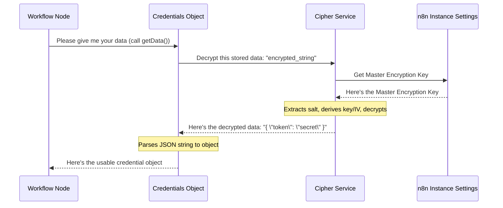

# Chapter 3: Credential Management

Welcome back! In [Chapter 2: Workflow Graph Representation (DirectedGraph)](02_workflow_graph_representation__directedgraph__.md), we learned how n8n understands the structure of your workflows. Now, let's talk about something super important: security. Many of your workflow nodes will need to talk to external services, like Google Sheets, Slack, or a custom API. To do this, they often need secret information like API keys, access tokens, or passwords. How does n8n handle these secrets safely? That's where **Credential Management** comes in!

## The Secret Keeper: Why Do We Need Credential Management?

Imagine you're building a workflow that automatically posts new customer feedback from a Google Sheet into a Slack channel.
1.  The "Google Sheets" node needs permission to read your sheet. This permission comes in the form of an API key or an access token.
2.  The "Slack" node needs permission to post messages to your channel. This also requires a token.

These tokens and keys are like digital keys to your accounts. You wouldn't want to just type them directly into your workflow where anyone could see them, or store them as plain text in a file. That would be like leaving your house keys under the doormat!

**Credential Management** solves this problem by acting like a **high-security digital vault**. It's responsible for:
1.  **Securely Storing:** Taking your sensitive API keys, tokens, and passwords, encrypting them (scrambling them into an unreadable format), and storing them safely.
2.  **Securely Retrieving:** When a node in your workflow needs to use a credential, this system retrieves the encrypted version, decrypts it (unscrambles it), and gives it to the node just for the moment it's needed.

This way, your secrets are never exposed in plain text in your workflow files or n8n's interface after they are initially saved.

## Key Concepts: Inside the Digital Vault

Let's understand the main ideas behind n8n's Credential Management:

1.  **Credentials:** These are the actual pieces of sensitive information. For example, for a "Google API" credential, the data might include an `accessToken` and a `refreshToken`.
2.  **Credential Types:** As we saw in [Chapter 1: Node and Credential Loading](01_node_and_credential_loading_.md), these are like templates that define *what kind* of information a service needs (e.g., "API Key Auth" needs an API key field, "OAuth2 Auth" needs client IDs, secrets, tokens, etc.).
3.  **Encryption:** This is the process of converting your readable credential data (like `mysecretapikey123`) into an unreadable, scrambled format using a secret code. Only someone with the correct "key" can unscramble it.
4.  **Decryption:** This is the reverse process: converting the scrambled, encrypted data back into its original, readable format.
5.  **Master Encryption Key:** This is the main secret key n8n uses to encrypt and decrypt all your credentials. Think of it as the master key to the entire digital vault. **It's very important and is set up when n8n is configured.** If this key is lost, your stored credentials cannot be decrypted.

## How It Works: Storing and Using a Secret

Let's walk through how n8n's "digital vault" handles a credential, for example, your Google API access token.

**1. Saving Your Secret (Encryption):**
   When you first add a new credential in n8n (e.g., for Google Sheets):
   *   You enter your sensitive details (like an access token).
   *   n8n takes this information.
   *   It uses the **Master Encryption Key** to encrypt your details.
   *   The encrypted (scrambled) version is then stored, typically in n8n's database. Your original, plain-text token is not stored after this.

**2. Using Your Secret (Decryption):**
   Later, when a workflow runs and a Google Sheets node needs to access your sheet:
   *   The node says, "I need the 'My Google Connection' credential."
   *   n8n fetches the *encrypted* data for 'My Google Connection' from storage.
   *   It uses the same **Master Encryption Key** to decrypt this data.
   *   The decrypted, plain-text token is then given to the Google Sheets node so it can make its API call.
   *   This decrypted token is typically only held in memory while the node is executing and is not written back to disk or logs in its plain form.

This process ensures that your sensitive information is protected while stored and only made available in its usable form when absolutely necessary.

## A Peek at the Code: The `Credentials` and `Cipher` Classes

The main players in n8n's `core` for this are the `Credentials` class and the `Cipher` class.

*   **`Credentials` class (File: `src/credentials.ts`):** This class represents a single credential (like your "My Google Connection"). It knows how to handle its own data, including triggering encryption and decryption.
*   **`Cipher` class (File: `src/encryption/cipher.ts`):** This class is the specialist for doing the actual encryption and decryption work using the master encryption key.

### Storing (Encrypting) Data with `Credentials.setData()`

When n8n needs to save new credential data you've entered, it uses the `setData` method of a `Credentials` object.

```typescript
// In src/credentials.ts (Simplified)
// T is a placeholder for the actual structure of your credential data
export class Credentials<T extends object = any> /* ... */ {
	// ... other properties like id, name, type ...
	public data?: string; // This will store the ENCRYPTED data as a string
	private readonly cipher = Container.get(Cipher); // Gets the Cipher service

	setData(credentialObject: T): void {
		// 1. 'credentialObject' is your plain-text sensitive data
		//    e.g., { accessToken: 'secret123', refreshToken: 'refresh456' }

		// 2. The Cipher service encrypts it
		this.data = this.cipher.encrypt(credentialObject);
		// Now, 'this.data' holds a long, scrambled string
	}
	// ... other methods ...
}
```
**Explanation:**
1.  You pass your sensitive data (e.g., an object with `accessToken` and `refreshToken`) to `setData()`.
2.  The `Credentials` object doesn't store this directly. Instead, it asks the `cipher` service (an instance of the `Cipher` class) to encrypt it.
3.  The `cipher.encrypt()` method does the heavy lifting (which we'll see next) and returns a scrambled string.
4.  This scrambled, encrypted string is stored in the `this.data` property of the `Credentials` object. This is what gets saved to the database.

### Retrieving (Decrypting) Data with `Credentials.getData()`

When a node needs to use the credential, n8n retrieves the `Credentials` object (with its encrypted `data`) and calls `getData()`.

```typescript
// In src/credentials.ts (Simplified)
// (Continuing the Credentials class from above)

	getData(): T {
		if (this.data === undefined) {
			// Error: No data was ever set!
			throw new CredentialDataError(this, CREDENTIAL_ERRORS.NO_DATA);
		}

		let decryptedJsonString: string;
		try {
			// 1. 'this.data' is the encrypted string from storage
			// 2. The Cipher service decrypts it
			decryptedJsonString = this.cipher.decrypt(this.data);
		} catch (cause) {
			// Error: Could not decrypt! Maybe wrong master key?
			throw new CredentialDataError(this, CREDENTIAL_ERRORS.DECRYPTION_FAILED, cause);
		}

		try {
			// 3. Convert the decrypted JSON string back into an object
			return JSON.parse(decryptedJsonString); // Original uses a safer jsonParse
		} catch (cause) {
			// Error: Decrypted data isn't valid JSON
			throw new CredentialDataError(this, CREDENTIAL_ERRORS.INVALID_JSON, cause);
		}
	}
```
**Explanation:**
1.  The `getData()` method starts with `this.data`, which holds the encrypted string.
2.  It passes this encrypted string to the `cipher.decrypt()` method.
3.  The `cipher` service attempts to decrypt it using the master encryption key. If it fails (e.g., because the master key is different from the one used for encryption), it throws an error. The `CREDENTIAL_ERRORS.DECRYPTION_FAILED` message (from `src/constants.ts`) gives a hint about this.
4.  If successful, `cipher.decrypt()` returns a plain-text JSON string.
5.  This JSON string is then parsed back into a JavaScript object (e.g., `{ accessToken: 'secret123', ... }`), which is returned to the node.

## Under the Hood: The `Cipher` at Work

The `Cipher` class is where the actual cryptographic magic happens. It uses AES-256-CBC, a strong and widely used encryption algorithm.

### Encryption with `Cipher.encrypt()`

```typescript
// In src/encryption/cipher.ts (Simplified)
// (InstanceSettings provides the master 'encryptionKey')
export class Cipher {
	constructor(private readonly instanceSettings: InstanceSettings) {}

	encrypt(data: string | object) {
		const salt = randomBytes(8); // 1. Generate a unique, random "salt"
		// 2. Derive an encryption key and IV from master key and salt
		const [key, iv] = this.getKeyAndIv(salt);

		const cipher = createCipheriv('aes-256-cbc', key, iv); // 3. Setup AES cipher
		const jsonData = typeof data === 'string' ? data : JSON.stringify(data);
		let encrypted = cipher.update(jsonData, 'utf8', 'base64'); // 4. Encrypt
		encrypted += cipher.final('base64');

		// 5. Prepend "Salted__" (as hex) and the salt, then encode everything as Base64
		// RANDOM_BYTES is Buffer.from('53616c7465645f5f', 'hex') -> "Salted__"
		return Buffer.concat([RANDOM_BYTES, salt, Buffer.from(encrypted, 'base64')]).toString('base64');
	}
	// ... getKeyAndIv and decrypt methods ...
}
```
**Explanation (Simplified):**
1.  **Salt:** A random "salt" is generated. Adding a unique salt for each encryption makes even identical passwords encrypt to different results, enhancing security.
2.  **Key & IV Derivation (`getKeyAndIv`):** The master `encryptionKey` (from `InstanceSettings`) and this salt are used to derive the actual key and Initialization Vector (IV) needed for AES encryption. We'll peek at `getKeyAndIv` below.
3.  **AES Cipher Setup:** An AES-256-CBC cipher is initialized with the derived key and IV.
4.  **Encryption:** The input data (converted to a JSON string if it's an object) is encrypted.
5.  **Formatting:** The final output is a Base64 encoded string containing a marker (`Salted__`), the salt, and the encrypted data. This format is compatible with how other libraries like CryptoJS handle encryption, making it potentially interoperable.

### Decryption with `Cipher.decrypt()`

```typescript
// In src/encryption/cipher.ts (Simplified)
decrypt(encryptedString: string) {
	const inputBuffer = Buffer.from(encryptedString, 'base64'); // 1. Decode Base64

	// 2. Extract salt (8 bytes after the "Salted__" marker)
	const salt = inputBuffer.subarray(8, 16);
	// 3. The actual encrypted content starts after the salt
	const encryptedContents = inputBuffer.subarray(16);

	// 4. Derive the same key and IV using master key and extracted salt
	const [key, iv] = this.getKeyAndIv(salt);

	const decipher = createDecipheriv('aes-256-cbc', key, iv); // 5. Setup AES decipher
	let decrypted = decipher.update(encryptedContents); // 6. Decrypt
	decrypted = Buffer.concat([decrypted, decipher.final()]);
	return decrypted.toString('utf8'); // 7. Return plain text
}
```
**Explanation (Simplified):**
1.  **Decode Base64:** The input encrypted string is decoded from Base64.
2.  **Extract Salt:** The salt is extracted from the decoded data (it's stored alongside the encrypted content).
3.  **Extract Encrypted Content:** The actual encrypted part is separated.
4.  **Key & IV Derivation:** The *exact same* `getKeyAndIv` logic is used with the master `encryptionKey` and the *extracted salt* to re-derive the same key and IV that were used for encryption. This is crucial!
5.  **AES Decipher Setup:** An AES decipher is set up.
6.  **Decryption:** The encrypted content is decrypted.
7.  **Return Plain Text:** The result is the original JSON string.

### Deriving the Key and IV with `getKeyAndIv()`

This helper method is vital for both encryption and decryption. It ensures the same cryptographic key and IV are used if the master key and salt are the same.

```typescript
// In src/encryption/cipher.ts (Simplified)
private getKeyAndIv(salt: Buffer): [Buffer, Buffer] {
	// 'encryptionKey' is the master key from n8n's settings
	const { encryptionKey } = this.instanceSettings;
	const passwordAndSalt = Buffer.concat([Buffer.from(encryptionKey, 'binary'), salt]);

	// Uses MD5 hashes in a specific sequence to derive a 32-byte key (for AES-256)
	// and a 16-byte IV. This is a standard way to derive keys, compatible with CryptoJS.
	let M = passwordAndSalt;
	let D: Buffer[] = [];
	for (let i = 0; i < 3; i++) { // Creates key and IV (48 bytes total)
		const hash = createHash('md5').update(M).digest();
		D.push(hash);
		if (i < 2) M = Buffer.concat([hash, passwordAndSalt]);
	}
	const result = Buffer.concat(D);
	const key = result.subarray(0, 32); // First 32 bytes for AES-256 key
	const iv = result.subarray(32, 48);  // Next 16 bytes for IV
	return [key, iv];
}
```
**Explanation:**
This method takes the master `encryptionKey` and the `salt`. It repeatedly hashes them using MD5 in a specific way to produce a longer byte sequence. From this sequence, it extracts the 32-byte encryption key (for AES-256) and the 16-byte Initialization Vector (IV). The exact steps ensure that if you provide the same master key and salt, you'll always get the same encryption key and IV.

### Visualizing the Flow

Here's how the pieces fit together when a node needs data:



This "digital vault" system, powered by the `Credentials` and `Cipher` classes, is fundamental to how n8n securely manages the sensitive information required for your automations to interact with the world.

## Conclusion

You've now unlocked the secrets of n8n's Credential Management! You've learned:
*   Why secure credential handling is crucial for automation.
*   How n8n acts like a "digital vault," encrypting secrets for storage and decrypting them only when needed.
*   The roles of the `Credentials` class (managing individual credential data) and the `Cipher` class (performing encryption/decryption using AES-256).
*   The importance of the master encryption key and how salt enhances security.
*   A simplified view of how data flows from plain text to encrypted storage, and back to plain text for a node's use.

With credentials securely managed, your workflows can confidently and safely access the services they need. But how does a workflow actually *run*? And what happens when it starts?

Next, we'll explore the journey of a workflow from being dormant to actively processing data in [Chapter 4: Workflow Lifecycle and Activation](04_workflow_lifecycle_and_activation_.md).

---

Generated by [AI Codebase Knowledge Builder](https://github.com/The-Pocket/Tutorial-Codebase-Knowledge)