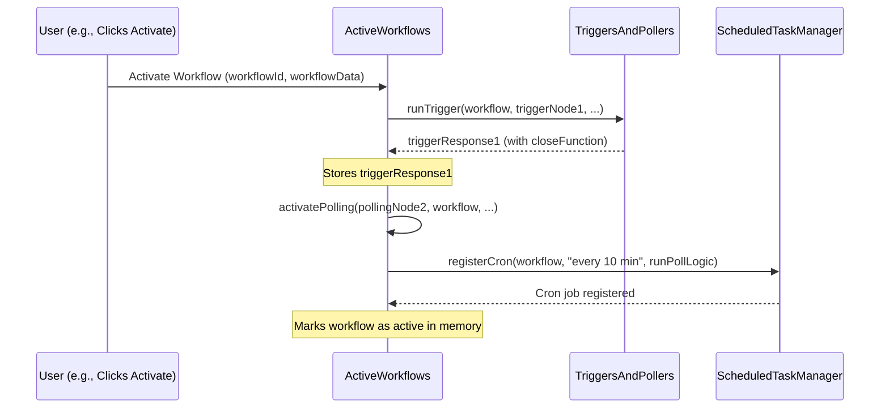

# Chapter 4: Workflow Lifecycle and Activation

Welcome back! In [Chapter 3: Credential Management](03_credential_management_.md), we saw how n8n keeps your sensitive data safe. Now that your workflow has its "keys" to access different services, how does it actually spring into action and stay ready to work? This chapter explores how n8n manages the runtime state of your workflows – how they are started, kept active for triggers or scheduled tasks, and then stopped.

## The Operations Center for Your Automations

Imagine you've built a workflow that should:
1.  Listen for new orders on your e-commerce website (a webhook).
2.  Every morning, check for new customer reviews and post them to Slack.

For this to work, n8n can't just run the workflow once and forget about it. It needs a system to:
*   **Start listening:** Set up the "webhook listener" for new orders.
*   **Keep checking:** Remember to run the "customer review check" every morning.
*   **Stay vigilant:** Ensure these processes are active and ready.
*   **Clean up:** If you deactivate the workflow, it needs to stop the listener and cancel the scheduled checks.

This is what **Workflow Lifecycle and Activation** is all about. Think of it as the **operations center** for all your automated processes. When you "activate" a workflow, this system sets up its "listening posts" (trigger nodes like webhooks) and "scheduled checks" (polling nodes). It ensures these are running, ready to kick off the workflow when their conditions are met, and properly dismantles them when a workflow is deactivated.

## Key Concepts: Bringing Your Workflows to Life

Let's break down the main ideas:

1.  **Workflow Activation:** This is like flipping the "ON" switch for your workflow. When you activate a workflow, n8n prepares it to run automatically.
2.  **Trigger Nodes (The "Listeners"):**
    *   These nodes kick off your workflow in response to an *external event*.
    *   Examples:
        *   `Webhook Node`: Listens for incoming HTTP requests.
        *   `Kafka Trigger Node`: Listens for messages on a Kafka topic.
    *   When a workflow with a trigger node is activated, n8n tells the trigger node to start listening. For a webhook, this might mean opening a specific web address (URL) and waiting for data to arrive.
3.  **Polling Nodes (The "Scheduled Checkers"):**
    *   These nodes kick off your workflow on a *schedule* you define.
    *   Examples:
        *   `Cron Node`: Runs the workflow at specific times (e.g., every Monday at 9 AM).
        *   `Interval Node`: Runs the workflow repeatedly after a certain time has passed (e.g., every 5 minutes).
    *   When a workflow with a polling node is activated, n8n sets up a scheduler (like a repeating alarm clock) to run that part of the workflow at the right times.
4.  **Workflow Deactivation:** This is like flipping the "OFF" switch. n8n will stop any listeners, cancel any scheduled checks, and the workflow will no longer run automatically.

## Bringing a Workflow to Life: Activation

When you hit the "Activate" button for a workflow in the n8n interface, a lot happens behind the scenes. The `ActiveWorkflows` class (found in `src/execution-engine/active-workflows.ts`) is central to this.

Let's say your workflow has one webhook trigger and one polling node that checks for new emails every 10 minutes.

**1. Registering the Workflow as Active:**
   n8n first notes that this workflow is now "active." The `ActiveWorkflows` class will store information about this workflow.

**2. Setting up Trigger Nodes:**
   For each trigger node (like our webhook):
   *   The `ActiveWorkflows` class uses the `TriggersAndPollers` service (from `src/execution-engine/triggers-and-pollers.ts`).
   *   `TriggersAndPollers.runTrigger()` is called. This method essentially tells the trigger node: "Start your listening process now!"
   *   For a webhook, the node starts listening on its configured URL. It might return a `closeFunction` which n8n can call later if the workflow is deactivated, to properly shut down the listener.

   ```typescript
   // Simplified from TriggersAndPollers.runTrigger()
   // (inside TriggersAndPollers class)
   async runTrigger(workflow: Workflow, node: INode, /*...other params...*/) {
       // 'triggerFunctions' provides tools for the node, like 'emit'
       const triggerFunctions = getExecuteTriggerFunctions(/*...*/);
       const nodeType = workflow.nodeTypes.getByName(node.type); // Get node's code

       if (nodeType.trigger) {
           // Call the 'trigger' method defined in the node's code
           return await nodeType.trigger.call(triggerFunctions);
       }
   }
   ```
   This snippet shows that the `trigger` method within the specific node's code (e.g., the Webhook node's code) is executed. This `trigger` method is responsible for setting up the actual listening mechanism.

**3. Setting up Polling Nodes:**
   For each polling node (like our "check email every 10 minutes" node):
   *   The `ActiveWorkflows` class calls its own `activatePolling` method.
   *   This method figures out the schedule (e.g., "every 10 minutes").
   *   It then uses the `ScheduledTaskManager` (from `src/execution-engine/scheduled-task-manager.ts`) to register a recurring task.
   *   `ScheduledTaskManager.registerCron()` sets up a cron job (a time-based job scheduler).

   ```typescript
   // Simplified from ActiveWorkflows.activatePolling()
   // (inside ActiveWorkflows class)
   private async activatePolling(node: INode, workflow: Workflow, /*...*/) {
       const pollFunctions = getPollFunctions(/*...*/);
       // Get schedule like "every 10 minutes" from node settings
       const pollTimesConfig = pollFunctions.getNodeParameter('pollTimes');
       const cronTimes = (pollTimesConfig.item || []).map(toCronExpression); // Convert to cron format

       for (const cronTime of cronTimes) {
           // 'executeTrigger' is a function that will run the poll node's logic
           const executeTrigger = async () => { /* run the node's poll logic */ };
           this.scheduledTaskManager.registerCron(workflow, cronTime, executeTrigger);
       }
   }
   ```
   The `toCronExpression` function (from `n8n-workflow`) converts user-friendly schedule settings (like "every 10 minutes") into a format (`cronTime`) that the scheduler understands. The `ScheduledTaskManager` then uses this to know when to run `executeTrigger`.

   ```typescript
   // Simplified from ScheduledTaskManager.registerCron()
   // (inside ScheduledTaskManager class)
   registerCron(workflow: Workflow, cronExpression: string, onTick: () => void) {
       // 'CronJob' comes from an external library
       const cronJob = new CronJob(
           cronExpression, // e.g., "*/10 * * * *" for every 10 mins
           onTick,         // Function to run when schedule hits
           undefined,      // onComplete
           true,           // Start the job right away
           workflow.timezone, // Use workflow's timezone
       );
       // Store this cronJob so it can be stopped later
       // ... (add to this.cronJobs map) ...
   }
   ```
   The `CronJob` object is like an alarm clock that will "ring" (call the `onTick` function) according to the `cronExpression`.

Once all trigger and polling nodes are set up, the workflow is fully active!

## Putting a Workflow to Rest: Deactivation

When you deactivate a workflow:

1.  **Stopping Scheduled Tasks:**
    *   `ActiveWorkflows.remove()` is called.
    *   It tells the `ScheduledTaskManager` to stop all cron jobs associated with this workflow.
    *   `ScheduledTaskManager.deregisterCrons()` finds all the `CronJob` objects for that workflow and calls their `stop()` method.

    ```typescript
    // Simplified from ScheduledTaskManager.deregisterCrons()
    // (inside ScheduledTaskManager class)
    deregisterCrons(workflowId: string) {
        const cronJobsForWorkflow = this.cronJobs.get(workflowId) ?? [];
        for (const cronJob of cronJobsForWorkflow) {
            cronJob.stop(); // Stop each scheduled task
        }
        this.cronJobs.delete(workflowId); // Remove from active list
    }
    ```

2.  **Closing Trigger Listeners:**
    *   Remember the `closeFunction` that some trigger nodes (like webhooks) might provide when they are activated? Now's the time to call it.
    *   `ActiveWorkflows.remove()` iterates through any stored `triggerResponses` and calls their `closeFunction` if it exists. This allows the trigger node to gracefully shut down (e.g., stop listening on a port).

    ```typescript
    // Simplified from ActiveWorkflows.remove() and closeTrigger()
    // (inside ActiveWorkflows class)
    async remove(workflowId: string) {
        // ... (other logic) ...
        this.scheduledTaskManager.deregisterCrons(workflowId);

        const workflowData = this.activeWorkflows[workflowId];
        for (const response of workflowData.triggerResponses ?? []) {
            if (response.closeFunction) {
                await response.closeFunction(); // Tell trigger to shut down
            }
        }
        delete this.activeWorkflows[workflowId]; // Remove from active list
    }
    ```

3.  **Marking as Inactive:**
    *   The workflow is removed from the list of active workflows in `ActiveWorkflows`.

## Under the Hood: Meet the Managers

Let's visualize the main players in the activation process for a workflow with a trigger node and a polling node:



Here's a bit more about these "managers":

*   **`ActiveWorkflows` (`src/execution-engine/active-workflows.ts`)**:
    *   This is the central coordinator. It keeps a dictionary `activeWorkflows` where keys are workflow IDs and values contain information like any `triggerResponses` (which might include `closeFunction`s).
    *   Its `add()` method orchestrates the activation of triggers and pollers.
    *   Its `remove()` method orchestrates the deactivation.

    ```typescript
    // Simplified from ActiveWorkflows.add()
    async add(workflowId: string, workflow: Workflow, /*...other params...*/) {
        const triggerNodes = workflow.getTriggerNodes();
        for (const triggerNode of triggerNodes) {
            // Calls TriggersAndPollers.runTrigger()
            // Stores response if it has closeFunction etc.
        }
        this.activeWorkflows[workflowId] = { /* triggerResponses */ };

        const pollingNodes = workflow.getPollNodes();
        for (const pollNode of pollingNodes) {
            await this.activatePolling(pollNode, workflow, /*...*/);
        }
    }
    ```

*   **`TriggersAndPollers` (`src/execution-engine/triggers-and-pollers.ts`)**:
    *   This class is responsible for actually running the `trigger` or `poll` methods defined within the node types.
    *   `runTrigger()`: Called by `ActiveWorkflows` to start a trigger node. It executes the `trigger()` method of the node (e.g., `Webhook.trigger()`).
    *   `runPoll()`: Called by the scheduled task (managed by `ScheduledTaskManager`) to execute the `poll()` method of a polling node (e.g., `Cron.poll()`).

    ```typescript
    // Simplified from TriggersAndPollers.runPoll()
    async runPoll(workflow: Workflow, node: INode, pollFunctions: IPollFunctions) {
        const nodeType = workflow.nodeTypes.getByName(node.type);
        if (nodeType.poll) {
            // Execute the 'poll' method defined in the node's code
            // This method should return data if it finds any.
            return await nodeType.poll.call(pollFunctions);
        }
        return null;
    }
    ```

*   **`ScheduledTaskManager` (`src/execution-engine/scheduled-task-manager.ts`)**:
    *   This class manages all the cron jobs. It uses the `cron` library.
    *   `registerCron()`: Creates and starts a new `CronJob`.
    *   `deregisterCrons()`: Stops and removes cron jobs for a specific workflow.
    *   It keeps all active `CronJob` objects in a `Map` called `cronJobs`.

## The Role of Execution Functions

You might have noticed `getExecuteTriggerFunctions` and `getPollFunctions` (from `src/node-execute-functions.ts`) being passed around. These functions are crucial because they create a special **context** for the trigger or poll methods when they run. This context provides the node with essential tools, like:
*   `emit()`: To send data into the workflow when the trigger fires or poller finds something.
*   `getNodeParameter()`: To access its own settings (like the schedule for a polling node).

We'll dive much deeper into this execution context in the next chapter. For now, just know that these functions prepare the environment for the trigger and poll logic to execute correctly.

## Conclusion

You've now seen how n8n manages the lifecycle of your workflows, turning them from static definitions into active, listening, and periodically checking processes. You learned:
*   The difference between **trigger nodes** (event-driven) and **polling nodes** (schedule-driven).
*   How **workflow activation** involves setting up these nodes using `ActiveWorkflows`, `TriggersAndPollers`, and `ScheduledTaskManager`.
*   How **workflow deactivation** properly dismantles these setups, stopping listeners and cancelling schedules.
*   The roles of key classes like `ActiveWorkflows` (the coordinator), `TriggersAndPollers` (the executor for node-specific logic), and `ScheduledTaskManager` (the timekeeper).

This "operations center" ensures that your automations are alive and responsive when they need to be. But what exactly happens *inside* a node when it's triggered or polled and starts processing data?

Next, we'll explore the environment and tools available to a node during its execution in [Chapter 5: Node Execution Context](05_node_execution_context_.md).

---

Generated by [AI Codebase Knowledge Builder](https://github.com/The-Pocket/Tutorial-Codebase-Knowledge)