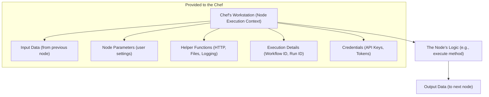
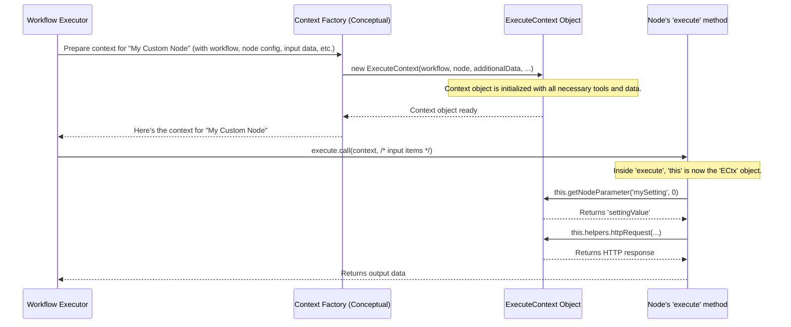

# Chapter 5: Node Execution Context

Welcome back! In [Chapter 4: Workflow Lifecycle and Activation](04_workflow_lifecycle_and_activation_.md), we saw how n8n brings your workflows to life, activating them to listen for triggers or run on schedule. Now, imagine one of your workflow nodes, say an "HTTP Request" node, is about to run. What information does it need? How does it access its settings or the data from the previous node? This is where the **Node Execution Context** comes in.

## Your Node's Personal Assistant and Toolkit

Think of a node in your workflow as a chef in a busy kitchen. When it's their turn to cook a dish (perform their task), they don't just get a vague instruction. They get a fully prepared workstation. This workstation is the **Node Execution Context**.

It's the operational environment provided to each node when it runs. It bundles all necessary data, helper functions, and contextual information that a node needs.



The **Node Execution Context** solves a crucial problem: **How does a node get everything it needs to do its job in a structured and convenient way?** Instead of the node having to search everywhere for information, n8n packages it all up and hands it over. This makes writing node logic much cleaner and more organized.

## What's on the "Workstation"? Key Components

When a node's `execute` method (or `trigger`, `poll`, `webhook` method for specialized nodes) is called, the `this` keyword inside that method refers to its Node Execution Context. This "context" object is packed with useful things:

1.  **Input Data (`this.getInputData()`):**
    *   **The Ingredients:** This is the data passed from the previous node(s) in the workflow. If your "HTTP Request" node comes after a "Read Sheet" node, the rows from the sheet would be part of this input data.
    *   Nodes typically process this data item by item.

2.  **Node Parameters (`this.getNodeParameter()`):**
    *   **The Recipe Details:** These are the settings you configured for the node in the n8n editor. For an "HTTP Request" node, this would include the URL, HTTP method (GET, POST), headers, body, etc.
    *   The node uses these parameters to customize its behavior for each specific item it processes.

3.  **Helper Functions (`this.helpers`):**
    *   **Specialized Kitchen Tools:** The context provides a collection of utility functions. Need to make an HTTP request? There's `this.helpers.httpRequest()`. Need to work with files? There are binary data helpers.
    *   These save node developers from reinventing the wheel for common tasks.

4.  **Credentials (`this.getCredentials()`):**
    *   **Access Badges to Secured Areas:** If your node needs to talk to a service that requires authentication (like Google API, Slack API), it can request the necessary credentials (API keys, OAuth2 tokens) using this method. These credentials are securely fetched as explained in [Chapter 3: Credential Management](03_credential_management_.md).

5.  **Execution Details & Workflow Info:**
    *   **The Order Ticket & Kitchen Info:** The context knows about the current execution:
        *   `this.getExecutionId()`: The unique ID of the current workflow run.
        *   `this.getWorkflow().id`: The ID of the workflow itself.
        *   `this.getMode()`: Whether the workflow is running in 'manual' (test) or 'production' mode.
        *   `this.logger`: For logging messages.
        *   `this.sendMessageToUI()`: For sending messages to the UI during manual test runs.

Different types of nodes (e.g., regular, trigger, webhook) receive slightly varied contexts tailored to their roles. For example:
*   **Trigger nodes** (using `TriggerContext` or `PollContext`) have an `emit()` function to send data into the workflow and start an execution.
*   **Webhook nodes** (using `WebhookContext`) have special methods like `this.getBodyData()` or `this.getHeaderData()` to access details of an incoming HTTP request.

For most regular nodes that transform data, they will be working with an `ExecuteContext`.

## Using the Context: A Simple Example

Let's imagine you're writing the `execute` method for a very simple custom node that takes a name as input, appends a greeting from its parameters, and logs it.

```typescript
// Inside your custom node's .node.ts file (simplified)
import { IExecuteFunctions, INodeExecutionData } from 'n8n-workflow';

export async function execute(this: IExecuteFunctions): Promise<INodeExecutionData[][]> {
  const items = this.getInputData(); // Get all input items
  const returnData: INodeExecutionData[] = [];

  for (let itemIndex = 0; itemIndex < items.length; itemIndex++) {
    // 1. Get a parameter value for the current item
    const greeting = this.getNodeParameter('greetingMessage', itemIndex, 'Hello') as string;

    // 2. Access data from the input item
    const name = items[itemIndex].json.name as string;

    const fullMessage = `${greeting}, ${name}!`;

    // 3. Log a message (visible in backend logs, or UI for test runs)
    this.logger.info(`Processed: ${fullMessage}`);
    if (this.getMode() === 'manual') {
      this.sendMessageToUI(`Console Log: Processed ${fullMessage}`);
    }

    // 4. Prepare output data
    returnData.push({ json: { message: fullMessage } });
  }
  return [returnData]; // Return data for the next node
}
```

**What's happening here?**
1.  `this.getNodeParameter('greetingMessage', itemIndex, 'Hello')`: Retrieves the value of a node parameter named "greetingMessage". `itemIndex` is used because parameters can be expressions that resolve differently for each item. If not found, it defaults to "Hello".
2.  `items[itemIndex].json.name`: Accesses a field named `name` from the JSON data of the current input item.
3.  `this.logger.info(...)` and `this.sendMessageToUI(...)`: Uses built-in logging capabilities.
4.  The node prepares its output, which will become the input for the next node.

This `this` object, packed with these methods and properties, is the Node Execution Context.

## How is the Context Prepared? Under the Hood

When n8n's execution engine decides it's time to run a node:

1.  **Gathering Information:** The engine collects all necessary pieces:
    *   The `Workflow` object (the blueprint we saw in [Chapter 2: Workflow Graph Representation (DirectedGraph)](02_workflow_graph_representation__directedgraph__.md)).
    *   The specific `INode` object (the configuration of the node being executed).
    *   `additionalData`: A crucial object containing execution-wide details like the `executionId`, helper for [Credential Management](03_credential_management_.md), API URLs, etc.
    *   `mode`: 'manual' or 'production'.
    *   `runExecutionData`: Data about the current state of the execution for all nodes.
    *   Input data from connected nodes.

2.  **Creating the Context Instance:** n8n then creates an instance of a specific context class. For a regular node's `execute` method, this is usually `ExecuteContext`.
    *   `ExecuteContext` inherits from `BaseExecuteContext`, which itself inherits from `NodeExecutionContext`. These base classes provide common functionalities.

3.  **Passing to the Node:** This newly created context object is then supplied as `this` when the node's `execute` method (or `trigger`, `poll`, etc.) is called.

Let's visualize this:


### A Peek at the Code

The foundation for all contexts is `NodeExecutionContext`.

File: `src/execution-engine/node-execution-context/node-execution-context.ts`
```typescript
// Simplified for clarity
export abstract class NodeExecutionContext {
	constructor(
		readonly workflow: Workflow,
		readonly node: INode,
		readonly additionalData: IWorkflowExecuteAdditionalData, // Holds executionId, credentialsHelper, etc.
		readonly mode: WorkflowExecuteMode,
		// ... other common parameters ...
	) {}

	// Example: Get a node parameter (simplified logic)
	protected _getNodeParameter(
		parameterName: string,
		itemIndex: number,
		fallbackValue?: any,
		// ... options ...
	): NodeParameterValueType | object {
		const value = get(this.node.parameters, parameterName, fallbackValue);
		// In reality, expressions are resolved here using this.workflow.expression.getParameterValue(...)
		// ...
		return value; // Simplified: returns raw or resolved value
	}

	// Example: Get credentials (simplified logic)
	protected async _getCredentials<T extends object = ICredentialDataDecryptedObject>(
		type: string, /* ... other params ... */
	): Promise<T> {
		// Uses this.additionalData.credentialsHelper.getDecrypted(...)
		// ... (error handling and checks as seen in Chapter 3) ...
		const creds = await this.additionalData.credentialsHelper.getDecrypted(/*...*/);
		return creds as T;
	}

	getExecutionId() {
		return this.additionalData.executionId!;
	}
	// ... many other useful methods like getWorkflow(), getTimezone(), logger ...
}
```
This base class stores common data like the `workflow`, `node`, and `additionalData`. It provides the core logic for methods like `_getNodeParameter` and `_getCredentials`.

Then, more specific contexts like `ExecuteContext` extend this and add more specialized functionalities.

File: `src/execution-engine/node-execution-context/execute-context.ts`
```typescript
// Simplified for clarity
import { BaseExecuteContext } from './base-execute-context'; // Extends NodeExecutionContext
import { getRequestHelperFunctions } from './utils/request-helper-functions';
import { getBinaryHelperFunctions } from './utils/binary-helper-functions';
// ... other helper imports ...

export class ExecuteContext extends BaseExecuteContext implements IExecuteFunctions {
	readonly helpers: IExecuteFunctions['helpers']; // Collection of utility functions
	// ...

	constructor(
		workflow: Workflow,
		node: INode,
		additionalData: IWorkflowExecuteAdditionalData,
		// ... other parameters like inputData, executeData ...
	) {
		super(/* pass parameters to BaseExecuteContext */);

		// Bundle various helper functions into `this.helpers`
		this.helpers = {
			// ...
			...getRequestHelperFunctions(/* ... */),      // For HTTP requests
			...getBinaryHelperFunctions(/* ... */),      // For file handling
			// ... other helpers like returnJsonArray, copyInputItems ...
		};
		// ...
	}

	// Example: Get input data for the current node
	getInputData(inputIndex = 0, connectionType = NodeConnectionType.Main) {
		// Accesses pre-processed input data specific to this node's execution
		return super.getInputItems(inputIndex, connectionType) ?? [];
	}
	// ... other methods specific to regular node execution ...
}
```
The `ExecuteContext` constructor, for example, initializes the `this.helpers` object by calling functions like `getRequestHelperFunctions`. These functions (often found in the `utils` subdirectory) return an object containing the actual helper methods (e.g., `httpRequest`, `prepareBinaryData`). This makes these tools readily available to the node via `this.helpers.toolName()`.

Other context types like `TriggerContext`, `PollContext`, and `WebhookContext` (found in files like `trigger-context.ts`, `poll-context.ts`, `webhook-context.ts`) follow a similar pattern. They extend `NodeExecutionContext` (or `BaseExecuteContext`) and add methods or properties specific to their needs:
*   `TriggerContext`: Adds an `emit()` method.
*   `PollContext`: Similar to `TriggerContext` but for scheduled polling, also has `emit()`.
*   `WebhookContext`: Provides `getBodyData()`, `getHeaderData()`, `getResponseObject()`, etc.

This structured approach ensures that no matter what kind of node it is, it gets a "workstation" (a context) perfectly equipped for its specific job.

## Conclusion

You've now learned about the Node Execution Context, the vital "personal assistant and toolkit" for every node in n8n. You've seen:
*   Why it's essential: It provides a node with everything it needs (input data, parameters, helpers, credentials, execution info) in one place.
*   The key components available on the "workstation" (like `getInputData`, `getNodeParameter`, `helpers`, `getCredentials`).
*   How a node uses its context (via `this`) within its `execute` method.
*   A glimpse into how n8n prepares and provides these contexts, with base classes like `NodeExecutionContext` and specific ones like `ExecuteContext`.
*   That different node types (regular, trigger, webhook) get specialized contexts.

This context is the bridge between the n8n core engine and the individual logic of each node, enabling powerful and modular automation. One common type of data nodes often deal with is files, or "binary data." How does n8n manage these?

Next, we'll explore how n8n handles files and other non-JSON data in [Chapter 6: Binary Data Management](06_binary_data_management_.md).

---

Generated by [AI Codebase Knowledge Builder](https://github.com/The-Pocket/Tutorial-Codebase-Knowledge)