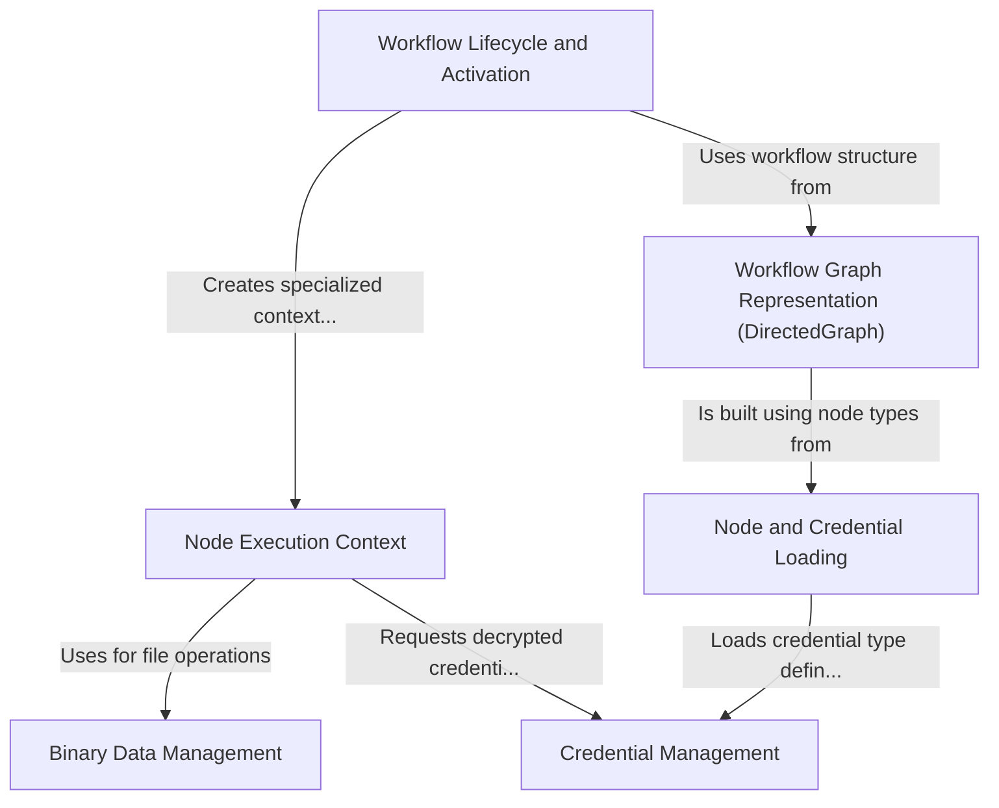

# Tutorial: core

n8n core is the engine behind a **workflow automation tool**. It allows users to *visually connect different applications and services* (called nodes) to create automated sequences of tasks. The core handles everything from loading these nodes and their credential types, managing credentials securely, to executing the workflows and handling the data that flows through them, including binary files. It represents workflows as graphs and manages their active state, especially for triggers and scheduled tasks.

**Source Repository:** [None](None)

## Chapters

1. [Node and Credential Loading
](01_node_and_credential_loading_.md)
2. [Workflow Graph Representation (DirectedGraph)
](02_workflow_graph_representation__directedgraph__.md)
3. [Credential Management
](03_credential_management_.md)
4. [Workflow Lifecycle and Activation
](04_workflow_lifecycle_and_activation_.md)
5. [Node Execution Context
](05_node_execution_context_.md)
6. [Binary Data Management
](06_binary_data_management_.md)

---

Generated by [AI Codebase Knowledge Builder](https://github.com/The-Pocket/Tutorial-Codebase-Knowledge)