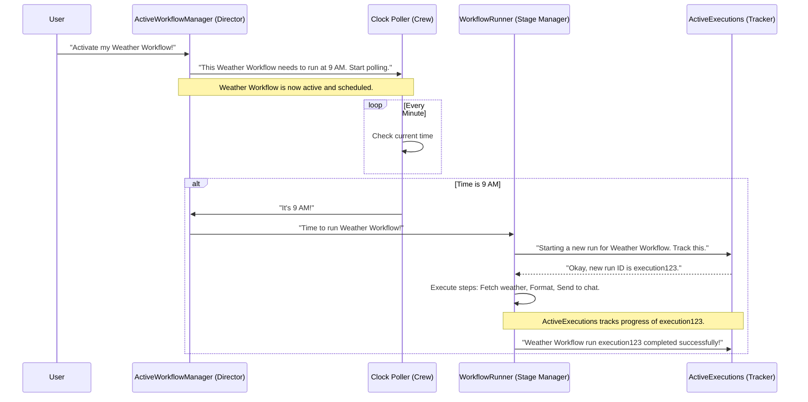

# Chapter 1: Workflow Lifecycle Management

Welcome to the `packages` project! If you're looking to understand how our automation platform works under the hood, you're in the right place. This first chapter dives into a core concept: **Workflow Lifecycle Management**.

Imagine you've built a helpful automation: every morning at 9 AM, it fetches the day's weather forecast and sends a summary to your favorite chat application.
*   How does the system know to run this *specific* automation?
*   How does it remember to run it *every morning*?
*   What happens *when* it runs?
*   And how does it keep track of whether the weather report was sent successfully or if something went wrong?

Workflow Lifecycle Management is the system that answers all these questions. It's like the director and stage crew for a theatrical play, ensuring everything runs smoothly from script to performance.

## The Cast of Characters (Key Concepts)

Let's meet the main components involved in managing a workflow's life:

1.  **`Workflow` (The Script)**:
    *   This is your automation blueprint. In our weather example, the `Workflow` defines the trigger ("Every morning at 9 AM") and the sequence of actions (fetch weather, format, send to chat).
    *   Technically, this is defined in the `n8n-workflow` package and represented as a `WorkflowEntity` when stored in the [database](05_database_interaction_.md). Each step in your workflow is a [Node](02_node_and_credential_system_.md).

2.  **`ActiveWorkflowManager` (The Director)**:
    *   This component is like the play's director. It decides which workflows (plays) are currently "active" and ready to be performed.
    *   When you activate your weather workflow, `ActiveWorkflowManager` recognizes its schedule. It then sets up the necessary "pollers" (think of them as crew members who constantly check the clock) or "triggers" (like a webhook listener waiting for an external signal).

3.  **`WorkflowRunner` (The Stage Manager)**:
    *   When it's time for an active workflow to start (e.g., it's 9 AM for our weather workflow, or a webhook gets called), `ActiveWorkflowManager` signals `WorkflowRunner`.
    *   `WorkflowRunner` is the stage manager who then initiates a *new performance* (a specific run or "execution") of that workflow script.

4.  **`ActiveExecutions` (The Performance Tracker)**:
    *   Once `WorkflowRunner` starts a workflow, `ActiveExecutions` keeps track of this specific, ongoing performance. It knows if the weather report workflow is currently fetching data, sending the message, or if it has finished. Each run gets a unique ID.

5.  **`WorkflowExecutionService` (The Special Assistant)**:
    *   This service helps in special scenarios. For example:
        *   If your weather workflow encounters an error (maybe the weather API is down), `WorkflowExecutionService` can help run a designated "error workflow."
        *   When you manually test a workflow from the user interface, this service is involved.

Let's see how they work together with our weather report example:



## Activating a Workflow: The Director's Role (`ActiveWorkflowManager`)

When you build a workflow and set it to "active," `ActiveWorkflowManager` takes over. Its main job is to look at the workflow's trigger nodes and prepare them.

Let's peek at a simplified version of how `ActiveWorkflowManager` might add a workflow:

```typescript
// Simplified from cli/src/active-workflow-manager.ts

// class ActiveWorkflowManager
async add(workflowId: string, activationMode: string, /* ... other params ... */) {
    // 1. Load the workflow's blueprint (WorkflowEntity) from the database
    const dbWorkflow = await this.workflowRepository.findById(workflowId);
    if (!dbWorkflow) { /* ... handle error: workflow not found ... */ }

    // 2. Create a Workflow object from the blueprint
    const workflow = new Workflow({
        id: dbWorkflow.id,
        name: dbWorkflow.name,
        nodes: dbWorkflow.nodes, // The actual steps (nodes)
        // ... other properties
        nodeTypes: this.nodeTypes, // Info about available node types
    });

    // 3. Check if it *can* be activated (e.g., has a trigger)
    const canBeActivated = this.checkIfWorkflowCanBeActivated(workflow, /* ... */);
    if (!canBeActivated) {
        throw new Error(`Workflow ${workflow.name} has no trigger node!`);
    }

    // 4. If it has webhooks, register them
    if (this.shouldAddWebhooks(activationMode)) {
        await this.addWebhooks(workflow, /* ... additional data ... */);
    }

    // 5. If it has other triggers (like schedules) or pollers, start them
    if (this.shouldAddTriggersAndPollers()) {
        await this.addTriggersAndPollers(dbWorkflow, workflow, /* ... */);
    }

    this.logger.info(`Workflow ${workflow.name} is now active!`);
    return true;
}
```

*   **Step 1 & 2**: It fetches your workflow's design from the [database](05_database_interaction_.md) (where `WorkflowEntity` is stored) and creates an in-memory `Workflow` object.
*   **Step 3**: It checks if the workflow actually has a starting point (a trigger [node](02_node_and_credential_system_.md)).
*   **Step 4 & 5**: Based on the trigger type, it either sets up webhook listeners (`addWebhooks`) or starts pollers/other triggers (`addTriggersAndPollers`). For our weather workflow, `addTriggersAndPollers` would be relevant to handle the schedule.

The `checkIfWorkflowCanBeActivated` method is crucial:

```typescript
// Simplified from cli/src/active-workflow-manager.ts

// class ActiveWorkflowManager
checkIfWorkflowCanBeActivated(workflow: Workflow, /* ... */): boolean {
    for (const nodeName of Object.keys(workflow.nodes)) {
        const node = workflow.nodes[nodeName];
        if (node.disabled === true) continue; // Skip disabled nodes

        const nodeType = this.nodeTypes.getByNameAndVersion(node.type, node.typeVersion);
        if (!nodeType) continue; // Unknown node type

        // Does this node type define a trigger, poller, or webhook?
        if (nodeType.poll || nodeType.trigger || nodeType.webhook) {
            return true; // Found a starting point!
        }
    }
    return false; // No trigger found
}
```
This ensures that only workflows with a valid starting mechanism (like a schedule, webhook, etc.) can be made active.

## Showtime! Running the Workflow (`WorkflowRunner`)

When a trigger condition is met (9 AM for the weather workflow, or an incoming request for a webhook-triggered workflow), it's time for `WorkflowRunner` to shine.

`WorkflowRunner` is responsible for taking the `Workflow` blueprint and actually executing its steps with the given input data.

Here's a conceptual look at how `WorkflowRunner.run()` initiates an execution:

```typescript
// Simplified from cli/src/workflow-runner.ts

// class WorkflowRunner
async run(
    workflowExecutionData: IWorkflowExecutionDataProcess, // Contains workflow blueprint and input data
    /* ... other params ... */
): Promise<string> { // Returns the unique ID for this run

    // 1. Tell ActiveExecutions to start tracking this new run
    const executionId = await this.activeExecutions.add(
        workflowExecutionData,
        /* existing executionId if restarting */
    );

    // ... (permission checks and other preparations) ...

    // 2. Decide how to run it (simplified)
    // In a distributed setup, this might be enqueued for a worker process.
    // Otherwise, it runs in the current main process.
    if (this.executionsMode === 'queue' && workflowExecutionData.executionMode !== 'manual') {
        await this.enqueueExecution(executionId, workflowExecutionData, /* ... */);
    } else {
        // This will create a WorkflowExecute instance and start processing nodes
        await this.runMainProcess(executionId, workflowExecutionData, /* ... */);
    }

    this.logger.info(`Execution ${executionId} for workflow ${workflowExecutionData.workflowData.name} has started.`);
    return executionId;
}
```

*   **Step 1**: Crucially, it calls `this.activeExecutions.add()`. This registers the new performance and gets a unique `executionId`.
*   **Step 2**: It then proceeds to actually run the workflow, either by sending it to a queue (for scaling) or running it directly in the main process. The `runMainProcess` method (not shown in full detail here for brevity) is where the `WorkflowExecute` class (from `n8n-core`) gets instantiated to step through the workflow's [nodes](02_node_and_credential_system_.md).

## Keeping Tabs: `ActiveExecutions`

`ActiveExecutions` is the memory for all currently running (or recently completed) workflow instances *within the current process*.

When `WorkflowRunner` calls `activeExecutions.add()`:

```typescript
// Simplified from cli/src/active-executions.ts

// class ActiveExecutions
async add(
    executionDataToProcess: IWorkflowExecutionDataProcess,
    existingExecutionId?: string
): Promise<string> {
    let executionId = existingExecutionId;

    if (executionId === undefined) {
        // This is a brand-new execution
        const createPayload: CreateExecutionPayload = {
            // ... data from executionDataToProcess ...
            workflowId: executionDataToProcess.workflowData.id,
            status: 'new', // Initial status
            // ...
        };
        // Save this new execution record to the database
        executionId = await this.executionRepository.createNewExecution(createPayload);
    } else {
        // This is resuming an existing execution (e.g., after a 'wait' node)
        // ... update existing execution in database ...
    }

    // Store details about this running execution in memory
    const executingWorkflow: IExecutingWorkflowData = {
        executionData: executionDataToProcess,
        startedAt: new Date(),
        postExecutePromise: createDeferredPromise<IRun | undefined>(), // A promise that resolves/rejects when done
        status: 'running', // Update status
        // ... other tracking properties ...
    };
    this.activeExecutions[executionId!] = executingWorkflow;

    // ... (logic to clean up this.activeExecutions[executionId] when the promise settles)

    this.logger.debug(`Execution ${executionId} added to active tracking.`);
    return executionId!;
}
```

*   It first ensures there's a record in the [database](05_database_interaction_.md) for this execution (creating one if it's new).
*   Then, it stores information about this specific run (like its start time, current status, and promises that will signal its completion) in an in-memory object (`this.activeExecutions`), keyed by the `executionId`.
*   This allows the system to query the status of active runs, stop them if needed (`stopExecution`), and know when they are finalized (`finalizeExecution`).

## The Special Assistant: `WorkflowExecutionService`

The `WorkflowExecutionService` often acts as an intermediary or a handler for specific execution scenarios. For example, it's used when a workflow needs to be run from another part of the system, like triggering an error workflow or a manual test run.

A key method here is `runWorkflow`:

```typescript
// Simplified from cli/src/workflows/workflow-execution.service.ts

// class WorkflowExecutionService
async runWorkflow(
    workflowData: IWorkflowBase, // The workflow blueprint
    triggerNode: INode,           // The node that started this (e.g., Schedule trigger)
    inputData: INodeExecutionData[][], // Data for the trigger node
    additionalData: IWorkflowExecuteAdditionalData, // Context like userId
    mode: WorkflowExecuteMode, // How it's being run (e.g., 'trigger', 'manual')
    // ...
) {
    // 1. Prepare the initial execution data structure
    const nodeExecutionStack: IExecuteData[] = [{
        node: triggerNode,
        data: { main: inputData },
        // ...
    }];
    const executionData: IRunExecutionData = { /* ... initial structure ... */ };
    // ...

    // 2. Package everything up for the WorkflowRunner
    const runData: IWorkflowExecutionDataProcess = {
        userId: additionalData.userId,
        executionMode: mode,
        executionData,
        workflowData, // The blueprint
    };

    // 3. Delegate to WorkflowRunner to actually run it
    return await this.workflowRunner.run(runData, /* ... other options ... */);
}
```
This method essentially prepares all the necessary information and then calls `this.workflowRunner.run()` to kick off the actual execution, similar to what we saw earlier. This makes `WorkflowExecutionService` a convenient way to start workflows programmatically.

## Conclusion

And that's the core of Workflow Lifecycle Management! We've seen:
*   A **`Workflow`** is the script.
*   **`ActiveWorkflowManager`** is the director, deciding which scripts are active and preparing their triggers.
*   **`WorkflowRunner`** is the stage manager, initiating a new performance when a trigger fires.
*   **`ActiveExecutions`** tracks these ongoing performances.
*   **`WorkflowExecutionService`** assists in special execution cases.

Together, these components ensure that your automations are managed, triggered, executed, and tracked correctly. They are the backbone that allows the `packages` project to bring your automated tasks to life.

In the next chapter, we'll zoom into the "actors" and "props" of our plays: the [Node and Credential System](02_node_and_credential_system_.md).

---

Generated by [AI Codebase Knowledge Builder](https://github.com/The-Pocket/Tutorial-Codebase-Knowledge)