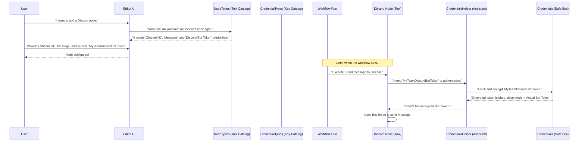
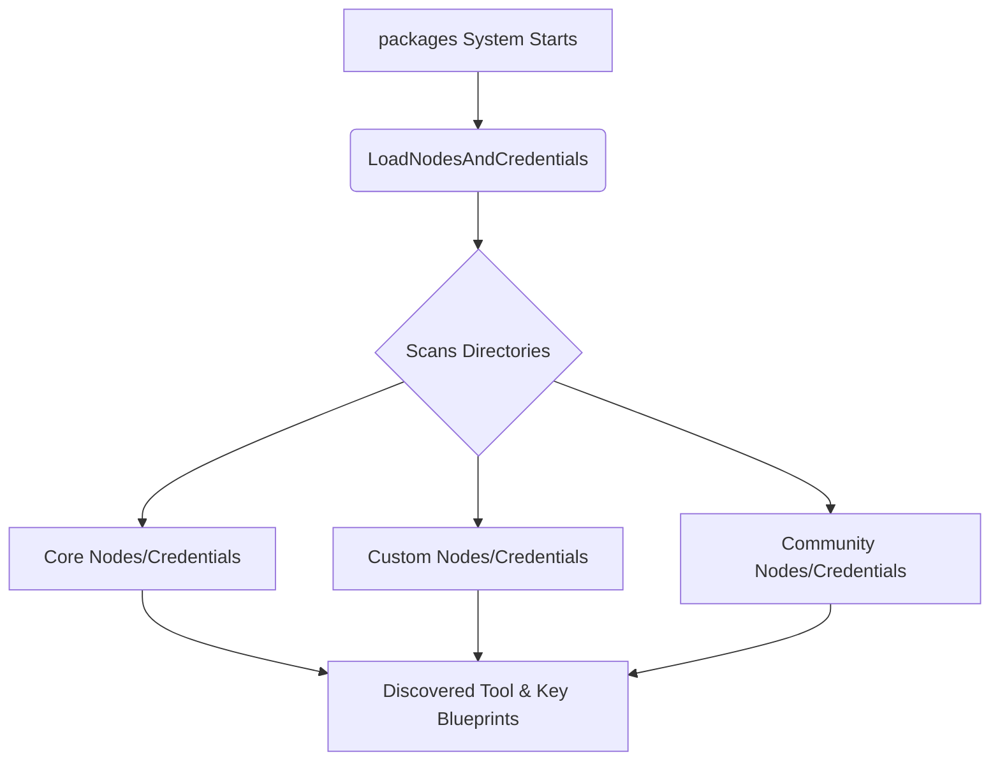
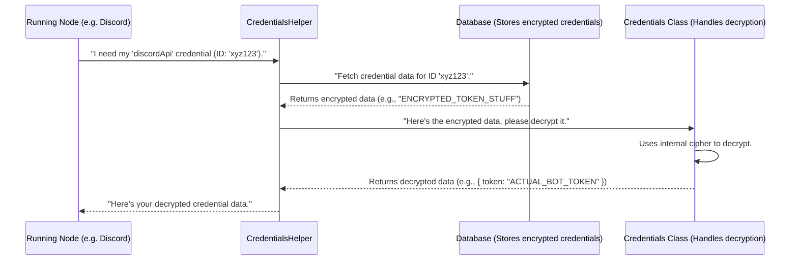

# Chapter 2: Node and Credential System

In the [previous chapter on Workflow Lifecycle Management](01_workflow_lifecycle_management_.md), we learned how workflows are brought to life, scheduled, and executed. We saw that a workflow is made up of "nodes" which are the actual steps of your automation. Now, let's dive deeper into what these nodes are and how they can securely interact with other services.

Imagine you want to build a workflow that automatically posts a "Good Morning!" message to your team's private Discord channel every day. To do this, your workflow needs:
1.  A specialized "tool" that knows how to talk to Discord.
2.  A "key" or password (like a Discord Bot Token) to prove to Discord that your workflow is allowed to post messages.

This is where the **Node and Credential System** comes in. It's like a versatile toolbox with specialized tools, where some tools require specific keys to operate or to access secured areas.

## The Big Picture: Tools and Keys

At its heart, this system is about two main things:

*   **Nodes (The Tools)**: These are the individual building blocks of your workflows. Each node performs a specific task. For example:
    *   A "Read File" node reads content from a file.
    *   An "HTTP Request" node sends data to a web address.
    *   A "Discord" node can send messages to a Discord server.
    *   A "Google Sheets" node can read or write data to a spreadsheet.

*   **Credentials (The Keys)**: Many online services (like Discord, Google Sheets, Twitter, etc.) require you to prove your identity before you can use them. Credentials are how you store these sensitive pieces of information (like API keys, usernames and passwords, or access tokens) securely. Your nodes can then use these credentials to authenticate with external services.

Our Discord example needs a "Discord node" (the tool) and "Discord credentials" (the key, which would be a Bot Token).

## Meet the Team (Key Components)

Several components work together to manage these tools and keys:

1.  **`LoadNodesAndCredentials` (The Quartermaster)**:
    *   **Analogy**: Think of a quartermaster in an army. Their job is to go out and find all the available equipment (tools/nodes) and special keys (credentials) from various supply depots.
    *   **Role**: This component is responsible for discovering all available node types (like "Discord", "HTTP Request") and credential types (like "Discord API Token", "Generic API Key") from different sources. These sources include:
        *   **Core**: Nodes and credentials that come built-in with `packages`.
        *   **Custom**: Nodes and credentials you or your team might have developed specifically.
        *   **Community**: Nodes and credentials shared by the wider user community.

2.  **`NodeTypes` (The Tool Catalog)**:
    *   **Analogy**: After the quartermaster gathers all the tools, `NodeTypes` is like a detailed catalog or inventory list of every single tool.
    *   **Role**: It provides a comprehensive list of all discovered node types. For each node type, it details:
        *   What the node does (e.g., "Sends a message to Discord").
        *   What parameters it needs to function (e.g., for a Discord node: "Channel ID", "Message Content").
        *   If it requires any specific type of key (credentials).

3.  **`CredentialTypes` (The Key Catalog)**:
    *   **Analogy**: Similar to the tool catalog, this is a catalog specifically for all the *types* of keys that can be used.
    *   **Role**: It lists all available credential types (e.g., "Discord Bot Token", "OAuth2 API Credential"). This helps the system understand what kind of information a specific key needs (e.g., a Discord Bot Token needs a field for the "token string").

4.  **`CredentialsHelper` (The Key Assistant)**:
    *   **Analogy**: When a soldier needs a key to open a locked gate, the Key Assistant helps them find the *correct* specific key from the keychain and use it properly.
    *   **Role**: When a node needs to perform an action that requires authentication (like posting to Discord), `CredentialsHelper` assists the node. It helps fetch the actual secret data for the chosen credential (e.g., "MyTeamDiscordBotToken") securely. It handles things like fetching the encrypted secret and preparing it for the node.

5.  **`Credentials` (The Secure Safe Box)**:
    *   **Analogy**: The actual keys are stored in a very secure safe box. Only authorized personnel can access it, and the keys themselves might be in a special code only the safe box understands.
    *   **Role**: This class is responsible for the heavy lifting of security. It handles the **encryption** (scrambling sensitive data like API keys so they are not stored in plain text) and **decryption** (unscrambling them when a node legitimately needs to use them). This ensures your secret keys are kept safe, typically in the [database](05_database_interaction_.md).

Let's see how these work together using our Discord message example.



## A Peek Under the Hood

Let's briefly look at what happens internally.

### 1. Discovering Tools and Keys (`LoadNodesAndCredentials`)

When `packages` starts up, `LoadNodesAndCredentials` scans various locations to find all available node and credential type definitions.



A simplified idea of what `LoadNodesAndCredentials` does during its `init` process:

```typescript
// Simplified concept from cli/src/load-nodes-and-credentials.ts
class LoadNodesAndCredentials {
    // known.nodes will store info like: { 'n8n-nodes-base.Discord': { sourcePath: '...', className: 'Discord' } }
    // known.credentials will store: { 'discordApi': { sourcePath: '...', className: 'DiscordApi' } }
    known = { nodes: {}, credentials: {} };

    async init() {
        // 1. Scan built-in 'n8n-nodes-base' package
        await this.scanPackageForNodesAndCredentials("path/to/n8n-nodes-base");

        // 2. Scan other locations (custom, community)
        await this.scanPackageForNodesAndCredentials("path/to/custom-nodes");
        // ... and so on ...

        console.log("Discovery complete! All node and credential blueprints found.");
    }

    async scanPackageForNodesAndCredentials(packagePath: string) {
        // ... (logic to find node and credential files within packagePath) ...
        // For each found node file:
        //   this.known.nodes['packageName.NodeType'] = { sourcePath: '...', className: '...' };
        // For each found credential file:
        //   this.known.credentials['credentialName'] = { sourcePath: '...', className: '...' };
    }
}
```
This `LoadNodesAndCredentials` component (from `cli/src/load-nodes-and-credentials.ts`) essentially builds up an internal map (`this.known`) of where to find the code for each node and credential type.

### 2. Understanding a Tool (`NodeTypes`)

Once `LoadNodesAndCredentials` has found everything, `NodeTypes` acts as the query interface for node information. When you add a "Discord" node in the UI, the system internally asks `NodeTypes` for its details.

```typescript
// Simplified concept from cli/src/node-types.ts
class NodeTypes {
    constructor(private loader: LoadNodesAndCredentials) {}

    getByNameAndVersion(nodeTypeName: string, version?: number) {
        // 1. Ask the loader to get the actual code for this node type
        const nodeCode = this.loader.getNode(nodeTypeName); // e.g., 'n8n-nodes-base.Discord'

        // 2. Get specific version details if versioned
        const specificNodeVersion = NodeHelpers.getVersionedNodeType(nodeCode.type, version);

        // Returns an object with 'description' (name, properties, etc.)
        // and the 'execute' method for the node.
        return specificNodeVersion;
    }
}
```
`NodeTypes` (from `cli/src/node-types.ts`) uses `LoadNodesAndCredentials` to fetch the actual node implementation and then provides its description (like parameters, icon, etc.) and executable methods.

### 3. Understanding Key Types (`CredentialTypes`)

Similarly, `CredentialTypes` provides information about the different kinds of keys (credentials) available.

```typescript
// Simplified concept from cli/src/credential-types.ts
class CredentialTypes {
    constructor(private loader: LoadNodesAndCredentials) {}

    getByName(credentialTypeName: string) { // e.g., "discordApi"
        // 1. Ask the loader to get the code for this credential type
        const credentialCode = this.loader.getCredential(credentialTypeName);

        // Returns an object with 'name', 'properties' (fields the key needs),
        // and 'authenticate' method (if it has special auth logic).
        return credentialCode.type;
    }
}
```
`CredentialTypes` (from `cli/src/credential-types.ts`) helps the system understand what fields a credential like "Discord Bot Token" needs (e.g., a "token" field).

### 4. Using a Key Securely (`CredentialsHelper` and `Credentials`)

This is where the actual secrets are handled during a workflow run.

1.  A node (e.g., Discord node) needs its credentials.
2.  It asks `CredentialsHelper` for the decrypted data.
3.  `CredentialsHelper` first fetches the *specific stored credential* (e.g., "MyTeamDiscordBotToken" which is of type "discordApi") from the [database](05_database_interaction_.md). This data is encrypted.
4.  It then uses the `Credentials` class to decrypt this data.
5.  The decrypted, actual secret (the bot token string) is returned to the node.



Here's a highly simplified idea of `CredentialsHelper` getting the data:

```typescript
// Simplified from cli/src/credentials-helper.ts
class CredentialsHelper {
    async getDecrypted(
        nodeCredentialsDetails: { id: string; name: string }, // e.g., { id: 'xyz123', name: 'MyDiscordBot' }
        credentialTypeName: string, // e.g., "discordApi"
    ): Promise<object> { // Returns the actual secret data
        // 1. Fetch the specific credential entry (which contains encrypted data)
        // This would typically involve a database call using credentialsRepository
        const encryptedCredentialRecord = await this.credentialsRepository.findById(nodeCredentialsDetails.id);
        const encryptedDataString = encryptedCredentialRecord.data; // This is encrypted!

        // 2. Create a Credentials object to handle decryption
        const creds = new Credentials({ id: 'xyz123', name: 'MyDiscordBot' }, credentialTypeName, encryptedDataString);

        // 3. Get the decrypted data
        const decryptedDataObject = creds.getData(); // Calls the Credentials class's decrypt logic
        return decryptedDataObject; // e.g., { "token": "ACTUAL_SECRET_TOKEN_HERE" }
    }
}
```
And the `Credentials` class (from `core/src/credentials.ts`) itself handles the decryption:

```typescript
// Simplified from core/src/credentials.ts
class Credentials {
    encryptedDataBlob: string; // Stores the secret data, but encrypted
    // ... (other properties like id, name, type)

    constructor(details: any, type: string, encryptedData: string) {
        this.encryptedDataBlob = encryptedData;
        // ...
    }

    getData(): object { // Decrypts and returns the actual secret
        // Uses an internal 'cipher' to decrypt this.encryptedDataBlob
        const decryptedJsonString = this.cipher.decrypt(this.encryptedDataBlob);

        // Parses the JSON string back into an object
        return JSON.parse(decryptedJsonString); // e.g., { "token": "ACTUAL_SECRET_TOKEN_HERE" }
    }
}
```
The `CredentialsEntity` (from `cli/src/databases/entities/credentials-entity.ts`) defines how this encrypted data is stored in the [database](05_database_interaction_.md).

Together, these components ensure that:
*   `packages` knows about all available "tools" (nodes) and "key types" (credential types).
*   Workflows can be built using these tools.
*   When a tool needs a key, the system can securely fetch and provide the *actual* secret key data at runtime without exposing it unnecessarily.

## Conclusion

You've now learned about the Node and Credential System, the backbone that provides the "tools" (nodes) for your automations and the "keys" (credentials) to securely interact with other services. We've seen:

*   How **`LoadNodesAndCredentials`** discovers all tools and key types.
*   How **`NodeTypes`** and **`CredentialTypes`** act as catalogs for them.
*   How **`CredentialsHelper`** and the **`Credentials`** class work together to provide nodes with the secret data they need, securely and just in time.

This system allows `packages` to be extensible (new nodes and credential types can be added) and secure (sensitive data is encrypted).

In the next chapter, we'll look at the [Server Framework](03_server_framework_.md), which is responsible for handling incoming web requests, routing them, and providing the overall structure for the `packages` application to run.

---

Generated by [AI Codebase Knowledge Builder](https://github.com/The-Pocket/Tutorial-Codebase-Knowledge)