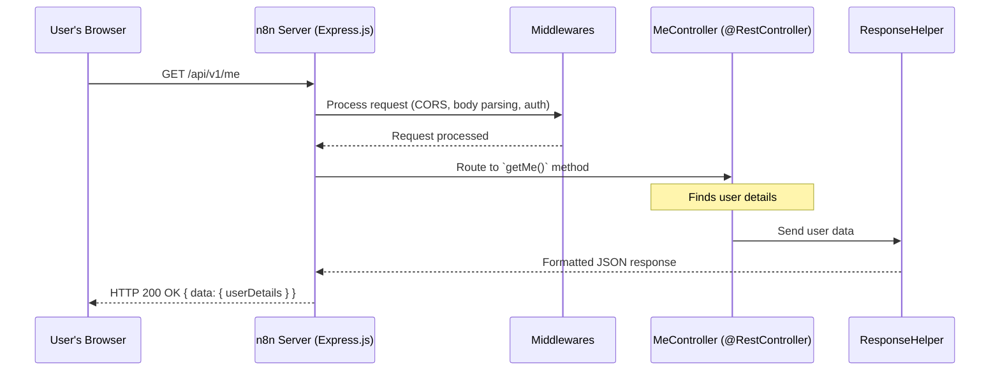

# Chapter 3: Server Framework

In the [previous chapter on the Node and Credential System](02_node_and_credential_system_.md), we explored how n8n manages its "tools" (nodes) and "keys" (credentials). Now, imagine n8n as a large, busy office building. How do requests from the outside world (like a user trying to log in, or a webhook signal arriving) find their way to the right department and get a proper response? This is where the **Server Framework** comes in.

Think of the Server Framework as the main reception, security, and internal routing system of this n8n building. It's responsible for:
*   **Receiving visitors (incoming HTTP requests):** When someone or something tries to communicate with n8n over the internet.
*   **Guiding them to the correct department (routing):** Making sure the request reaches the specific part of n8n's code that knows how to handle it.
*   **Ensuring smooth interactions (common functionalities):** Handling things like security checks, understanding the request's language (parsing data), and making sure everyone gets a standardized reply.

Let's say you, as a user, click a button in the n8n interface to view your workflows. Your browser sends a request to the n8n server. How does n8n know which piece of code should fetch your workflows and send them back to you? The Server Framework manages this entire process.

## The Building Blocks of Our Server

Our n8n "building" has several key components that make up its Server Framework:

1.  **`AbstractServer` (The Building Blueprint):**
    *   **Analogy:** This is like the master architectural plan for any entrance to our building. Whether it's the main grand entrance or a smaller, specialized one (like a delivery dock for webhooks), they all share some common design principles.
    *   **Role:** `AbstractServer` (from `cli/src/abstract-server.ts`) provides a basic structure and common functionalities that any server in n8n (like the main application server or a dedicated webhook server) will need. It's a template ensuring consistency.

2.  **`Server` (The Main Entrance):**
    *   **Analogy:** This is the main, bustling entrance lobby of our n8n building. It's where most visitors arrive.
    *   **Role:** The `Server` class (from `cli/src/server.ts`) is the primary implementation of `AbstractServer`. It uses a popular Node.js web framework called **Express.js** to handle incoming HTTP calls. This is where general services like request parsing, enabling Cross-Origin Resource Sharing (CORS, which allows your browser to talk to n8n from different web pages), and basic error handling are set up.

3.  **Express.js (The Reception & Security Staff):**
    *   **Analogy:** Express.js acts like the friendly and efficient reception and security staff at the main entrance. They greet visitors, check their credentials (sometimes), understand what they're asking for, and direct them.
    *   **Role:** Express.js is the underlying web framework that `Server` uses to listen for HTTP requests, manage "middlewares" (see below), and route requests.

4.  **Middlewares (Security Checkpoints & Welcome Committee):**
    *   **Analogy:** Before a visitor reaches a specific department, they might go through a few checkpoints. One checkpoint might scan their bag (parse request body), another might check if they are allowed to enter from their current location (CORS), and another ensures they are not a known troublemaker (bot blocking).
    *   **Role:** Middlewares are functions that process requests sequentially before they reach their final destination.
        *   `rawBodyReader` & `bodyParser` (from `cli/src/middlewares/body-parser.ts`): These help understand the content of the request, like reading the data sent in a form.
        *   `corsMiddleware` (from `cli/src/middlewares/cors.ts`): Handles CORS, allowing your browser to securely interact with n8n.
        *   Error handlers: Catch issues and ensure graceful responses.

5.  **`RestController` and `Route` (Department Signs & Desk Numbers):**
    *   **Analogy:** Once past the main lobby, signs (`@RestController`) point visitors to the correct wing or floor (a "Controller" which groups related functions). Further signs (`@Route`) direct them to a specific desk within that department, based on the path they took and what they're asking for (e.g., "GET /workflows" vs "POST /workflows").
    *   **Role:** These are "decorators" (special markers in TypeScript code) used to define specific API endpoints.
        *   `@RestController('/workflows')` (from `cli/src/decorators/rest-controller.ts`) declares a class as a "Controller" responsible for handling all requests starting with `/api/v1/workflows`.
        *   `@Get('/:id')` (from `cli/src/decorators/route.ts`) inside that controller would define a function to handle requests like `GET /api/v1/workflows/123`.

6.  **`ResponseHelper` (The Official Communications Office):**
    *   **Analogy:** After a department has processed a request, they don't just shout the answer back. They go through the building's official communications office, which formats the reply in a standard, professional way.
    *   **Role:** `ResponseHelper` (from `cli/src/response-helper.ts`) ensures that all responses sent back from n8n are consistently formatted, whether it's a success message with data or an error report.

## A Request's Journey: Asking "Who Am I?"

Let's trace a common request: you're logged into n8n, and the UI wants to display your username. It sends a `GET` request to an endpoint like `/api/v1/me`.



Here's a simplified look at what happens under the hood:

### 1. Setting Up the "Main Entrance" (`Server` & `AbstractServer`)

When n8n starts, the `Server` class gets everything ready. It inherits from `AbstractServer`.

The `AbstractServer`'s `start()` method sets up common functionalities:
```typescript
// Simplified from cli/src/abstract-server.ts
// class AbstractServer
async start(): Promise<void> {
    // ... (error handler setup) ...

    this.setupCommonMiddlewares(); // Like compression, rawBodyReader

    // ... (webhook handlers) ...

    // Block bots
    this.app.use((req, res, next) => { /* ... bot checking logic ... */ });

    if (inDevelopment) { // Special handling for development
        this.setupDevMiddlewares(); // e.g., CORS for easy local dev
    }

    // Setup body parsing AFTER webhooks (webhooks might need raw body)
    this.app.use(bodyParser);

    await this.configure(); // Each server (like main Server) can add its own setup
    // ...
}
```
*   `setupCommonMiddlewares()` adds essential processing steps.
*   `bodyParser` middleware (from `cli/src/middlewares/body-parser.ts`) is crucial. It reads the incoming request data (if any) and makes it usable by the application (e.g., converting JSON text into a JavaScript object).
    ```typescript
    // Simplified concept from cli/src/middlewares/body-parser.ts
    export const bodyParser: RequestHandler = async (req, _res, next) => {
        await parseBody(req); // Tries to parse JSON, XML, form data
        if (!req.body) req.body = {}; // Ensure req.body always exists
        next(); // Move to the next middleware or route handler
    };
    ```
*   `corsMiddleware` (from `cli/src/middlewares/cors.ts`) is added in development to allow the UI (often running on a different port) to talk to the backend.
    ```typescript
    // Simplified from cli/src/middlewares/cors.ts
    export const corsMiddleware: RequestHandler = (req, res, next) => {
        res.header('Access-Control-Allow-Origin', req.headers.origin); // Allow your browser
        // ... (other CORS headers) ...
        next();
    };
    ```
The main `Server` class then does its specific configuration in `configure()`:
```typescript
// Simplified from cli/src/server.ts
// class Server
async configure(): Promise<void> {
    // ... (metrics, PostHog, Public API setup) ...

    // Crucially, register all defined "departments" (Controllers)
    Container.get(ControllerRegistry).activate(this.app);

    // ... (setup for UI settings, static files like index.html) ...
}
```
The key part here is `Container.get(ControllerRegistry).activate(this.app)`. The `ControllerRegistry` (from `cli/src/decorators/controller.registry.ts`) knows about all classes marked with `@RestController` and sets them up with Express.js so they can receive requests.

### 2. Defining a "Department" and a "Desk" (`RestController` & `Route`)

Somewhere in the n8n codebase (specifically `cli/src/controllers/me.controller.ts`), there's a controller for handling user-related requests, looking something like this:

```typescript
// Simplified concept for a controller like MeController
import { Get, RestController } from '@/decorators'; // Our key decorators
import { send } from '@/response-helper';          // For standardized responses

@RestController('/me') // This class handles requests to '/api/v1/me'
export class MeController {

    @Get('/') // This method handles GET requests to the base path ('/api/v1/me')
    async getMyDetails(req: AuthenticatedRequest, res: Response) {
        // 1. req.user would be populated by authentication middleware (see Chapter 4)
        const userDetails = { id: req.user.id, email: req.user.email /* ... */ };

        // 2. Return data (ResponseHelper will format it)
        return userDetails;
    }
}
```
*   `@RestController('/me')`: This tells n8n that any HTTP request path starting with `/api/v1/me` (the `/api/v1` prefix is added by `ControllerRegistry`) should be handled by this `MeController` class.
*   `@Get('/')`: Inside `MeController`, this marks the `getMyDetails` method to handle `GET` requests specifically to `/api/v1/me`. If it were `@Get('/:id')`, it would handle `GET /api/v1/me/some-id`.
*   The `ControllerRegistry` ensures that when a `GET` request for `/api/v1/me` arrives, Express.js calls this `getMyDetails` method.

### 3. Authentication (A Glimpse into Chapter 4)

Notice `req: AuthenticatedRequest`. Before `getMyDetails` is even called, an authentication middleware (which we'll cover in detail in the [Authentication and Authorization](04_authentication_and_authorization_.md) chapter) would have already run. This middleware checks if the user is properly logged in and, if so, attaches the user's information to the `req.user` object. If not authenticated, the request would be rejected before it even reaches the `MeController`.

### 4. Sending a Standardized Reply (`ResponseHelper`)

Once `getMyDetails` has the user information, it returns it. The `send` function from `ResponseHelper` (often automatically applied by the `ControllerRegistry` for methods that don't handle `res` directly) takes this data and wraps it in a standard JSON format.

```typescript
// Simplified from cli/src/response-helper.ts
export function send<T>(processFunction: (req, res) => Promise<T>) {
    return async (req, res) => {
        try {
            const data = await processFunction(req, res); // Call the actual controller method

            if (!res.headersSent) { // If response not already sent by controller
                sendSuccessResponse(res, data); // Format and send
            }
        } catch (error) {
            // ... (reportError, sendErrorResponse) ...
        }
    };
}

export function sendSuccessResponse(res: Response, data: any) {
    // ... (set status code, headers) ...
    res.json({ // Standard success format
        data,
    });
}
```
So, if `getMyDetails` returns `{ id: 'user123', email: 'test@example.com' }`, `ResponseHelper` ensures the browser receives:
```json
{
  "data": {
    "id": "user123",
    "email": "test@example.com"
  }
}
```
And if an error occurred, `sendErrorResponse` would ensure a consistently formatted error message.

## Conclusion

The Server Framework is the invisible yet essential infrastructure that allows n8n to listen to the outside world, process requests securely and efficiently, and respond in a clear, consistent manner. We've seen:

*   **`AbstractServer`** provides the blueprint for server operations.
*   **`Server`** is the main implementation, using Express.js to handle HTTP.
*   **Middlewares** (like `bodyParser`, `corsMiddleware`) process requests in stages.
*   **`@RestController`** and **`@Route`** decorators define how URLs map to specific code functions (controllers and their methods).
*   **`ResponseHelper`** standardizes all outgoing communication.

This framework ensures that when your browser (or any other service) "knocks on n8n's door," it's greeted, understood, routed to the right "department," and gets a proper reply.

Next, we'll dive into one of the most critical "security checkpoints" in our building: [Authentication and Authorization](04_authentication_and_authorization_.md), which determines who you are and what you're allowed to do within n8n.

---

Generated by [AI Codebase Knowledge Builder](https://github.com/The-Pocket/Tutorial-Codebase-Knowledge)