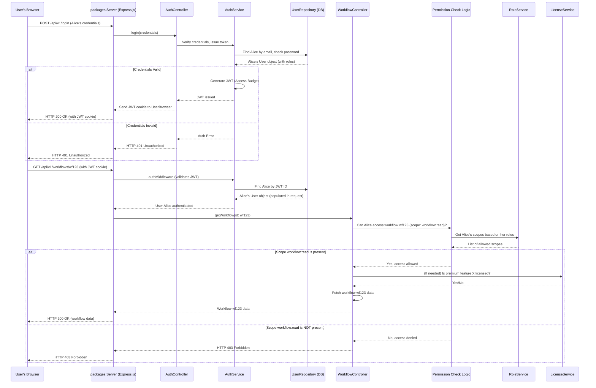

# Chapter 4: Authentication and Authorization

Welcome back! In the [previous chapter on the Server Framework](03_server_framework_.md), we saw how `packages` handles incoming requests and directs them to the right part of the application, like a receptionist in a large office building. But how does our system know *who* is making a request, and *what* they're allowed to do once inside? This is where **Authentication and Authorization** come into play.

Imagine you're trying to access a secure building. First, you need to prove who you are (that's **Authentication**). Then, once inside, the security system needs to determine which rooms you can enter and what you can do in those rooms (that's **Authorization**).

Our main use case: A user, let's call her Alice, wants to log in to `packages` and then view one of her workflows. How does `packages` make sure it's really Alice, and how does it ensure she can only see *her* workflows and not someone else's (unless specifically shared)?

## The Security Checkpoint System

Think of `packages`'s security as a multi-layered checkpoint system within that building:

1.  **`AuthService` (The Main Gate Guard):** This is your first stop. The `AuthService` is like the primary guard at the main entrance.
    *   **Authentication:** When Alice tries to log in, `AuthService` verifies her identity (e.g., checks her username and password).
    *   **Session Issuance:** If her credentials are correct, `AuthService` issues her an "access badge" – in technical terms, a JSON Web Token (JWT) stored in a cookie. This badge proves she's authenticated for her current session.

2.  **`User` Entity (Your ID Card Details):**
    *   This is like Alice's official ID card stored in the building's secure records. It contains her specific information, like her email, name, and crucially, her assigned "roles" (e.g., 'global:owner', 'project:editor'). These roles are like the type of access badge she holds (e.g., "Manager", "Staff"). This information is stored in the [Database Interaction](05_database_interaction_.md) system.

3.  **`License` Service (Premium Area Access Control):**
    *   Some areas or features in the building are premium and require a special kind of access badge. The `License` service checks if Alice's license key (if she has one for a paid plan) grants her access to these restricted, premium features (e.g., advanced debugging tools or more user seats).

4.  **`RoleService` & Permission Definition Files (The Rulebook & Access Lists):**
    *   Once Alice is inside and tries to access a specific room (a "resource" like a workflow or a credential) or perform an action (a "scope" like `workflow:read` or `credential:delete`), the `RoleService` consults the building's detailed rulebook.
    *   This rulebook consists of various permission definition files (e.g., for global roles, project roles). These files explicitly state what a person with a specific badge type (role, like 'global:owner' or 'project:editor') is allowed to do (scopes) in different parts of the building (resources).

Let's see how these components work together for Alice.

## Alice Logs In and Views Her Workflow

### 1. Authentication: Alice Arrives at the Main Gate (`AuthService`)

Alice goes to the `packages` login page and enters her email and password. This request hits an endpoint handled by a controller, like `AuthController`.

```typescript
// Simplified concept from cli/src/controllers/auth.controller.ts
// class AuthController
async login(req, res, payload: LoginRequestDto) {
    const { email, password } = payload;
    let user;

    // Attempt to log in via email/password
    // (handleEmailLogin would internally use UserRepository to find the user and check password)
    user = await handleEmailLogin(email, password); // Simplified

    if (user) {
        // If login is successful, AuthService issues an access badge (JWT cookie)
        this.authService.issueCookie(res, user, req.browserId);
        return /* user details */ ;
    }
    throw new AuthError('Wrong username or password.');
}
```
*   The `AuthController` takes the email and password.
*   It tries to verify them (simplified here as `handleEmailLogin`). This step involves checking against the `User` entity data in the [Database Interaction](05_database_interaction_.md).
*   If successful, it calls `this.authService.issueCookie()`.

The `AuthService` then generates the "access badge" (JWT) and sends it back to Alice's browser as a cookie.

```typescript
// Simplified from cli/src/auth/auth.service.ts
// class AuthService
issueCookie(res: Response, user: User, browserId?: string) {
    // ... (checks for user limits based on License) ...

    // Create the JWT "access badge"
    const token = this.issueJWT(user, browserId);

    res.cookie(AUTH_COOKIE_NAME, token, {
        httpOnly: true, // Cookie not accessible via client-side JavaScript
        secure: true,   // Only sent over HTTPS (in production)
        // ... other cookie options
    });
}

issueJWT(user: User, browserId?: string) {
    const payload = { // Information to put inside the badge
        id: user.id,
        hash: this.createJWTHash(user), // To invalidate token if user details change
        browserId: browserId ? this.hash(browserId) : undefined,
    };
    // Sign the payload with a secret key to create the JWT string
    return this.jwtService.sign(payload, { expiresIn: this.jwtExpiration });
}
```
*   `issueJWT()` creates a payload with Alice's user ID and a hash (to ensure token validity).
*   `this.jwtService.sign()` (using a secret key known only to the server) generates the actual JWT string.
*   `issueCookie()` sets this JWT string as an HTTP-only cookie in Alice's browser. Now she's authenticated!

### 2. Authorization: Alice Tries to View a Workflow

Now Alice is logged in. Her browser will automatically send the JWT cookie with every subsequent request to `packages`. She clicks to view one of her workflows.

This request goes to the server, and before it reaches the specific controller that handles fetching workflows, a middleware from `AuthService` checks her "access badge":

```typescript
// Simplified from cli/src/auth/auth.service.ts
// class AuthService
async authMiddleware(req: AuthenticatedRequest, res: Response, next: NextFunction) {
    const token = req.cookies[AUTH_COOKIE_NAME]; // Get the badge from the cookie

    if (token) {
        try {
            // Verify the badge and retrieve Alice's details
            req.user = await this.resolveJwt(token, req, res);
        } catch (error) {
            // If badge is invalid or expired, clear it
            this.clearCookie(res);
        }
    }

    if (req.user) next(); // Alice is authenticated, proceed
    else res.status(401).json({ message: 'Unauthorized' }); // No valid badge
}
```
*   `authMiddleware` extracts the JWT token from the `AUTH_COOKIE_NAME` cookie.
*   `resolveJwt()` (shown simplified below) verifies the token's signature, checks if it's expired, and fetches the user's details (including roles) from the `User` entity.

```typescript
// Simplified from cli/src/auth/auth.service.ts
// class AuthService
async resolveJwt(token: string, /* ... */): Promise<User> {
    const jwtPayload = this.jwtService.verify(token); // Verify signature, expiration

    const user = await this.userRepository.findOne({ where: { id: jwtPayload.id } });

    if (!user || user.disabled || jwtPayload.hash !== this.createJWTHash(user)) {
        throw new AuthError('Unauthorized'); // User not found, disabled, or critical details changed
    }
    // ... (browserId check, token refresh logic) ...
    return user; // Return the authenticated User object
}
```
If the JWT is valid, `req.user` is populated with Alice's `User` object. Now the system knows *who* is making the request.

Next, the request reaches the `WorkflowController` (or similar). Before it executes the logic to fetch the workflow, a permission check occurs. This often happens via decorators or a direct call to a permission-checking function, which uses the `RoleService`.

Let's say Alice (whose `User` entity says her role is `global:member`) tries to read workflow `wf123`. The system needs to check if `global:member` has the scope `workflow:read`.

```typescript
// Conceptual permission check (often done via decorators or helper functions)
// Inside a controller method for getting a workflow:
async getWorkflow(req: AuthenticatedRequest, workflowId: string) {
    const user = req.user; // Alice, authenticated

    // The system checks if Alice has the 'workflow:read' permission for this resource.
    // This uses RoleService and permission definitions.
    const canAccess = await userHasScopes(user, ['workflow:read'], false, { workflowId });

    if (!canAccess) {
        throw new ForbiddenError('You are not allowed to view this workflow.');
    }

    // If access is granted, potentially check License for premium features
    if (somePremiumWorkflowFeatureBeingUsed && !this.license.isFeatureEnabled('PREMIUM_WORKFLOW_FEATURE')) {
        throw new ForbiddenError('This feature requires a premium license.');
    }

    // Proceed to fetch and return the workflow...
}
```
*   `userHasScopes` (a function from `cli/src/permissions.ee/check-access.ts`) is a key part of this. It consults the `RoleService`.
*   The `RoleService` knows about Alice's `User.role` (e.g., 'global:member').
*   It looks up the scopes associated with 'global:member' from permission definition files (like `cli/src/permissions.ee/global-roles.ts`).
    ```typescript
    // Simplified excerpt from cli/src/permissions.ee/global-roles.ts
    export const GLOBAL_MEMBER_SCOPES: Scope[] = [
        'workflow:read', // A global member can read workflows (general permission)
        'workflow:list',
        // ... other scopes ...
    ];
    ```
*   If `workflow:read` is among the scopes for Alice's role (or a more specific project/resource role she might have for that workflow), access is granted.
*   The `License` service (`cli/src/license.ts`) might then be checked if Alice is trying to use a specific premium aspect of viewing workflows. For example:
    ```typescript
    // Simplified from cli/src/license.ts
    // class License
    isFeatureEnabled(feature: BooleanLicenseFeature) {
        // Checks if the loaded license certificate enables this feature
        return this.manager?.hasFeatureEnabled(feature) ?? false;
    }
    ```

If all checks pass, Alice gets to see her workflow!

## Under the Hood: A Request's Security Journey

Let's visualize the process from login to accessing a protected resource:



## Key Code Insights

### 1. The User (`cli/src/databases/entities/user.ts`)

The `User` entity stores vital information, including the role that dictates their base permissions.

```typescript
// Simplified from cli/src/databases/entities/user.ts
@Entity()
export class User extends WithTimestamps implements IUser {
    @PrimaryGeneratedColumn('uuid')
    id: string;

    @Column()
    email: string;

    @Column()
    password: string; // Hashed password

    @Column()
    role: GlobalRole; // e.g., 'global:owner', 'global:admin', 'global:member'

    // This getter dynamically provides scopes based on the role
    get globalScopes() {
        // STATIC_SCOPE_MAP maps roles to arrays of Scope strings
        return STATIC_SCOPE_MAP[this.role] ?? [];
    }

    // ... other properties and methods
}
```
*   The `role` property is fundamental.
*   `globalScopes` is a convenient way to get all permissions associated with the user's global role directly from the `User` object. These scopes come from definitions like `GLOBAL_MEMBER_SCOPES` in `cli/src/permissions.ee/global-roles.ts`.

### 2. Role Definitions (e.g., `cli/src/permissions.ee/global-roles.ts`)

These files are the "rulebook" defining what each role can do.

```typescript
// Excerpt from cli/src/permissions.ee/global-roles.ts
import type { Scope } from '@n8n/permissions';

export const GLOBAL_OWNER_SCOPES: Scope[] = [
    'workflow:create', 'workflow:read', 'workflow:update', 'workflow:delete',
    'user:create', 'user:read', 'user:update', 'user:delete',
    // ... many other permissions
];

export const GLOBAL_MEMBER_SCOPES: Scope[] = [
    'workflow:read', 'workflow:list',
    'credential:read', 'credential:list',
    // ... fewer permissions than an owner
];
```
*   A `Scope` is a string like `'resource:action'`, e.g., `'workflow:read'`.
*   Different roles are assigned different arrays of these `Scope` strings.

### 3. Role Service (`cli/src/services/role.service.ts`)

`RoleService` is the interpreter of these rules. It helps determine effective permissions by considering global roles, project-specific roles, and resource-sharing roles.

```typescript
// Simplified concept from cli/src/services/role.service.ts
// class RoleService
getRoleScopes(role: AllRoleTypes, filters?: Resource[]): Scope[] {
    // COMBINED_MAP holds all role-to-scope mappings
    let scopes = COMBINED_MAP[role];
    if (filters) { // Optionally filter scopes by resource type (e.g., only 'workflow' scopes)
        scopes = scopes.filter((s) => filters.includes(s.split(':')[0] as Resource));
    }
    return scopes;
}

// Helps combine scopes from global, project, and direct sharing
combineResourceScopes(
    type: 'workflow' | 'credential', // The resource type being accessed
    user: User,
    shared: SharedResource[], // How this specific resource is shared
    userProjectRelations: ProjectRelation[], // User's roles in relevant projects
): Scope[] {
    const globalScopes = this.getRoleScopes(user.role, [type]);
    const scopesSet: Set<Scope> = new Set(globalScopes);
    // ... (logic to merge scopes from project roles and direct sharing rules) ...
    // This ensures the most permissive access based on all applicable roles.
    return [...scopesSet].sort();
}
```
*   `getRoleScopes()`: Retrieves the list of permissions (scopes) for a given role name.
*   `combineResourceScopes()`: This is more advanced. For a specific resource (like a workflow), it intelligently merges permissions from the user's global role, their roles in any projects the resource belongs to, and any direct sharing settings on that resource. This gives the final, effective set of permissions for that user on that resource.

## Conclusion

Authentication and Authorization are the gatekeepers of `packages`, ensuring that only legitimate users can access the system and that they can only perform actions and see data they're permitted to.

We've seen:
*   **`AuthService`** verifies identity (authentication) and issues JWT session cookies.
*   The **`User` entity** stores user details, including their crucial roles.
*   **`RoleService`**, along with permission definition files, determines what actions (scopes) a user can perform on various resources (authorization).
*   The **`License` service** adds another layer, checking if premium features are accessible based on the user's subscription.

These components work in concert to create a secure environment, much like a real building's multi-layered security system.

In the next chapter, we'll dig into how `packages` stores and retrieves all this information, including user details, workflows, and credentials, by exploring [Database Interaction](05_database_interaction_.md).

---

Generated by [AI Codebase Knowledge Builder](https://github.com/The-Pocket/Tutorial-Codebase-Knowledge)