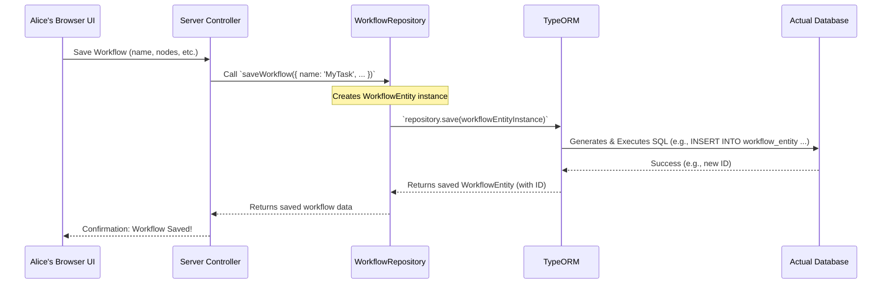

# Chapter 5: Database Interaction

In the [previous chapter on Authentication and Authorization](04_authentication_and_authorization_.md), we learned how `packages` identifies users like Alice and determines what they're allowed to do. But where does `packages` store Alice's user account information? If Alice creates a new automation workflow, where does that workflow's design "live" so she can access it later? The answer lies in **Database Interaction**.

Think of the database as your application's long-term memory and its comprehensive filing system. It's where all crucial data – user accounts, workflow designs, credentials, execution logs, and more – is permanently stored and organized.

In `packages`, this "filing system" is built upon a powerful tool called **TypeORM**. Let's explore how this works using a library analogy:

Imagine `packages` is a vast library:

*   **TypeORM (The Library Management Software):** This is the sophisticated software the library uses to organize everything – from cataloging books to tracking checkouts. It's the foundation for how we store and retrieve information.
*   **`Db.ts` (The Library's Main Control Panel):** Located at `cli/src/db.ts`, this file is like the main control panel at the library entrance. It's responsible for starting up ("initializing") the library management software (TypeORM) and ensuring it's connected to the library's storage (the actual database). It also manages this connection.
*   **Database Entities (Types of Books):** Entities like `WorkflowEntity` (from `cli/src/databases/entities/workflow-entity.ts`), `User` (from `cli/src/databases/entities/user.ts`), or `CredentialsEntity` (from `cli/src/databases/entities/credentials-entity.ts`) are like blueprints for different sections or types of books in the library.
    *   A `WorkflowEntity` blueprint defines what information a "workflow book" contains (e.g., name, nodes, connections, active status).
    *   A `User` entity blueprint defines what an "account book" contains (e.g., email, password, role).
    These blueprints define the structure (or "schema") of the information being stored.
*   **Repositories (Specialized Librarians):** Repositories like `WorkflowRepository` (from `cli/src/databases/repositories/workflow.repository.ts`), `CredentialsRepository` (from `cli/src/databases/repositories/credentials.repository.ts`), or `UserRepository` (from `cli/src/databases/repositories/user.repository.ts`) are like specialized librarians.
    *   The `WorkflowRepository` librarian knows exactly how to find, add, or update "workflow books" in their specific section.
    *   The `UserRepository` librarian manages the "user account books."
    They handle the actual operations of fetching, saving, or deleting data records ("books").
*   **Database Migrations (Updating the Library's Layout):** As `packages` evolves, the structure of the information we need to store might change (e.g., we decide "workflow books" also need a "last edited by" field). Database migrations are like planned renovations or re-organizations of the library's layout. They ensure that these changes are applied correctly and consistently to the database structure over time, without losing existing books. These are often found in directories like `cli/src/databases/migrations/`.

## Use Case: Alice Saves and Retrieves Her Workflow

Let's say Alice has just designed a new workflow to automate her daily tasks. She clicks "Save."

1.  **Saving the Workflow:**
    *   The workflow data (its name, nodes, connections, etc.) is sent to the `packages` backend.
    *   The backend will use the `WorkflowRepository` (our specialized librarian for workflows).
    *   This librarian takes Alice's workflow data, prepares it according to the `WorkflowEntity` blueprint (the "workflow book" structure), and uses TypeORM (the library management software) to store it in the database.

2.  **Retrieving the Workflow:**
    *   Later, Alice wants to open this workflow. She finds it in her list of workflows in the UI.
    *   The UI requests this specific workflow from the backend.
    *   Again, the `WorkflowRepository` is called.
    *   The librarian uses TypeORM to search the database for the "workflow book" with the matching ID.
    *   Once found, the data is retrieved, packaged up as a `WorkflowEntity` object, and sent back to Alice's UI.

## A Peek at the Code

Let's look at simplified examples of these components.

### 1. The Library Control Panel (`Db.ts`)

This file is crucial for getting the database connection ready.

```typescript
// Simplified from cli/src/db.ts
import { DataSource as Connection } from '@n8n/typeorm';
import { getConnectionOptions } from '@/databases/config'; // Configuration helper
// ... other imports

let connection: Connection; // Holds our database connection

export async function init(): Promise<void> {
    // 1. Get database settings (like address, username, password)
    const connectionOptions = getConnectionOptions();
    // 2. Create a new connection object using TypeORM
    connection = new Connection(connectionOptions);
    // 3. Actually connect to the database
    await connection.initialize();
    console.log("Database connection initialized!");
}

export async function migrate(): Promise<void> {
    // Run all pending "renovations" (migrations) to update database structure
    await connection.runMigrations({ transaction: 'each' });
    console.log("Database migrations completed!");
}
```
*   `init()`: This function is called when `packages` starts. It uses `getConnectionOptions()` (from `cli/src/databases/config.ts`, which reads your database settings) to establish a connection to the database via TypeORM.
*   `migrate()`: After connecting, this function runs any pending migrations. This ensures the database "tables" (like sections in the library) match what the application's Entities expect.

### 2. A Book Blueprint (`WorkflowEntity`)

An entity defines the structure of a "table" in the database. Think of it as defining the fields for a particular type of record.

```typescript
// Simplified from cli/src/databases/entities/workflow-entity.ts
import { Entity, PrimaryColumn, Column } from '@n8n/typeorm';

@Entity() // Marks this class as a database table blueprint
export class WorkflowEntity {
    @PrimaryColumn('varchar') // Defines 'id' as the main unique identifier
    id: string;

    @Column('varchar') // Defines 'name' as a text column
    name: string;

    @Column('boolean', { default: false }) // Defines 'active' as true/false
    active: boolean;

    @Column({ type: 'simple-json' }) // Defines 'nodes' to store complex JSON data
    nodes: object[];

    // ... other properties like createdAt, updatedAt, etc.
}
```
*   `@Entity()`: This TypeORM "decorator" tells TypeORM that `WorkflowEntity` class corresponds to a table (likely named `workflow_entity` or similar, depending on configuration) in the database.
*   `@PrimaryColumn()`, `@Column()`: These decorators define the "columns" (fields) of the table and their data types (e.g., `varchar` for text, `boolean` for true/false, `simple-json` for storing structured data).

### 3. A Specialized Librarian (`WorkflowRepository`)

A repository provides methods to interact with entities (and thus, the database table).

```typescript
// Simplified from cli/src/databases/repositories/workflow.repository.ts
import { Service } from '@n8n/di';
import { DataSource, Repository } from '@n8n/typeorm';
import { WorkflowEntity } from '../entities/workflow-entity';

@Service() // Marks this class for dependency injection
export class WorkflowRepository extends Repository<WorkflowEntity> {
    constructor(dataSource: DataSource) {
        // Tells TypeORM this repository works with WorkflowEntity
        super(WorkflowEntity, dataSource.manager);
    }

    async findById(workflowId: string): Promise<WorkflowEntity | null> {
        // Uses TypeORM's built-in 'findOne' to find a workflow by its ID
        return await this.findOne({ where: { id: workflowId } });
    }

    async saveWorkflow(workflowData: Partial<WorkflowEntity>): Promise<WorkflowEntity> {
        // Uses TypeORM's 'save' method to create or update a workflow
        const workflow = this.create(workflowData); // Creates an entity instance
        return await this.save(workflow); // Saves it to the database
    }
}
```
*   `extends Repository<WorkflowEntity>`: This tells TypeORM that `WorkflowRepository` is designed to work with `WorkflowEntity` objects.
*   `constructor`: It gets the `DataSource` (the main TypeORM connection established by `Db.ts`) and initializes the base `Repository`.
*   `findById()`: A custom method that uses TypeORM's `findOne()` to look up a workflow by its `id`. TypeORM handles generating the correct SQL `SELECT` query.
*   `saveWorkflow()`: A custom method. It first creates a `WorkflowEntity` instance from the provided data using `this.create()`, then uses TypeORM's `this.save()` method. `save()` is smart: if the entity has an ID that already exists in the database, it updates the record; otherwise, it inserts a new one.

## How It All Connects: A Request's Journey to the Database

Let's visualize how saving Alice's new workflow might happen internally:



1.  **UI to Controller:** Alice saves her workflow. The data goes to a server controller.
2.  **Controller to Repository:** The controller calls a method on `WorkflowRepository`, like `saveWorkflow()`, passing the workflow data.
3.  **Repository to TypeORM:** The `WorkflowRepository` uses TypeORM's methods (like `save()`). It gives TypeORM a `WorkflowEntity` object populated with Alice's data.
4.  **TypeORM to Database:** TypeORM translates this into the appropriate SQL command (e.g., `INSERT INTO workflow_entity (...) VALUES (...)`) and sends it to the actual database (like PostgreSQL, SQLite, or MySQL).
5.  **Database Stores Data:** The database executes the SQL command and stores the data in the `workflow_entity` table.
6.  **Response Back:** The success (and any new ID if it was an insert) flows back up the chain.

### The Role of Migrations

What if, in a new version of `packages`, we decide every `WorkflowEntity` should also store the `userId` of the person who created it?

1.  **Update Entity:** We would add a `userId: string;` property (with a `@Column()` decorator) to `WorkflowEntity`.
2.  **Create Migration:** We'd then create a new migration file (e.g., in `cli/src/databases/migrations/postgresdb/`). This file would contain instructions, using TypeORM's schema builder tools (often via `cli/src/databases/dsl/index.ts`), to:
    *   `ADD COLUMN userId VARCHAR(...)` to the `workflow_entity` table.
    *   Perhaps populate existing rows with a default `userId` if necessary.
    ```typescript
    // Conceptual migration 'up' method
    // public async up(context: MigrationContext): Promise<void> {
    //    await context.schemaBuilder
    //        .addColumns('workflow_entity', [context.schemaBuilder.column('userId').string()])
    //        .execute();
    // }
    ```
3.  **Run Migrations:** When users update to this new `packages` version, `Db.ts`'s `migrate()` function will automatically run this new migration. The `cli/src/databases/utils/migration-helpers.ts` file assists in managing and executing these migration files.

This ensures that the database structure (the library's layout) is always in sync with what the application code (the Entities) expects, preventing errors and data inconsistencies.

## Conclusion

Database interaction is the foundation of `packages`'s memory. By leveraging **TypeORM**, `packages` provides a structured and maintainable way to store and manage all critical application data:

*   **`Db.ts`** boots up the connection.
*   **Entities** (like `WorkflowEntity`, `User`) define the "what" – the structure of the data.
*   **Repositories** (like `WorkflowRepository`) define the "how" – the methods to access and modify that data.
*   **Migrations** ensure the database schema evolves gracefully with the application.

This system is like a well-organized library, ensuring that every piece of information, from user accounts to complex workflow designs, is filed correctly and can be retrieved efficiently when needed.

In the next chapter, we'll explore the [Event System](06_event_system_.md), which allows different parts of `packages` to communicate with each other when interesting things happen, like a workflow finishing its execution or a user logging in.

---

Generated by [AI Codebase Knowledge Builder](https://github.com/The-Pocket/Tutorial-Codebase-Knowledge)