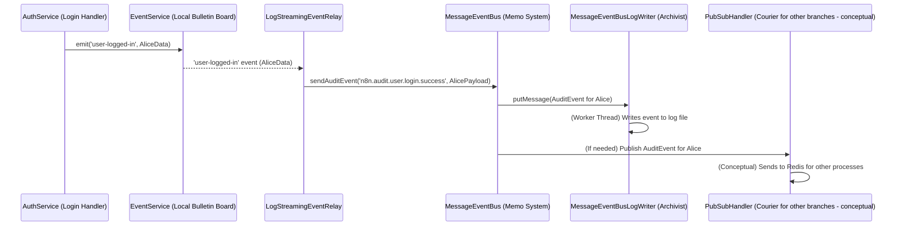

# Chapter 6: Event System

Welcome to Chapter 6! In our [previous chapter on Database Interaction](05_database_interaction_.md), we saw how `packages` stores and retrieves important information like workflow designs and user accounts. Now, imagine different parts of `packages` need to tell each other when something interesting happens. For example, when a user logs in, how can other parts of the application react to this without being directly told by the login code? This is where the **Event System** comes in.

Think of the Event System as `packages`'s internal communication network, like an office's announcement system. It allows one part of the application to broadcast a message (an "event") about something that occurred, and other interested parts can "listen" for these messages and react accordingly. This is super helpful because the part making the announcement doesn't need to know *who* is listening, and the listeners don't need to know exactly *who* made the announcement. They are "decoupled."

**Our Central Use Case:**
1.  When a user, let's say Alice, successfully logs into `packages`, the authentication system needs to announce this.
2.  A separate logging component wants to hear about these login events so it can record them for auditing purposes.
3.  For more critical events, like a workflow finishing, these announcements might need to be sent to other `packages` processes (like worker instances if you're running a scaled setup) and be reliably logged for potential review or replay.

## The Office Announcement System: Key Concepts

Our "office announcement system" has a few key parts:

1.  **`EventService` (The Local Bulletin Board):**
    *   **Analogy:** Imagine a simple bulletin board in your local office. Anyone in *that office* can post a note (emit an event) like "User Alice logged in at 9 AM." Other colleagues in the *same office* who are interested can check this board (subscribe to events) and act on the information.
    *   **Role:** `EventService` (from `cli/src/events/event.service.ts`) handles these local, in-process announcements. It's fast and straightforward for communication within the same `packages` instance.

2.  **Events (The Announcements):**
    *   **Analogy:** These are the actual notes posted on the bulletin board or the content of a wider memo.
    *   **Role:** They represent significant occurrences, like `"user-logged-in"`, `"workflow-created"`, or `"workflow-execution-finished"`. Each event usually carries some data related to the occurrence (e.g., which user logged in, or which workflow was created). You can find many predefined event names in `cli/src/eventbus/event-message-classes/index.ts`.

3.  **`MessageEventBus` (The Inter-Office Memo & Archiving System):**
    *   **Analogy:** Sometimes, an announcement is too important for just the local bulletin board. It needs to be sent as an official memo to *other office branches* (other `packages` processes, like workers) and a copy must be *officially archived* for records.
    *   **Role:** `MessageEventBus` (from `cli/src/eventbus/message-event-bus/message-event-bus.ts`) handles these more complex scenarios. It's designed for:
        *   Sending messages across different `packages` processes.
        *   Ensuring messages are reliably logged.

4.  **`MessageEventBusLogWriter` (The Diligent Archivist):**
    *   **Analogy:** This is the person in the office responsible for taking every important memo sent via the `MessageEventBus`, making a copy, and filing it away securely.
    *   **Role:** `MessageEventBusLogWriter` (from `cli/src/eventbus/message-event-bus-writer/message-event-bus-log-writer.ts`) persistently saves events processed by `MessageEventBus` to log files. This is crucial for auditing, debugging, and potentially replaying events if something went wrong.

5.  **`PubSubHandler` (The Inter-Branch Courier Service):**
    *   **Analogy:** When a memo from `MessageEventBus` needs to go to another office branch (another process), this courier service (often using a system like Redis pub/sub) delivers it.
    *   **Role:** `PubSubHandler` (from `cli/src/scaling/pubsub/pubsub-handler.ts`) is responsible for publishing messages to a central messaging system (like Redis) and subscribing to messages from it, enabling communication between the main `packages` instance and its workers, or even between multiple main instances in a clustered setup. We'll touch more on this in the [Scaling and Concurrency](07_scaling_and_concurrency_.md) chapter.

## Simple Announcements: Using the `EventService` (Local Bulletin Board)

Let's say when Alice logs in, we want a simple console message.

1.  The part of `packages` that handles successful logins (e.g., within `AuthService` from [Authentication and Authorization](04_authentication_and_authorization_.md)) will "post a note" using `EventService`.
2.  A separate, simple logging service will "check the bulletin board" for these login notes.

Here's how a component might emit an event:

```typescript
// Somewhere in the code, after a user successfully logs in:
import { eventService } from './my-app-services'; // Conceptual import
// ...
const userDetails = { id: 'alice123', email: 'alice@example.com' };
const authMethod = 'password';

// Emit a 'user-logged-in' event with details
eventService.emit('user-logged-in', {
    user: userDetails,
    authenticationMethod: authMethod,
});
console.log("Login event for Alice has been announced locally!");
```
*   `eventService.emit('user-logged-in', ...)`: This is like posting a note titled "user-logged-in" with Alice's details on the local bulletin board.

Another part of the application can subscribe to this event:

```typescript
// In a simple logger service initialization:
import { eventService } from './my-app-services'; // Conceptual import

eventService.on('user-logged-in', (eventData) => {
    console.log(
        `AUDIT: User ${eventData.user.email} logged in via ${eventData.authenticationMethod}.`
    );
});
console.log("Logger is now watching for 'user-logged-in' announcements.");
```
*   `eventService.on('user-logged-in', ...)`: This tells our logger to watch the bulletin board. Whenever a "user-logged-in" note appears, it will execute the provided function, printing the audit message.

The `EventService` itself is a `TypedEmitter`, making it straightforward to use.

```typescript
// Simplified from cli/src/events/event.service.ts
import { Service } from '@n8n/di';
import { TypedEmitter } from '@/typed-emitter';
// ... (import EventMap type definition) ...

@Service()
export class EventService extends TypedEmitter<EventMap> {}
```
*   It inherits from `TypedEmitter`, which provides the `emit` and `on` (and other related) methods. `EventMap` defines all possible event names and their data structures.

## Bridging to Broader Communication: `LogStreamingEventRelay`

Often, local events announced on `EventService` are also important enough to be sent through the more robust `MessageEventBus` for wider distribution and logging. The `LogStreamingEventRelay` (from `cli/src/events/relays/log-streaming.event-relay.ts`) is a perfect example of a component that listens to local `EventService` events and then relays them to the `MessageEventBus`.

```typescript
// Simplified from cli/src/events/relays/log-streaming.event-relay.ts
// class LogStreamingEventRelay
init() {
    this.setupListeners({ // setupListeners uses eventService.on internally
        'user-logged-in': (event) => this.handleUserLoggedIn(event),
        // ... other events
    });
}

@Redactable() // A decorator to help with redacting sensitive data
private handleUserLoggedIn(event: RelayEventMap['user-logged-in']) {
    // Now, use MessageEventBus to send it more broadly and log it
    void this.eventBus.sendAuditEvent({ // eventBus is an instance of MessageEventBus
        eventName: 'n8n.audit.user.login.success', // A specific event name for MessageEventBus
        payload: { ...event.user, authenticationMethod: event.authenticationMethod },
    });
    console.log("Relayed 'user-logged-in' to MessageEventBus for wider announcement and archiving.");
}
```
*   `this.setupListeners(...)`: This sets up subscriptions to various local events on `EventService`.
*   `handleUserLoggedIn(event)`: When `EventService` emits `'user-logged-in'`, this method is called.
*   `this.eventBus.sendAuditEvent(...)`: It then takes the event data and uses the `MessageEventBus` (here aliased as `this.eventBus`) to send it out as an "audit event." This ensures it's logged by `MessageEventBusLogWriter` and potentially sent to other processes.

## Advanced Announcements: `MessageEventBus` (Inter-Office Memos & Archiving)

When `LogStreamingEventRelay` (or any other service) calls `this.eventBus.sendAuditEvent(...)`, the `MessageEventBus` takes over.

Imagine a workflow "MonthlySalesReport" just finished successfully. The `WorkflowRunner` (from [Workflow Lifecycle Management](01_workflow_lifecycle_management_.md)) might signal this, and eventually, an event like `n8n.workflow.success` would be sent via `MessageEventBus`.

```typescript
// Simplified from cli/src/eventbus/message-event-bus/message-event-bus.ts
// class MessageEventBus

async sendAuditEvent(options: EventMessageAuditOptions) {
    // 1. Create a structured event message
    const auditEventMessage = new EventMessageAudit(options);
    // 2. Send it through the general send method
    await this.send(auditEventMessage);
}

async send(msgs: EventMessageTypes | EventMessageTypes[]) {
    if (!Array.isArray(msgs)) {
        msgs = [msgs];
    }
    for (const msg of msgs) {
        // 3. Ask the LogWriter to save this message
        this.logWriter?.putMessage(msg);

        // 4. (Simplified) If no specific destinations (like external systems) are set up
        // to receive this, confirm it's "sent" (meaning logged).
        if (!this.shouldSendMsg(msg)) { // Checks if any external destinations are listening
            this.confirmSent(msg, { id: '0', name: 'eventBus' });
        }

        // 5. Emit the message for any internal listeners or for cross-process publishing
        await this.emitMessage(msg);
    }
}
```
1.  A specific helper like `sendAuditEvent` creates a standardized message object (e.g., `EventMessageAudit`).
2.  The main `send` method takes this message.
3.  `this.logWriter?.putMessage(msg)`: It immediately tells the `MessageEventBusLogWriter` (our archivist) to write this message to a log file.
4.  `this.confirmSent(...)`: If the event doesn't need to go to external specialized listeners (configured "destinations"), it's marked as "sent" (meaning logged).
5.  `await this.emitMessage(msg)`: This is where the `MessageEventBus` actually emits the event. This allows:
    *   Other parts of the *same* process that might be listening directly to `MessageEventBus` to react.
    *   The `Publisher` service (used by `PubSubHandler`) to pick it up and send it to other processes (like workers via Redis).

### The Archivist: `MessageEventBusLogWriter`

The `MessageEventBusLogWriter` is responsible for the actual writing to disk.

```typescript
// Simplified from cli/src/eventbus/message-event-bus-writer/message-event-bus-log-writer.ts
// class MessageEventBusLogWriter

putMessage(msg: EventMessageTypes): void {
    if (this.worker) { // It uses a separate worker thread for performance
        // Sends the message to the worker thread to be written to a file
        this.worker.postMessage({ command: 'appendMessageToLog', data: msg.serialize() });
        // console.log(`Archivist: Message ${msg.id} given to worker for logging.`);
    }
}

confirmMessageSent(msgId: string, source?: EventMessageConfirmSource): void {
    if (this.worker) {
        // Also tells the worker thread to mark this message as confirmed in the log
        this.worker.postMessage({
            command: 'confirmMessageSent',
            data: new EventMessageConfirm(msgId, source).serialize(),
        });
        // console.log(`Archivist: Message ${msgId} confirmed as sent by ${source?.name}.`);
    }
}
```
*   `putMessage()`: Takes the event and sends it to a dedicated worker thread. This thread handles writing the event data (usually as a line in a JSON log file) without blocking the main application.
*   `confirmMessageSent()`: Marks the message in the log as having been successfully processed or sent to its final destination. This is useful for tracking and potential resending if failures occur.

### Event Names: A Common Language

The system uses predefined event names to ensure everyone is talking about the same thing. These are defined in `cli/src/eventbus/event-message-classes/index.ts`:

```typescript
// Excerpt from cli/src/eventbus/event-message-classes/index.ts
export const eventNamesWorkflow = [
	'n8n.workflow.started',
	'n8n.workflow.success',
	'n8n.workflow.failed',
] as const;

export const eventNamesAudit = [
	'n8n.audit.user.login.success',
	'n8n.audit.user.login.failed',
	// ... many more audit events
] as const;

export type EventNamesWorkflowType = (typeof eventNamesWorkflow)[number];
// ... other type definitions
```
This list defines the "official" types of announcements that can be made through the `MessageEventBus`.

## Internal Flow: From Local Announcement to Archived Memo

Let's visualize Alice logging in, and that event being logged:



1.  **Local Announcement:** `AuthService` emits `user-logged-in` on `EventService`.
2.  **Relay Listens:** `LogStreamingEventRelay` (subscribed to `EventService`) picks this up.
3.  **Memo Created:** The Relay uses `MessageEventBus` to send an `n8n.audit.user.login.success` event.
4.  **Archived:** `MessageEventBus` tells `MessageEventBusLogWriter` to log this event.
5.  **Wider Distribution (Optional):** `MessageEventBus` also makes the event available for `PubSubHandler` to send to other processes if `packages` is running in a scaled environment.

## Conclusion

The Event System is `packages`'s internal communication backbone, allowing different parts to react to happenings without direct, hardcoded connections.

*   **`EventService`** acts like a local office bulletin board for quick, in-process notifications.
*   **`MessageEventBus`** is the more robust inter-office memo system, ensuring events are:
    *   Logged persistently by **`MessageEventBusLogWriter`**.
    *   Potentially distributed to other processes (like workers) via **`PubSubHandler`**.
*   Components like **`LogStreamingEventRelay`** can bridge these systems, listening to local events and promoting them to the `MessageEventBus`.

This decoupled way of communicating makes the application more modular and easier to extend. For example, if you want to add a new action whenever a user logs in, you just subscribe to the `'user-logged-in'` event; you don't need to modify the original login code.

In the next chapter, we'll explore how `packages` handles running many things at once and scales to support more users and workflows in [Scaling and Concurrency](07_scaling_and_concurrency_.md).

---

Generated by [AI Codebase Knowledge Builder](https://github.com/The-Pocket/Tutorial-Codebase-Knowledge)