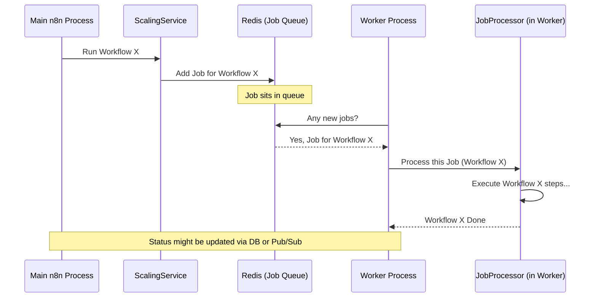

# Chapter 7: Scaling and Concurrency

Welcome to the final chapter of our `packages` deep dive! In the [previous chapter on the Event System](06_event_system_.md), we saw how different parts of `packages` can communicate with each other by sending and listening to announcements. Now, let's tackle a big question: How does `packages` handle many tasks at once, especially when it's used by many people or has lots of automations running? This is where **Scaling and Concurrency** come in.

Imagine `packages` is a very popular restaurant. On a busy Friday night, orders (workflow executions) come flooding in.
*   How does the kitchen manage all these orders without getting chaotic?
*   How do they ensure chefs aren't trying to cook too many dishes at the same time at one station?
*   If the restaurant expands and opens multiple kitchen branches, how do they coordinate?

Scaling and Concurrency is the system that addresses these challenges, ensuring `packages` can run smoothly and efficiently, even under heavy load. Our main goal is to understand how `packages` processes many workflow executions simultaneously, especially when deployed in a more complex setup with multiple processes (like a main app and several "worker" apps).

## The Busy Restaurant Kitchen: Key Concepts

Let's meet the team and systems that keep our `packages` restaurant running efficiently:

1.  **`ScalingService` (The Head Chef Setting Up the System):**
    *   **Analogy:** The Head Chef or Restaurant Manager who designs the workflow for handling customer orders. They decide to implement a digital queue for incoming orders.
    *   **Role:** When `packages` is set up to handle many tasks using "workers" (a mode called "queue mode"), `ScalingService` is responsible for setting up and interacting with the **order queue**. This queue is often managed using a fast in-memory database like Redis, with a library called BullMQ helping organize the jobs. It's how `packages` sends tasks (workflow executions) to be processed by available workers.

2.  **`JobProcessor` (The Station Chef):**
    *   **Analogy:** A station chef in the kitchen (e.g., the grill chef or pasta chef). Each `JobProcessor` runs in a separate "worker" process – think of it as a dedicated cooking station. This chef continuously checks the order queue.
    *   **Role:** When an "order" (a workflow execution job) appears in the queue, an available `JobProcessor` picks it up and starts "cooking" – meaning, it actually runs the workflow.

3.  **`ConcurrencyControlService` (The Expediter / Kitchen Supervisor):**
    *   **Analogy:** The expediter or kitchen supervisor who stands at the pass. They make sure a particular cooking station (or the main kitchen in simpler setups) isn't overwhelmed. If a chef already has 5 pans on the fire, the expediter might say, "Hold the next order for this station for a moment!"
    *   **Role:** This service limits how many workflows can be actively "cooking" at the same time *within a single process*. In a simple `packages` setup (not using workers), this prevents the main application from being swamped. In a worker setup, it can also limit how many tasks one specific worker process handles concurrently.

4.  **`Publisher` and `Subscriber` Services (The Intercom / Order Update System):**
    *   **Analogy:** The kitchen's internal communication system. The waiter (main process) might send an order to the kitchen (workers) via a digital system (`Publisher`). The kitchen might send updates back ("Dish #123 is ready!") using the same system (`Subscriber` on the main process listens).
    *   **Role:** These services (`cli/src/scaling/pubsub/publisher.service.ts` and `cli/src/scaling/pubsub/subscriber.service.ts`) allow different `packages` processes (like the main app and worker apps) to send messages to each other. This is often done using Redis's "publish/subscribe" feature. This is vital for things like sending a command to stop a running workflow on a worker or relaying status updates.

5.  **`OrchestrationService` and `MultiMainSetup` (Coordinating Multiple Kitchen Branches):**
    *   **Analogy:** If our restaurant becomes a chain with multiple main kitchens, these components act like the central management deciding which kitchen is the "lead" for certain tasks (like creating daily specials or handling inventory for shared ingredients).
    *   **Role:** If you run `packages` with multiple main processes (for high availability), `MultiMainSetup` (from `cli/src/scaling/multi-main-setup.ee.ts` for enterprise editions) helps elect a "leader" instance. The `OrchestrationService` (from `cli/src/services/orchestration.service.ts`) uses this setup to ensure that tasks which should only be done by one main instance (like cleaning up old execution logs or managing scheduled triggers) are handled correctly.

## Handling a Flood of Workflow Orders

Let's say 100 different workflows need to start at the same time. If `packages` is running in "queue" mode:

1.  **Taking Orders:** For each workflow, the main `packages` process (specifically the `WorkflowRunner` from [Workflow Lifecycle Management](01_workflow_lifecycle_management_.md)) decides it needs to be run. Instead of trying to run all 100 itself, it tells `ScalingService` to "add this workflow execution to the order queue."
2.  **Chefs Pick Up Orders:** Several worker processes, each with a `JobProcessor`, are monitoring this queue. As jobs appear, each `JobProcessor` grabs one and starts executing the workflow.
3.  **Managing Station Load:** If a particular worker's `JobProcessor` is already handling its maximum configured concurrent tasks (e.g., 5 workflows), `ConcurrencyControlService` might pause it from picking new jobs from the main queue until one of its current tasks finishes. (Note: In queue mode, the primary concurrency control is the number of workers and how many jobs they each pull. `ConcurrencyControlService` is more dominant in non-queue mode for the main process).
4.  **Communication:** If the main process needs to tell a worker to stop a specific workflow, it uses `Publisher` to send a "stop" command. The worker's `Subscriber` picks this up, and the `JobProcessor` acts accordingly.

### Visualizing the Order Flow (Queue Mode)



## A Look Inside the Code (Simplified)

Let's peek at how these components might work.

### 1. Adding an Order to the Queue (`ScalingService`)

When a workflow needs to be executed in queue mode, `ScalingService` is used to add it as a "job".

```typescript
// Simplified from cli/src/scaling/scaling.service.ts
// class ScalingService

async addJob(jobData: JobData, { priority }: { priority: number }) {
    // jobData contains info like { executionId: 'exec123', loadStaticData: true }
    const jobOptions = {
        priority, // Higher priority jobs might be picked up sooner
        removeOnComplete: true, // Clean up from queue once done
        removeOnFail: true,
    };

    // 'this.queue' is the BullMQ queue instance connected to Redis
    const job = await this.queue.add(JOB_TYPE_NAME, jobData, jobOptions);

    this.logger.info(`Enqueued execution ${jobData.executionId} (job ${job.id})`);
    return job; // Returns a reference to the job in the queue
}
```
*   **Input:** `jobData` (details about the workflow execution) and a `priority`.
*   **Action:** This method uses `this.queue.add()` (which comes from the BullMQ library) to place the job onto the Redis queue. `JOB_TYPE_NAME` is a constant string that identifies the type of job.
*   **Effect:** The workflow execution task is now waiting in Redis for a worker to pick it up.

### 2. The Station Chef at Work (`JobProcessor`)

A `JobProcessor` runs in a worker process. It's set up to listen to the queue and process jobs.

```typescript
// Simplified from cli/src/scaling/job-processor.ts
// class JobProcessor

async processJob(job: Job): Promise<JobResult> { // Job is from BullMQ
    const { executionId } = job.data; // Get execution ID from job data

    this.logger.info(`Worker started execution ${executionId} (job ${job.id})`);

    // 1. Fetch full execution details from the database
    const execution = await this.executionRepository.findSingleExecution(executionId, /* ... */);
    if (!execution) throw new Error('Execution not found!');

    // 2. Reconstruct the Workflow object
    const workflow = new Workflow({ /* ... using execution.workflowData ... */ });

    // 3. Execute the workflow (simplified)
    // This internally uses WorkflowExecute class from n8n-core
    const workflowRunPromise = workflowExecute.run(workflow); // workflowExecute is an instance
    this.runningJobs[job.id] = { run: workflowRunPromise, executionId, /*...*/ };

    await workflowRunPromise; // Wait for the workflow to finish

    delete this.runningJobs[job.id];
    this.logger.info(`Worker finished execution ${executionId} (job ${job.id})`);
    return { success: true };
}
```
*   **Input:** A `job` object pulled from the BullMQ queue by the worker.
*   **Action:**
    *   It fetches detailed information about the execution from the [Database Interaction](05_database_interaction_.md) system using `executionRepository`.
    *   It reconstructs the workflow and then runs it.
*   **Effect:** The workflow is executed in this worker process. The result (success/failure) is returned. `ScalingService` on the main process listens for completion/failure events from the queue.

### 3. The Expediter Managing Load (`ConcurrencyControlService`)

This service is primarily for limiting simultaneous executions *within a single process*, especially relevant when `packages` is *not* in queue mode, or to limit a specific worker.

```typescript
// Simplified from cli/src/concurrency/concurrency-control.service.ts
// class ConcurrencyControlService

async throttle({ mode, executionId }: { mode: ExecutionMode; executionId: string }) {
    if (!this.isEnabled || this.isUnlimited(mode)) return; // If disabled or no limit for this mode

    // Get the correct queue (e.g., 'production' or 'evaluation')
    const queue = this.getQueue(mode); // This is an internal ConcurrencyQueue, not BullMQ
    if (queue) {
        // 'enqueue' will pause here if the capacity is full
        await queue.enqueue(executionId);
        this.eventService.emit('execution-throttled', { executionId, type: mode });
    }
}

release({ mode }: { mode: ExecutionMode }) {
    if (!this.isEnabled || this.isUnlimited(mode)) return;

    const queue = this.getQueue(mode);
    if (queue) {
        queue.dequeue(); // Frees up a spot
    }
}
```
*   `throttle()`: Before starting an execution (in the same process), this is called. If the relevant internal queue (managed by `ConcurrencyQueue` from `cli/src/concurrency/concurrency-queue.ts`) is full (e.g., already 5 "production" workflows running), `await queue.enqueue(executionId)` will pause until a spot opens up.
*   `release()`: When an execution finishes, this is called to signal that a spot is now free in the `ConcurrencyQueue`.

### 4. Inter-Kitchen Communication (`Publisher` / `Subscriber`)

These services use Redis Pub/Sub for real-time messaging between processes.

**Publisher (Sending a message):**
```typescript
// Simplified from cli/src/scaling/pubsub/publisher.service.ts
// class Publisher

async publishCommand(msg: PubSub.Command) { // e.g., { command: 'stopExecution', payload: { executionId: 'exec789' } }
    if (config.getEnv('executions.mode') !== 'queue') return; // Only in queue mode

    // 'this.client' is a Redis client
    await this.client.publish(
        'n8n.commands', // The Redis channel name
        JSON.stringify({ ...msg, senderId: this.instanceSettings.hostId }),
    );
    this.logger.debug(`Published pubsub msg: ${msg.command}`);
}
```
*   **Input:** A `msg` object containing a command and its payload.
*   **Action:** It sends this message to a specific Redis channel (e.g., `n8n.commands`).
*   **Effect:** Any process subscribed to this Redis channel will receive the message.

**Subscriber (Receiving a message):**
```typescript
// Simplified from cli/src/scaling/pubsub/subscriber.service.ts
// class Subscriber

constructor(/* ... */) {
    // ... (setup Redis client 'this.client') ...
    if (config.getEnv('executions.mode') !== 'queue') return;

    this.client.on('message', (channel: string, messageString: string) => {
        const msg = JSON.parse(messageString); // Parse the received message
        if (!msg || msg.senderId === this.instanceSettings.hostId) return; // Ignore own messages

        // Emit an internal event based on the command received
        // e.g., if msg.command is 'stopExecution', emit 'stopExecution' locally
        this.eventService.emit(msg.command, msg.payload);
        this.logger.debug(`Received pubsub msg: ${msg.command}`);
    });
    // ...
}

async subscribe(channel: PubSub.Channel) { // e.g., 'n8n.commands'
    await this.client.subscribe(channel);
}
```
*   **Action:** The `Subscriber` listens to specific Redis channels (e.g., `n8n.commands`). When a message arrives, it parses it and then uses the local [Event System](06_event_system_.md) (`this.eventService.emit`) to notify other parts of *its own process* about the received command.

### 5. Coordinating Multiple Main Kitchens (`MultiMainSetup` & `OrchestrationService`)

If you run multiple main `packages` processes, one needs to be the "leader" for certain global tasks.

```typescript
// Simplified concept from cli/src/scaling/multi-main-setup.ee.ts
// class MultiMainSetup

async tryBecomeLeader() {
    const { hostId } = this.instanceSettings; // Unique ID for this n8n instance
    // 'leaderKey' is a specific key in Redis, e.g., 'n8n:main_instance_leader'

    // Try to set the leaderKey in Redis to this instance's hostId,
    // but only if it's not already set (NX = Not eXists).
    const keySetSuccessfully = await this.publisher.setIfNotExists(this.leaderKey, hostId);

    if (keySetSuccessfully) {
        this.instanceSettings.markAsLeader(); // This instance is now the leader!
        await this.publisher.setExpiration(this.leaderKey, this.leaderKeyTtl); // Set a timeout
    } else {
        this.instanceSettings.markAsFollower(); // Another instance is leader
    }
}
```
*   **Action:** Periodically, each main instance tries to claim leadership by setting a specific key in Redis. The `setIfNotExists` operation is atomic, ensuring only one can succeed.
*   **Effect:** One main `packages` instance becomes the leader. The `OrchestrationService` then ensures this leader handles tasks like managing scheduled workflows or cleaning up old data. If the leader goes down, another instance will eventually win the election.

## Conclusion

Scaling and Concurrency are vital for `packages` to perform well as usage grows. We've seen how `packages` uses a "busy restaurant kitchen" model:

*   **`ScalingService`** sets up the order queue (using BullMQ and Redis) when in "queue" mode.
*   **`JobProcessor`** in worker processes act as station chefs, picking up and executing workflow jobs from this queue.
*   **`ConcurrencyControlService`** acts as an expediter, managing how many workflows run simultaneously within a single process to prevent overload.
*   **`Publisher` and `Subscriber`** services provide an intercom system (via Redis Pub/Sub) for communication between different `packages` processes.
*   **`OrchestrationService` and `MultiMainSetup`** coordinate tasks when multiple main `packages` "kitchens" (processes) are running, ensuring a single leader for specific responsibilities.

These systems, working together, allow `packages` to handle a large volume of tasks efficiently, distribute work across multiple processes or even machines, and maintain stability, ensuring all your automations run smoothly, no matter how busy the "restaurant" gets! This concludes our tour of `packages`'s core architecture. We hope this journey has given you a solid understanding of how `packages` works under the hood!

---

Generated by [AI Codebase Knowledge Builder](https://github.com/The-Pocket/Tutorial-Codebase-Knowledge)