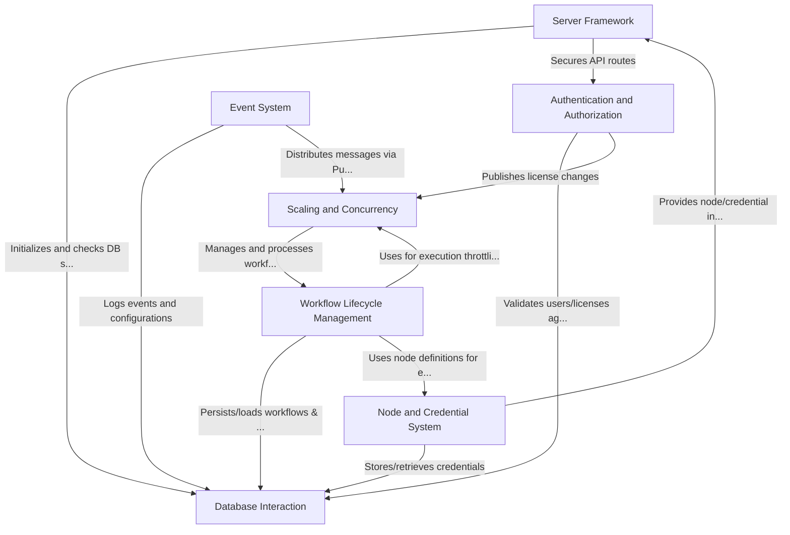

# Tutorial: packages

n8n is a **workflow automation tool** that allows users to connect different applications and services to automate tasks. It operates like a digital assembly line where *workflows* (the "assembly lines") are built using *nodes* (the "stations" or "tools").
The **Server Framework** acts as the main entry point, handling web requests and routing them. **Workflow Lifecycle Management** is responsible for running these workflows, from starting them based on triggers (like a schedule or a webhook) to tracking their execution.
The **Node and Credential System** provides the building blocks (nodes) and manages secure access to external services (credentials). All persistent data, like workflow definitions, execution history, and user accounts, is handled by the **Database Interaction** layer.
**Authentication and Authorization** ensures that only legitimate users can access n8n and their respective resources. The **Event System** facilitates communication between different parts of the application, allowing them to react to various occurrences. Finally, **Scaling and Concurrency** enables n8n to handle many workflow executions simultaneously, especially in larger deployments.

**Source Repository:** [None](None)

## Chapters

1. [Workflow Lifecycle Management
](01_workflow_lifecycle_management_.md)
2. [Node and Credential System
](02_node_and_credential_system_.md)
3. [Server Framework
](03_server_framework_.md)
4. [Authentication and Authorization
](04_authentication_and_authorization_.md)
5. [Database Interaction
](05_database_interaction_.md)
6. [Event System
](06_event_system_.md)
7. [Scaling and Concurrency
](07_scaling_and_concurrency_.md)

---

Generated by [AI Codebase Knowledge Builder](https://github.com/The-Pocket/Tutorial-Codebase-Knowledge)