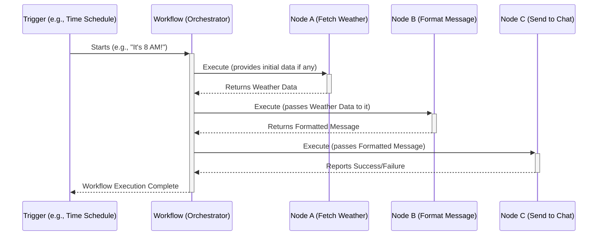

# Chapter 1: Workflow Orchestration

Welcome to your first step in mastering the `workflow` project! In this chapter, we'll explore the foundational concept of **Workflow Orchestration**.

Imagine you want to automate a repetitive task, like checking the weather every morning and sending a summary to your team's chat. Doing this manually is time-consuming and easy to forget. Workflow Orchestration is the magic that lets you build an automated, digital assistant to do this for you!

## What is Workflow Orchestration?

At its heart, **Workflow Orchestration** is about creating an automated process. Think of it like a highly detailed recipe or a digital assembly line. This "recipe" is made up of individual steps, which we call **Nodes**. These nodes are connected in a specific order, dictating how information (data) flows through the system and what actions are performed at each stage.

The central piece of this puzzle in our `workflow` project is the `Workflow` class. This class is like the head chef or the factory manager. It keeps track of:
*   All the individual steps (Nodes).
*   How these steps are connected.
*   Any special settings for each step or the overall process.
*   The current status of the automation.

The `Workflow` class ensures that your automated process runs smoothly from a starting point (a "trigger," like "every morning at 8 AM") all the way to its completion (e.g., "weather summary sent to chat"). It manages how data is transformed and what actions occur at each node.

Let's break down the key components:

*   **Workflow**: The entire automated process. For our example, the "Daily Weather Report" is a workflow.
*   **Nodes**: These are the individual building blocks or steps within your workflow.
    *   Example Node 1: "Get Today's Date"
    *   Example Node 2: "Fetch Weather Data for today" (using the date from Node 1)
    *   Example Node 3: "Format Weather Message" (using data from Node 2)
    *   Example Node 4: "Send Message to Chat" (using the formatted message from Node 3)
    We'll learn more about Nodes in detail in [Chapter 2: Node Definition & Behavior](02_node_definition___behavior_.md).
*   **Connections**: These are the "wires" or pathways that link nodes together. They define the order of operations and how data flows from the output of one node to the input of the next.
*   **Data**: Information that is passed between nodes. In our weather example, data could include the date, temperature, weather description, etc. We'll touch upon how data is handled in [Chapter 5: Data Access Proxy (WorkflowDataProxy)](05_data_access_proxy__workflowdataproxy_.md).

## The `Workflow` Class: The Orchestrator

The `Workflow` class is the JavaScript/TypeScript class responsible for managing and executing these automated processes. When you define a workflow, you're essentially providing a blueprint (like a set of instructions) to an instance of this `Workflow` class.

Let's look at what information a `Workflow` class needs to be created. It's defined by the `WorkflowParameters` interface:

```typescript
// Relevant part from: src/Workflow.ts
export interface WorkflowParameters {
	id?: string; // A unique identifier for the workflow
	name?: string; // A human-readable name, e.g., "Daily Weather Report"
	nodes: INode[]; // An array describing each step (Node) in the workflow
	connections: IConnections; // An object describing how nodes are connected
	active: boolean; // Is the workflow currently enabled?
	nodeTypes: INodeTypes; // A collection of all available node types the system knows
	settings?: IWorkflowSettings; // General settings for the workflow
	// ... other optional parameters like staticData, pinData
}
```
*   `id` and `name`: Help identify your workflow.
*   `nodes`: This is an array where each element describes a single step. For example, one element might define the "Fetch Weather Data" step, including what type of node it is (e.g., an HTTP Request to a weather API) and its specific settings (like the API's web address).
*   `connections`: This defines the "wiring." It specifies which output of a node connects to which input of another node.
*   `active`: A simple flag to turn the workflow on or off.
*   `nodeTypes`: This is crucial. It's like a catalog of all possible operations (node types) your workflow can use. For example, `n8n-nodes-base.httpRequest` is a type of node for making web requests. You can see many such types defined in `src/Constants.ts`.

### Example: Defining Nodes and Connections

Let's imagine a very simple workflow with two nodes: a "Start" node and a node to "Get a Random Joke."

Here's how the `nodes` array might look in a simplified JSON format:
```json
// This is what the 'nodes' parameter in WorkflowParameters might contain
[
  {
    "name": "Start", // A unique name for this node instance
    "type": "n8n-nodes-base.start", // Type of node (from src/Constants.ts)
    "typeVersion": 1,
    "parameters": {}, // Specific settings for this node
    "id": "1f72fb54-74c9-4a87-9e2b-b9c7a9e459e1" // A unique ID for this node instance
  },
  {
    "name": "GetRandomJoke",
    "type": "n8n-nodes-base.httpRequest", // This node makes an HTTP request
    "typeVersion": 1,
    "parameters": { "url": "https://api.chucknorris.io/jokes/random" },
    "id": "b3d9c02a-8e6f-414a-a0f3-c7d8e1b2a4f5"
  }
]
```
And here's how the `connections` object might specify that the "Start" node's output connects to the "GetRandomJoke" node's input:

```json
// This is what the 'connections' parameter in WorkflowParameters might contain
{
  "Start": { // Source Node's unique name ("name" field from above)
    "main": [ // Output type (most nodes have a 'main' output)
      [       // Output index (0 for the first output)
        {
          "node": "GetRandomJoke", // Target Node's unique name
          "type": "main",          // Target Node's input type
          "index": 0               // Target Node's input index (0 for the first input)
        }
      ]
    ]
  }
}
```
This structure tells the `Workflow` class: "After the 'Start' node finishes, take its main output (output 0) and send it to the main input (input 0) of the 'GetRandomJoke' node."

### Inside the `Workflow` Constructor

When a new `Workflow` object is created, its constructor takes these `WorkflowParameters` and sets up the internal state.

```typescript
// Simplified snippet from src/Workflow.ts constructor
constructor(parameters: WorkflowParameters) {
    this.id = parameters.id as string; // @tech_debt Ensure this is not optional
    this.name = parameters.name;
    this.nodeTypes = parameters.nodeTypes; // Stores the catalog of available node types

    // Nodes are stored in an object (this.nodes) for easy lookup by their name.
    // It also applies default values to node parameters based on their type.
    for (const node of parameters.nodes) {
        this.nodes[node.name] = node;
        // ... (code to get nodeType and apply default parameters is omitted for brevity)
    }

    // Connections define the flow from one node's output to another's input.
    this.connectionsBySourceNode = parameters.connections;

    // It also creates a reverse mapping of connections for easier lookup
    // of parent nodes (nodes that feed data into a given node).
    this.connectionsByDestinationNode = Workflow.getConnectionsByDestination(
        parameters.connections,
    );

    this.active = parameters.active || false;
    this.settings = parameters.settings || {};
    // ... (other properties like timezone and expression engine setup)
    // The expression engine is covered in [Chapter 4: Expression Engine](04_expression_engine_.md)
}
```
This constructor essentially "reads the recipe" (the `nodes` and `connections`) and prepares the "kitchen" (the `Workflow` instance) to execute it. The `this.nodes` object lets the workflow quickly find any node by its name, and `this.connectionsBySourceNode` (and its counterpart `this.connectionsByDestinationNode`) helps trace the path of data.

## The Orchestration Process in Action

So, what happens when a workflow runs? Let's use our "Daily Weather Report" example.



1.  **Trigger**: Something starts the workflow. This could be a scheduled time, a manual button click, or an incoming web request.
2.  **Workflow Orchestrator (the `Workflow` instance)**: It identifies the first node(s) to run.
3.  **Node Execution**:
    *   The orchestrator tells "Node A: Fetch Weather" to run. Node A does its job (e.g., calls a weather API) and produces some output data (the weather information).
    *   The orchestrator takes this output data and, based on the connections, passes it to "Node B: Format Message".
    *   Node B uses the weather data to create a nice message and outputs this formatted message.
    *   The orchestrator passes the formatted message to "Node C: Send to Chat".
    *   Node C sends the message to your chat application.
4.  **Completion**: Once all connected nodes have run, or an end condition is met, the workflow execution finishes.

The `Workflow` class is responsible for this entire flow: managing the sequence, handling the data as it moves from node to node, and managing the state of each node and the workflow as a whole.

## Conclusion

Workflow Orchestration is the art and science of automating multi-step processes. It's like being a conductor for a digital orchestra, where each musician (Node) plays its part at the right time, following the sheet music (Connections), to create a beautiful symphony (the automated outcome).

The `Workflow` class is the core component in the `workflow` project that makes this possible. It takes a definition of nodes and their connections and brings that automated process to life, ensuring everything runs smoothly from start to finish.

In the next chapter, we'll zoom in on the individual musicians in our orchestra: the Nodes. We'll explore [Chapter 2: Node Definition & Behavior](02_node_definition___behavior_.md) to understand how these fundamental building blocks are defined and how they operate.

---

Generated by [AI Codebase Knowledge Builder](https://github.com/The-Pocket/Tutorial-Codebase-Knowledge)