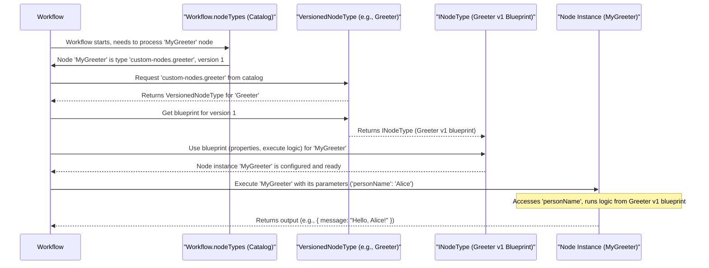

# Chapter 2: Node Definition & Behavior

Welcome to Chapter 2! In [Chapter 1: Workflow Orchestration](01_workflow_orchestration_.md), we learned that workflows are like automated recipes made up of individual steps called **Nodes**. We saw how the `Workflow` class manages these nodes and their connections. Now, let's zoom in and understand what these "Nodes" truly are and how they know what to do.

Imagine you're building with Lego. You have different types of bricks: some are simple 2x4s, others are wheels, and some are special window pieces. Each type of brick has a specific design and purpose. In our `workflow` project, these "Lego brick types" are called **`NodeType`s**.

## What's a Node Again? And What's a `NodeType`?

As a quick recap from Chapter 1:
*   **Nodes** are the individual building blocks or steps within your workflow. Each node performs a specific task, like "Fetch Weather Data" or "Send an Email."

But how does a node know *how* to fetch weather data? Or *what* settings it needs to send an email (like the recipient's address or the subject line)? This is where `NodeType` comes in.

A **`NodeType`** is like a **blueprint** or a **template** for a specific *kind* of node.
*   It defines what **parameters** (configurable settings) a node of this type will have. For an "Send Email" node type, parameters might include "To Address," "Subject," and "Body."
*   It specifies the **input and output connections** the node can have. Can it receive data? What kind of data does it produce?
*   Crucially, it contains the **core logic** – the actual code that gets executed when a node of this type runs.

Think of `NodeType`s as different types of Lego bricks. A "2x4 Red Brick" is one `NodeType`. A "Small Wheel" is another `NodeType`. When you build your Lego castle (your workflow), you pick these `NodeType`s from your Lego box and place instances of them (the actual Nodes) into your design.

For example, the `workflow` project defines various `NodeType`s like `n8n-nodes-base.httpRequest` for making web requests, or `n8n-nodes-base.start` to indicate the beginning of a workflow. You can see many of these standard types defined as constants in `src/Constants.ts`.

```typescript
// From: src/Constants.ts (examples of NodeType identifiers)
export const HTTP_REQUEST_NODE_TYPE = 'n8n-nodes-base.httpRequest';
export const START_NODE_TYPE = 'n8n-nodes-base.start';
// ... many more
```
These strings are unique identifiers for each `NodeType`.

## Parameters: Configuring Your Nodes

Most `NodeType`s define a set of parameters that you can configure when you use that node in your workflow. These parameters allow you to customize the node's behavior.

Let's take the `n8n-nodes-base.httpRequest` node type. Its blueprint would define parameters like:
*   `url`: The web address to send the request to.
*   `method`: The HTTP method (GET, POST, etc.).
*   `options`: Additional settings like headers or body content.

When you add an HTTP Request node to your workflow, you're creating an *instance* of this `NodeType`. You then fill in the specific values for these parameters, e.g.:
*   `url`: `"https://api.chucknorris.io/jokes/random"`
*   `method`: `"GET"`

This configured instance is the actual "Node" in your workflow's `nodes` array that we saw in Chapter 1.

```json
// A node instance in a workflow, using the 'httpRequest' NodeType
{
  "name": "GetRandomJoke",
  "type": "n8n-nodes-base.httpRequest", // The NodeType identifier
  "typeVersion": 1, // We'll get to this next!
  "parameters": { // Specific values for this node instance
    "url": "https://api.chucknorris.io/jokes/random",
    "method": "GET"
  },
  "id": "b3d9c02a-8e6f-414a-a0f3-c7d8e1b2a4f5"
}
```
The `NodeType` defines *that* an HTTP Request node needs a URL; your specific node instance provides *which* URL.

## Keeping Up With Changes: `VersionedNodeType`

Software evolves. Sometimes, we need to improve a `NodeType` – maybe add a new parameter, change how it works internally, or fix a bug. But what if you have old workflows that rely on the older behavior? We don't want to break them!

This is where `VersionedNodeType` comes to the rescue. Instead of having just one blueprint for, say, "HTTP Request," we can have multiple versions:
*   "HTTP Request v1"
*   "HTTP Request v2" (perhaps with a new authentication option)
*   "HTTP Request v3" (maybe with improved error handling)

A `VersionedNodeType` is like a container or a folder that holds all these different versions of a single `NodeType`'s blueprint.

When you define a node in your workflow, you specify both its `type` and its `typeVersion`:
```json
{
  "type": "n8n-nodes-base.httpRequest",
  "typeVersion": 2 // This workflow node uses version 2 of httpRequest
  // ...
}
```
This ensures that your workflow continues to use the exact version of the node blueprint it was designed with, even if newer versions become available. It also allows you to upgrade nodes in your workflow to newer versions at your own pace.

The `workflow` project has a class for this:

```typescript
// Simplified from: src/VersionedNodeType.ts
export class VersionedNodeType {
	currentVersion: number; // The default or latest recommended version
	nodeVersions: { [version: number]: INodeType }; // Stores each version's blueprint
	description: INodeTypeBaseDescription; // Shared info like name, icon

	constructor(nodeVersions: any, description: any) {
		this.nodeVersions = nodeVersions;
		this.description = description;
		// Determine the current version (e.g., the highest available)
		this.currentVersion = description.defaultVersion ?? Math.max(...Object.keys(nodeVersions).map(Number));
	}

	// Method to get a specific blueprint version
	getNodeType(version?: number): INodeType { // INodeType is the actual blueprint
		return this.nodeVersions[version || this.currentVersion];
	}
}
```
*   `nodeVersions` is an object where keys are version numbers (like `1`, `2`) and values are the actual `INodeType` blueprints for that version.
*   `getNodeType(version)` allows the system to retrieve the specific blueprint for the requested version. If no version is specified, it usually returns the `currentVersion` (often the latest stable one).

In Chapter 1, we saw that `WorkflowParameters` includes a `nodeTypes` field. This `nodeTypes` is a collection of these `VersionedNodeType` instances, acting as a catalog of all available node types and their versions that the workflow system knows about.

## The `INodeType` Blueprint: What's Inside?

So, what does an actual `INodeType` blueprint (the object stored inside `VersionedNodeType.nodeVersions`) look like? It's an interface, typically called `INodeType`, that defines several key things:

1.  **`description`**: An object containing metadata about the node type:
    *   `name`: The unique identifier string (e.g., `"n8n-nodes-base.httpRequest"`).
    *   `displayName`: A human-friendly name shown in the UI (e.g., "HTTP Request").
    *   `icon`: The icon used for the node in the UI.
    *   `group`: Helps categorize nodes in the UI.
    *   `version`: The version number of this specific blueprint.
    *   `description`: A short explanation of what the node does.
    *   **`properties`**: This is a crucial array. It defines all the parameters the node accepts, their names, types (string, number, boolean, options list, etc.), default values, and how they are displayed in the UI. We'll dive deeper into parameter types in [Chapter 3: Type System & Validation](03_type_system___validation_.md).

2.  **`inputs` and `outputs`** (Simplified): Defines the connection points. Most commonly, nodes have a `main` input and a `main` output, allowing them to be chained together. Some nodes might have multiple named inputs or outputs.

3.  **`execute()` method**: This is the heart of the `NodeType`. It's a function that contains the JavaScript/TypeScript code to perform the node's task.
    *   When a workflow runs a node, it calls this `execute()` method.
    *   The `execute()` method has access to the node's configured parameter values and any data passed to it from preceding nodes.
    *   It's responsible for performing the action (e.g., making an HTTP call, sending an email) and then returning the output data that will be passed to the next connected node(s). How data is accessed and managed is covered in [Chapter 5: Data Access Proxy (WorkflowDataProxy)](05_data_access_proxy__workflowdataproxy_.md).

Let's imagine a very simple custom `NodeType` blueprint for a "Greeter" node:

```typescript
// Conceptual INodeType structure for a "Greeter"
// This is not exact code, but illustrates the key parts.
const GreeterNodeType_V1: INodeType = {
  description: {
    name: 'custom-nodes.greeter',
    displayName: 'Greeter',
    version: 1,
    properties: [ // Defines configurable parameters
      {
        displayName: 'Person Name',
        name: 'personName', // Internal name for the parameter
        type: 'string',     // Data type (more in Ch3)
        default: 'World',
      },
    ],
  },
  // Simplified execute method
  async execute(this: IExecuteFunctions): Promise<INodeExecutionData[][]> {
    const items = this.getInputData(); // Get data from previous nodes
    const returnData: INodeExecutionData[] = [];

    for (let i = 0; i < items.length; i++) {
      // Get the 'personName' parameter configured for this node instance
      const personName = this.getNodeParameter('personName', i, '') as string;
      const greeting = `Hello, ${personName}!`;
      returnData.push({ json: { message: greeting } });
    }
    return [returnData]; // Output data for the next node
  }
};
```
This conceptual `GreeterNodeType_V1` defines one parameter (`personName`) and its `execute` logic creates a greeting message.

## How the Workflow Uses NodeTypes

Let's trace how a workflow uses these definitions:



1.  When a `Workflow` is created, it's given a `nodeTypes` catalog (a collection of `VersionedNodeType` instances).
2.  For each node defined in the workflow's `nodes` array (like our `GetRandomJoke` or a hypothetical `MyGreeter` node), the `Workflow` looks at its `type` (e.g., `"n8n-nodes-base.httpRequest"`) and `typeVersion` (e.g., `1`).
3.  It finds the corresponding `VersionedNodeType` in its `nodeTypes` catalog using the `type` string.
4.  It then calls `getNodeType(typeVersion)` on that `VersionedNodeType` to get the specific `INodeType` blueprint for that version.
5.  This `INodeType` blueprint provides all the information needed:
    *   Default values for parameters.
    *   Validation rules for parameters (more in [Chapter 3: Type System & Validation](03_type_system___validation_.md)).
    *   The `execute()` method that will be called when the node runs.

So, the `NodeType` defines *what a node can do* and *how it does it*, while the node instance in your workflow is a specific configuration of that capability.

## Conclusion

Nodes are the workhorses of your automation, and `NodeType`s are their DNA. A `NodeType` is a blueprint defining a node's settings (parameters), its connections, and its core behavior (the `execute` logic). `VersionedNodeType` ensures that these blueprints can evolve over time without breaking existing workflows, by allowing different versions of a `NodeType` to coexist.

When you build a workflow, you're selecting these `NodeType` "Lego bricks," configuring their specific parameters, and connecting them to create your desired automation. The `Workflow` orchestrator then uses these blueprints to bring your automation to life, executing the logic defined in each node's `NodeType`.

Understanding `NodeType`s is key to understanding how the `workflow` project can perform such a diverse range of tasks. Each task, from a simple calculation to a complex API interaction, is encapsulated within a `NodeType`.

Next, we'll explore how the parameters of these `NodeType`s are defined and validated in [Chapter 3: Type System & Validation](03_type_system___validation_.md). This will give us a deeper insight into how you can customize nodes and ensure they receive the correct kinds of data.

---

Generated by [AI Codebase Knowledge Builder](https://github.com/The-Pocket/Tutorial-Codebase-Knowledge)