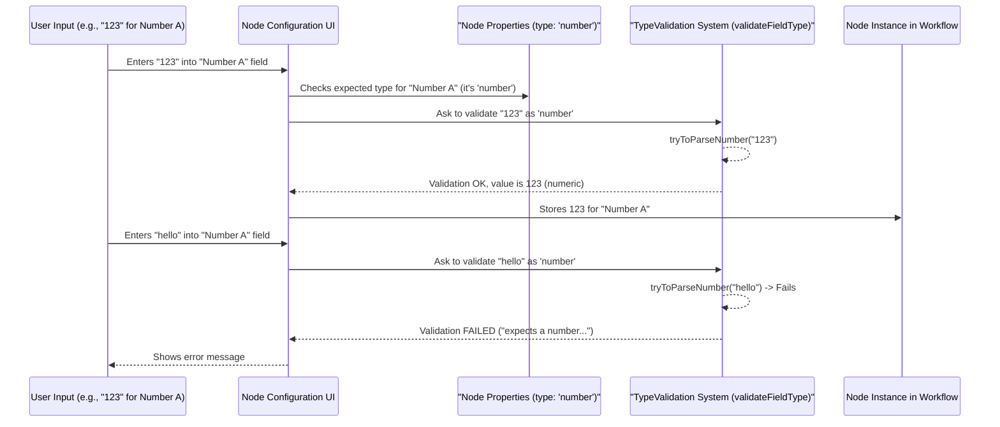

# Chapter 3: Type System & Validation

Welcome to Chapter 3! In [Chapter 2: Node Definition & Behavior](02_node_definition___behavior_.md), we learned how `NodeType`s act as blueprints for our workflow nodes, defining their parameters and what they do. Now, let's explore a crucial aspect that makes these nodes reliable and our workflows robust: the **Type System & Validation**.

## What's the Big Deal with Types and Validation?

Imagine you're building something with tools. You need a hammer for nails and a screwdriver for screws. What happens if you try to use a screwdriver to hammer a nail? It probably won't work well, and you might even break the screwdriver!

In the world of workflows, data and parameters are like your materials (nails, screws), and nodes are like your tools. The **Type System & Validation** acts like a super-smart assistant or a quality control inspector on an assembly line. It checks two main things:

1.  **Parameters:** When you set up a node (e.g., telling an "HTTP Request" node which URL to call), are the settings you provide the *right kind* of settings? If it expects a web address (a string of text), you shouldn't give it a number like `123`.
2.  **Data Flow:** As data moves from one node to the next, is it in the format the next node expects? If a "Calculate Sum" node expects numbers, but receives text like "apple", it won't be able to do its job.

This system helps prevent your workflow from crashing or behaving unexpectedly. By catching these "wrong tool for the job" or "wrong material" situations early, it ensures nodes operate correctly because they receive data they can understand and process.

### Our Use Case: The Simple Adder Node

Let's imagine a very simple custom node: an "Adder" node. Its job is to take two numbers, add them, and output the sum.
*   It needs two input parameters: "Number A" and "Number B".
*   Both "Number A" and "Number B" *must* be numbers.

If a user accidentally tries to set "Number A" to the text "hello", or if data flowing into "Number B" is the boolean value `true`, our Adder node would be confused! The Type System & Validation helps us prevent this.

## Key Concepts: Defining "Correct"

How does the system know what's "correct"? It relies on definitions within the `NodeType`.

### 1. Data Types: The Building Blocks of Information

In programming and workflows, data comes in different "flavors" or types. Here are some common ones you'll encounter:

*   **`string`**: Text. Examples: `"hello world"`, `"https://example.com"`, `"Chapter 3"`.
*   **`number`**: Numerical values. Examples: `123`, `0.5`, `-10`.
*   **`boolean`**: Represents truth values, either `true` or `false`.
*   **`object`**: A collection of key-value pairs, like a dictionary. Example: `{ "name": "Alice", "age": 30 }`.
*   **`array`**: An ordered list of items. Example: `[1, 2, 3]`, `["apple", "banana", "cherry"]`.
*   **`dateTime`**: Represents a specific date and time.
*   **`options`**: A special type where the value must be one of a predefined list of choices.

### 2. Defining Expected Types in Node Parameters

Remember from [Chapter 2: Node Definition & Behavior](02_node_definition___behavior_.md) that `INodeType` descriptions contain a `properties` array? This is where we tell the system what kind of data each parameter expects.

For our "Adder" node, its `INodeType` definition might include something like this:

```typescript
// Simplified INodeType properties for an "Adder" node
const AdderNodeTypeProperties: INodeProperties[] = [
  {
    displayName: 'Number A',
    name: 'numberA',       // Internal name
    type: 'number',      // Crucial! This parameter MUST be a number
    default: 0,
  },
  {
    displayName: 'Number B',
    name: 'numberB',
    type: 'number',      // This one too!
    default: 0,
  },
];
```
The `type: 'number'` part is key. It tells the `workflow` system: "When a user configures an Adder node, the value for 'numberA' and 'numberB' should be a number."

### 3. Validation: The "Inspector" at Work

Validation is the process of checking if the actual data or parameter value matches its expected type.

*   **Configuration Time:** When you're setting up your Adder node in the workflow editor and you type "hello" into the "Number A" field, the system can use the `type: 'number'` rule to immediately tell you, "Hey, 'Number A' needs to be a number, but you gave me text!"
*   **Runtime:** When data flows from a previous node into our Adder node, the system (or the Adder node itself using utility functions) can check if the incoming data for "Number A" and "Number B" is indeed numeric. If not, it can report an error instead of just crashing.

This helps catch errors early and makes your workflows much more predictable.

## How the System Uses Type Information

Let's see how this works with our Adder node.

When you add an "Adder" node to your workflow and start configuring its parameters:
1.  The UI looks at the `AdderNodeTypeProperties`.
2.  It sees `type: 'number'` for "Number A".
3.  If you enter `10`, great! It's a number.
4.  If you enter `"ten"`, the UI (using the validation logic we'll see soon) might show an error or try to be helpful.

The system might also try to *parse* or *convert* values if it makes sense. For example, if you input the string `"123"` for a `number` type parameter, the system might be smart enough to convert `"123"` (text) into `123` (number). But it wouldn't be able to convert `"hello"` into a number.

## Under the Hood: `TypeValidation.ts`

The `workflow` project has a dedicated file, `src/TypeValidation.ts`, that contains many of the tools for this "inspection" and "conversion" process. It provides functions to try and parse values into expected types.

### Step-by-Step Validation

Here's a simplified view of what happens when a parameter value is validated:



### Core Functions from `TypeValidation.ts`

Let's peek at some simplified examples of functions you might find in `src/TypeValidation.ts`.

**1. Parsing Specific Types:**
There are functions designed to convert input into a specific type, or throw an error if it's not possible.

```typescript
// Simplified from src/TypeValidation.ts
export const tryToParseNumber = (value: unknown): number => {
  const num = Number(value); // Try JavaScript's built-in conversion
  if (isNaN(num)) {
    throw new Error('Failed to parse value to number');
  }
  return num;
};

export const tryToParseString = (value: unknown): string => {
  if (typeof value === 'object') return JSON.stringify(value);
  return String(value); // Convert to string
};
```
*   `tryToParseNumber` attempts to convert any given `value` into a number. If it can't (e.g., `Number("hello")` results in `NaN` - Not a Number), it signals an error.
*   `tryToParseString` is generally more forgiving and will convert most things into a string representation.

**2. The Main Validator: `validateFieldType`**
This is a more general function that takes a value, an expected `FieldType` (like `'number'`, `'string'`, `'boolean'`), and checks if the value is valid for that type. It might also attempt conversion.

```typescript
// Simplified concept from src/TypeValidation.ts validateFieldType function
function validateFieldType(
    fieldName: string,
    value: unknown,
    type: FieldType, // e.g., 'string', 'number', 'boolean'
    // ... other options
): ValidationResult { // ValidationResult tells if valid and may contain new (parsed) value
    switch (type.toLowerCase()) {
        case 'number':
            try {
                return { valid: true, newValue: tryToParseNumber(value) };
            } catch (e) {
                return { valid: false, errorMessage: `'${fieldName}' expects a number.` };
            }
        case 'string':
            // ... similar logic using tryToParseString ...
            return { valid: true, newValue: tryToParseString(value) };
        // ... cases for 'boolean', 'datetime', 'array', 'object', etc.
        default:
            return { valid: true, newValue: value }; // If type unknown, assume valid
    }
}
```
*   `FieldType` is a type defined in `src/Interfaces.ts` that lists all recognized parameter types (e.g., `'string'`, `'number'`, `'boolean'`, `'dateTime'`, `'object'`, `'array'`).
*   The `validateFieldType` function uses a `switch` statement to handle different `type`s.
*   For each `type`, it calls the appropriate parsing function (like `tryToParseNumber`).
*   It returns a `ValidationResult` object, which indicates if the validation was successful (`valid: true/false`) and, if successful, potentially the `newValue` (e.g., the string `"123"` converted to the number `123`).

The `INodeProperties` interface (from `src/Interfaces.ts`), which we saw in Chapter 2, is where the `type: FieldType` is defined for each node parameter. This tells `validateFieldType` what to check against.

```typescript
// Relevant part from src/Interfaces.ts for INodeProperties
export interface INodeProperties {
	displayName: string;
	name: string;
	type: FieldType; // This is where the expected type is specified!
	default?: any;
	// ... other fields like 'placeholder', 'description', 'options' for 'options' type
}
```

This system of defining expected types and then validating against them is fundamental to how the `workflow` project maintains data integrity and helps you build reliable automations.

## Benefits of a Good Type System

*   **Fewer Errors:** Catches mistakes early, before your workflow runs and causes unexpected problems.
*   **Clearer Nodes:** When you look at a node's parameters, the type information clearly tells you what kind of input is expected.
*   **More Reliable Workflows:** Nodes get data they can actually work with, leading to more stable and predictable automations.
*   **Better Developer Experience:** If you're creating your own custom nodes, the type system guides you in defining how your node should be used.

## Conclusion

The Type System & Validation is like the diligent quality inspector for your workflow's assembly line. It ensures that parameters configured on nodes and data flowing between them are of the correct type and structure. By using type definitions in `INodeProperties` and validation functions (many of which are in `src/TypeValidation.ts`), the `workflow` project helps prevent runtime errors, makes nodes more robust, and ultimately leads to more reliable automations. You can be more confident that your "Adder" node will actually get numbers to add, not text or other confusing data!

In the next chapter, we'll explore another powerful feature that works hand-in-hand with parameters and data: the [Chapter 4: Expression Engine](04_expression_engine_.md). This engine allows you to dynamically generate parameter values and transform data in sophisticated ways, often relying on the type system to ensure its operations are valid.

---

Generated by [AI Codebase Knowledge Builder](https://github.com/The-Pocket/Tutorial-Codebase-Knowledge)