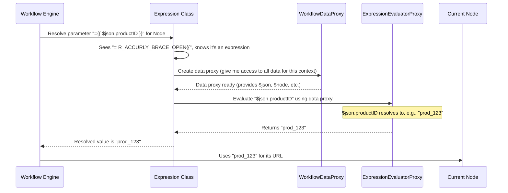

# Chapter 4: Expression Engine

Welcome to Chapter 4! In [Chapter 3: Type System & Validation](03_type_system___validation_.md), we saw how parameters for nodes are defined and validated, ensuring they get the right kind of data. But what if you don't want to type in a fixed value for a parameter? What if you need that value to change based on what happened earlier in your workflow, or based on some external information? That's where the **Expression Engine** comes in!

## What's the Problem? Making Workflows Dynamic!

Imagine you have a workflow that first fetches a customer's ID from a database ("Get Customer ID" node). Then, you want to use this ID to look up their recent orders using an "HTTP Request" node. The URL for the HTTP Request needs to include that specific customer's ID.

*   **Node 1: Get Customer ID**
    *   Output: `{ "customerId": "cust_789xyz" }`
*   **Node 2: HTTP Request (Fetch Orders)**
    *   Parameter (URL): `https://api.myorders.com/customer/???/orders`

How do you get `"cust_789xyz"` into the `???` part of the URL for Node 2? You can't just hardcode it, because the customer ID will be different every time the workflow runs for a different customer!

This is the problem the Expression Engine solves: it lets you use **dynamic placeholders** or **mini-formulas** within your node parameters (and other places) to access and manipulate data on the fly.

## Expressions: Your Smart Placeholders

Expressions in the `workflow` project are special strings that start with `={{` and end with `}}`. Inside these curly braces, you can write a bit of JavaScript-like code to tell the system what value you want to use.

Think of them like smart variables in a template:
*   `={{ $json.someValue }}`: This tries to get `someValue` from the JSON data of the current item being processed by the node.
*   `={{ $node["Node Name"].json.anotherValue }}`: This fetches `anotherValue` from the JSON output of a *different* node named "Node Name".
*   `={{ $env.API_KEY }}`: This accesses an environment variable named `API_KEY`.
*   `={{ 10 * 5 }}`: This performs a simple calculation.
*   `={{ "Hello, " + $json.name }}`: This combines a fixed string with a value from the current item's data.

### Solving Our Use Case

For our customer orders example, if the "Get Customer ID" node is named, say, `GetCustomerID`, we could set the URL parameter in the "HTTP Request" node like this:

`https://api.myorders.com/customer/={{ $node["GetCustomerID"].json.customerId }}/orders`

When the workflow runs, and the "Get Customer ID" node outputs `{ "customerId": "cust_789xyz" }`, the Expression Engine will see the `={{ ... }}` part. It will then evaluate `$node["GetCustomerID"].json.customerId`, which will resolve to `"cust_789xyz"`.

So, the final URL used by the HTTP Request node will be:
`https://api.myorders.com/customer/cust_789xyz/orders`

Magic! Your workflow is now dynamic.

## The Magic Trio: How Expressions Work

Three main components work together to make this magic happen:

1.  **`Expression` Class (`src/Expression.ts`)**: This is the brain of the operation. When the workflow encounters a parameter like `={{ ... }}`, the `Expression` class is responsible for:
    *   Recognizing that it's an expression.
    *   Coordinating with other components to get the actual value.
    *   Ensuring it's done securely.

2.  **`WorkflowDataProxy` (`src/WorkflowDataProxy.ts`)**: Think of this as the workflow's universal data librarian. It knows how to find and provide access to *any* piece of data your expression might need:
    *   Output from previous nodes (like `$node["Node Name"].json...`).
    *   Data from the current item being processed (`$json...`).
    *   Environment variables (`$env...`).
    *   Information about the workflow itself (`$workflow...`).
    We'll dive deep into this component in [Chapter 5: Data Access Proxy (WorkflowDataProxy)](05_data_access_proxy__workflowdataproxy_.md). For now, just know it's the source of truth for your expressions.

3.  **`ExpressionEvaluatorProxy` (`src/ExpressionEvaluatorProxy.ts`)**: This is the actual "calculator" or "interpreter." It takes the code inside your `{{ ... }}` (e.g., `$node["GetCustomerID"].json.customerId`) and the data provided by `WorkflowDataProxy`, executes the code, and returns the result.

## A Step-by-Step Look Under the Hood

Let's say a node parameter has the value `URL: ={{ $json.productID }}`. Here's a simplified sequence of what happens when the workflow needs to figure out the actual URL:



1.  The Workflow Engine encounters the parameter value `={{ $json.productID }}`.
2.  It asks the `Expression` class to resolve it.
3.  The `Expression` class removes the leading `=` (a convention for expressions in parameters) and sees the `{{ ... }}`.
4.  It creates an instance of `WorkflowDataProxy`. This proxy object is now "aware" of all data accessible at this point in the workflow for this specific node and item (e.g., if `$json.productID` is "prod_123" for the current item).
5.  The `Expression` class takes the actual expression string, `$json.productID`, and the data context (from `WorkflowDataProxy`) and passes them to the `ExpressionEvaluatorProxy`.
6.  The `ExpressionEvaluatorProxy` executes `$json.productID`. Using the data context, it finds that `$json.productID` is "prod_123".
7.  It returns "prod_123" back to the `Expression` class.
8.  The `Expression` class returns "prod_123" to the Workflow Engine.
9.  The node now uses "prod_123" as the value for its URL parameter.

## Diving into the Code (Simplified)

Let's look at simplified snippets to see these components in action.

### `Expression` Class (`src/Expression.ts`)

The `Expression` class has methods like `resolveSimpleParameterValue` that handle figuring out what an expression means.

```typescript
// Simplified from src/Expression.ts
// ... imports and other parts ...

export class Expression {
	// ... constructor ...

	resolveSimpleParameterValue(
		parameterValue: NodeParameterValue, // e.g., "={{ $json.id }}"
		// ... other arguments like runIndex, itemIndex, activeNodeName ...
	): NodeParameterValue {
		// Check if it is an expression
		if (typeof parameterValue !== 'string' || parameterValue.charAt(0) !== '=') {
			// Is no expression so return value as is
			return parameterValue;
		}

		// It IS an expression! Remove the leading "="
		const expressionString = parameterValue.substr(1); // Now " {{ $json.id }} "

		// Generate a data proxy which allows to query workflow data
		const dataProxy = new WorkflowDataProxy(
			this.workflow, // The current workflow instance
			// ... other necessary context data ...
		);
		const dataScope = dataProxy.getDataProxy(); // This is the 'world' of data for the expression

		// ... (Important security setup happens here to control what the expression can do)
		// For example, making sure 'process.env' is available via '$env'
		// and blocking dangerous functions.

		// Execute the expression using the ExpressionEvaluatorProxy
		const returnValue = this.renderExpression(expressionString, dataScope);

		// ... (some post-processing for objects/dates might happen)
		return returnValue;
	}

	private renderExpression(expression: string, data: IWorkflowDataProxyData) {
		try {
			// This calls the actual evaluator
			return evaluateExpression(expression, data); // evaluateExpression is from ExpressionEvaluatorProxy
		} catch (error) {
			// Handle errors, like syntax errors in the expression
			// ... error handling logic ...
			throw new ApplicationError('Error in expression: ' + error.message);
		}
	}
}
```
*   It first checks if the `parameterValue` actually looks like an expression (starts with `=`).
*   If it is, it creates a `WorkflowDataProxy` to get the necessary data context (`dataScope`).
*   Then, it calls `renderExpression`, which in turn uses `evaluateExpression` (from `ExpressionEvaluatorProxy.ts`) to run the expression code within that `dataScope`.

### `ExpressionEvaluatorProxy.ts`

This file is responsible for actually executing the JavaScript-like code within an expression. It often uses a third-party templating library.

```typescript
// Simplified from src/ExpressionEvaluatorProxy.ts
import * as tmpl from '@n8n_io/riot-tmpl'; // A templating library

// Set it to use double curly brackets instead of single ones for expressions
tmpl.brackets.set('{{ }}');

// This is the function that does the actual work
export const evaluateExpression = (expr: string, data: unknown): tmpl.ReturnValue => {
	// The 'tmpl' function from the library takes the expression string
	// and the data object, then evaluates the expression.
	return tmpl.tmpl(expr, data);
	// The actual file has more error handling and options
};
```
The `evaluateExpression` function is fairly straightforward at its core: it takes the expression string (e.g., `$json.id`) and the data context and uses a library (like `riot-tmpl` or `Tournament`) to get the result.

### `WorkflowDataProxy.ts` (A Tiny Peek)

We'll cover this in detail in the [next chapter](05_data_access_proxy__workflowdataproxy_.md), but here's a taste. When `dataProxy.getDataProxy()` is called in `Expression.ts`, it sets up an object where special keys like `$json`, `$node`, `$env`, `$itemIndex`, etc., are made available.

```typescript
// Conceptual idea of what WorkflowDataProxy makes available
// This is NOT actual code from the file, but illustrates the concept.
const dataScopeForExpression = {
    $json: { /* current item's JSON data */ id: "prod_123", name: "My Product" },
    $itemIndex: 0, // current item's index
    $node: {
        "GetCustomerID": { // Name of another node
            json: { customerId: "cust_789xyz" },
            // ... other data about that node
        }
    },
    $env: { /* environment variables */ API_KEY: "secret..." },
    // ... and many other useful things!
};
```
So, when `evaluateExpression` runs `{{ $json.id }}` with this `dataScopeForExpression`, it can look up `$json`, then `id`, and find "prod_123".

## A Note on Security: Playing Safe

You might wonder: if expressions are like mini-programs, is it safe? What if someone tries to write a malicious expression?

The `workflow` project takes this seriously!
*   **Sandboxing:** The `Expression` class, along with `ExpressionSandboxing.ts`, carefully controls what an expression can do. It doesn't just run any arbitrary JavaScript.
*   **Allowlists/Denylists:** It defines what global variables or functions are accessible (e.g., `Date`, `Math` are okay, but direct file system access is not). You can see parts of this setup in the `Expression.ts` `resolveSimpleParameterValue` method where `data.process`, `data.document`, `data.eval`, etc., are managed.
*   **Prototype Sanitization:** `ExpressionSandboxing.ts` includes mechanisms like `PrototypeSanitizer` to prevent access to sensitive JavaScript object properties like `__proto__` or `constructor`, which could be exploited.

This ensures that expressions are powerful for dynamic data access but restricted from performing harmful actions.

## Beyond Basic Data Access: Expression Extensions

Expressions can do more than just fetch data! You can perform operations like:
*   Formatting dates: `={{ $json.myDate.toFormat('yyyy-MM-dd') }}`
*   String manipulation: `={{ $json.name.toUpperCase() }}`
*   Conditional logic: `={{ $json.value > 10 ? 'High' : 'Low' }}`

These advanced capabilities are often provided by **Expression Extensions**, which we'll explore in [Chapter 6: Expression Extensions](06_expression_extensions_.md).

## Conclusion

The Expression Engine is a cornerstone of what makes `workflow` so flexible and powerful. By using simple `={{ ... }}` placeholders, you can:
*   Make your node parameters dynamic.
*   Access data from previous nodes, the current item, or environment variables.
*   Perform calculations and data transformations.

The `Expression` class, supported by `WorkflowDataProxy` (the data provider) and `ExpressionEvaluatorProxy` (the code executor), works behind the scenes to parse these expressions and resolve them to actual values during workflow execution. This enables your workflows to adapt and respond to changing data, automating complex tasks in a smart way.

Now that you understand how expressions get their values, you're probably curious about how that data is structured and accessed in the first place. Let's dive into that with [Chapter 5: Data Access Proxy (WorkflowDataProxy)](05_data_access_proxy__workflowdataproxy_.md)!

---

Generated by [AI Codebase Knowledge Builder](https://github.com/The-Pocket/Tutorial-Codebase-Knowledge)