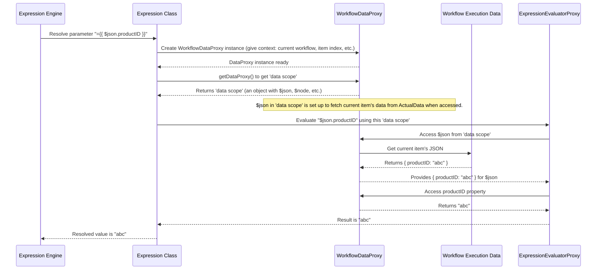

# Chapter 5: Data Access Proxy (WorkflowDataProxy)

In [Chapter 4: Expression Engine](04_expression_engine_.md), we learned how expressions like `={{ ... }}` let us use dynamic values in our workflow parameters. These expressions often need to fetch data from different parts of our workflow. But how do they know where to find this data and how to access it? That's where our star for this chapter, the **Data Access Proxy (`WorkflowDataProxy`)**, comes into play!

## The Problem: Where's My Data?

Imagine your expression is like a chef trying to cook a dish (the dynamic value). The chef needs ingredients (data). These ingredients might be:
*   The main ingredient from the previous step (output from a previous node).
*   A specific spice from the pantry (an environment variable).
*   The current cooking temperature (data from the item currently being processed).

If the chef had to run around looking for each ingredient in different places every time, it would be chaotic and slow!

Consider an expression we saw earlier:
`https://api.myorders.com/customer/={{ $node["GetCustomerID"].json.customerId }}/orders`

This expression needs to:
1.  Find a node named "GetCustomerID".
2.  Get its JSON output.
3.  Extract the `customerId` field from that JSON.

How does the expression engine manage this search without getting lost?

## WorkflowDataProxy: Your Workflow's Librarian

The `WorkflowDataProxy` is like a super-efficient librarian or a universal remote control for all the data within your currently running workflow. When an expression needs a piece of information, it doesn't go hunting wildly. Instead, it asks the `WorkflowDataProxy`.

The `WorkflowDataProxy` knows:
*   Where the output data of every executed node is stored.
*   What the JSON data of the current item being processed by a node is.
*   How to access environment variables.
*   Other useful context like the current item's index, workflow ID, etc.

It fetches this data and provides it to the expression engine in a structured and easy-to-use way. This dramatically simplifies how expressions retrieve data for dynamic operations.

## Key Data Pockets Handled by the Proxy

When an expression like `={{ ... }}` is evaluated, the `WorkflowDataProxy` makes several "pockets" of data available through special prefixed variables (often starting with `$`). Here are some of the most common ones:

*   **`$json`**: This usually refers to the JSON data of the *current item* being processed by the node that contains the expression. If a node is processing 10 items one by one, `$json` will refer to the specific item in the current iteration.
    *   Example: `={{ $json.productName }}` might get the `productName` from the current item.

*   **`$node["Node Name"]`**: This is your gateway to data from *other* nodes in the workflow.
    *   `$node["Node Name"].json`: Accesses the JSON output of "Node Name" for the current item's lineage (or the item specified by `$itemIndex`).
    *   `$node["Node Name"].binary`: Accesses binary data from "Node Name".
    *   `$node["Node Name"].parameter`: Accesses the configured parameters of "Node Name". (e.g., `{{$node["My HTTP Node"].parameter.url}}`)
    *   `$node["Node Name"].context`: Accesses contextual information stored by "Node Name".

*   **`$env`**: Accesses environment variables set up for your `workflow` instance.
    *   Example: `={{ $env.API_KEY }}`.

*   **`$itemIndex`**: The numerical index (starting from 0) of the current item being processed by the node. This is very useful when a node processes multiple items in a loop.

*   **`$runIndex`**: The index of the current execution run of a node (nodes can run multiple times in some loop scenarios).

*   **`$workflow`**: Provides information about the workflow itself.
    *   `$workflow.id`: The unique ID of the workflow.
    *   `$workflow.name`: The human-readable name of the workflow.

*   **`$parameter`**: Accesses the parameters of the *current node* where the expression is being used.
    *   Example: `={{ $parameter.someOtherSetting }}`.

*   **`$input`**: A special object providing direct access to the data that has flowed into the *current input* of the node.
    *   `$input.item`: Refers to the current item from the input data.
    *   `$input.all()`: Gets all items from the input.

*   **Utility Variables/Functions**:
    *   `$now`: The current date and time (as a Luxon DateTime object).
    *   `$today`: The start of the current day (as a Luxon DateTime object).
    *   `$jmespath(data, query)`: A function to query JSON data using JMESPath.

## How Expressions and the Proxy Work Together

Let's revisit our chef analogy and the expression: `={{ $node["GetCustomerID"].json.customerId }}`.

1.  The expression engine sees `$node`. It asks `WorkflowDataProxy`, "Hey, I need the '$node' data pocket."
2.  The proxy says, "Sure, here's access to all nodes."
3.  The expression then says, "...I need the one named 'GetCustomerID' from this '$node' pocket."
4.  The proxy looks up "GetCustomerID" and provides access to its data.
5.  The expression says, "...now I need its 'json' output."
6.  The proxy fetches the JSON output data for "GetCustomerID" (relevant to the current item/context).
7.  Finally, the expression says, "...and from that JSON, give me 'customerId'."
8.  The proxy (or the underlying data structure it provides) gives back the value of `customerId`.

The `WorkflowDataProxy` acts as an intermediary, abstracting away the complexities of where and how data is stored.

## Under the Hood: A Simplified Look

When an expression needs to be resolved, here's a simplified step-by-step of what happens:



1.  The [Chapter 4: Expression Engine](04_expression_engine_.md) asks the `Expression` class to resolve a value like `={{ $json.productID }}`.
2.  The `Expression` class creates an instance of `WorkflowDataProxy`, giving it all necessary context: the current `Workflow` object, the current `itemIndex`, the `runIndex`, the name of the node being executed (`activeNodeName`), and data from connected input nodes (`connectionInputData`).
3.  The `Expression` class calls a method on the `WorkflowDataProxy` (like `getDataProxy()`) to get a special "data scope" object. This object is what the expression will actually interact with.
4.  This "data scope" object is cleverly built. For example, when the expression tries to access `$json` from this scope:
    *   The `WorkflowDataProxy` knows the current `itemIndex`.
    *   It looks into `connectionInputData` (data passed from previous nodes to the current node) at that `itemIndex`.
    *   It retrieves the `json` property of that item.
5.  The `Expression` class then passes the actual expression string (e.g., `$json.productID`) and this "data scope" object to the `ExpressionEvaluatorProxy`.
6.  The `ExpressionEvaluatorProxy` (using a templating library) evaluates the string. When it sees `$json.productID`, it uses the "data scope" object to find `$json`, which in turn fetches the current item's data, and then accesses the `productID` property.

## Peeking into `WorkflowDataProxy.ts`

The file `src/WorkflowDataProxy.ts` is where this magic is defined. Let's look at some conceptual snippets.

The constructor takes all the necessary context:
```typescript
// Simplified from src/WorkflowDataProxy.ts
export class WorkflowDataProxy {
	constructor(
		private workflow: Workflow,
		private runExecutionData: IRunExecutionData | null, // All past execution data
		private runIndex: number,
		private itemIndex: number,
		private activeNodeName: string, // The node whose parameter is being resolved
		private connectionInputData: INodeExecutionData[], // Data from inputs to activeNodeName
		// ... other parameters like siblingParameters, mode, additionalKeys
	) {
		// ... initialization ...
	}
	// ...
}
```
This context allows the proxy to locate almost any piece of data.

The `getDataProxy()` method is central. It constructs and returns the "data scope" object that expressions will use:
```typescript
// Simplified concept from src/WorkflowDataProxy.ts getDataProxy()
public getDataProxy(): IWorkflowDataProxyData {
	const that = this; // 'that' or 'self' is often used to refer to the class instance
	                   // inside nested functions or proxy handlers.

	const baseScope = {
		$itemIndex: this.itemIndex,
		$runIndex: this.runIndex,
		$workflow: this.workflowGetter(), // Helper to provide $workflow.id, $workflow.name
		$node: this.nodeGetter(),         // Helper to provide $node["Node Name"] access
		$env: createEnvProvider(/* ... */), // Access to environment variables
		$parameter: this.nodeParameterGetter(this.activeNodeName), // Current node's params
		// ... and many more like $now, $today, $jmespath
	};

	// Use a JavaScript Proxy to dynamically handle $json, $binary for the current item
	return new Proxy(baseScope, {
		get(target, name, receiver) {
			if (name === '$json') {
				// Fetch current item's JSON data from connectionInputData
				if (that.connectionInputData && that.connectionInputData[that.itemIndex]) {
					return that.connectionInputData[that.itemIndex].json;
				}
				return {}; // Or handle error
			}
			if (name === '$binary') {
				// Fetch current item's binary data
				if (that.connectionInputData && that.connectionInputData[that.itemIndex]) {
					return that.connectionInputData[that.itemIndex].binary;
				}
				return {};
			}
			// For other keys like $itemIndex, $node, etc., get them from baseScope
			return Reflect.get(target, name, receiver);
		},
	}) as IWorkflowDataProxyData;
}
```
*   `workflowGetter()`: A helper function inside `WorkflowDataProxy` that returns an object (or another proxy) allowing access to `workflow.id`, `workflow.name`, etc.
*   `nodeGetter()`: Returns a proxy. When an expression does `$node["SomeNode"]`, this proxy's `get` handler intercepts "SomeNode" and uses another helper, `nodeDataGetter("SomeNode")`, to provide access to its `json`, `binary`, or `parameter` data. This data is usually retrieved from `runExecutionData.resultData.runData["SomeNode"]` (if the node has run) or from pinned data.
*   `nodeParameterGetter(nodeName)`: Returns a proxy for accessing the defined parameters of a given `nodeName`. If a parameter's value is itself an expression, it can be recursively resolved.
*   `createEnvProvider()`: This function (from `src/WorkflowDataProxyEnvProvider.ts`) creates a secure proxy to access environment variables defined in `process.env`.

**A Note on `src/AugmentObject.ts`:**
Sometimes, especially for scripting nodes (like the Code node) where you might directly modify data, the `WorkflowDataProxy` might wrap the data from `runExecutionData` or `connectionInputData` using functions from `src/AugmentObject.ts`. This `augmentObject` function makes the data objects a bit smarter, ensuring that if they are changed within the scripting node, these changes are tracked correctly without unintentionally altering the original data structures in other parts of the workflow unless explicitly intended. For typical expressions that just read data, this is less of a direct concern, but it's part of how `workflow` ensures data integrity.

## Security and Data Integrity

The `WorkflowDataProxy` primarily provides **read-only access** to data for most standard expressions. This is important for security and predictability. Your expressions can look at data from all over the workflow, but they generally don't change it. When they fetch complex objects, they often get a copy or a specially proxied version, preventing accidental modifications to the workflow's state.

## Conclusion

The `WorkflowDataProxy` is a crucial, though often invisible, component. It acts as the central librarian, providing the [Chapter 4: Expression Engine](04_expression_engine_.md) with structured and easy access to all relevant data sources within an executing workflow. It understands where outputs from previous nodes are, what the current item's data is, how to get environment variables, and much more. By handling the "where" and "how" of data retrieval, `WorkflowDataProxy` allows expressions to focus on "what" data they need, making your workflows dynamic and powerful.

Now that we understand how expressions can access data, what if we want them to do more complex data transformations or use custom logic? That's where [Chapter 6: Expression Extensions](06_expression_extensions_.md) come in, allowing us to add new superpowers to our expressions!

---

Generated by [AI Codebase Knowledge Builder](https://github.com/The-Pocket/Tutorial-Codebase-Knowledge)