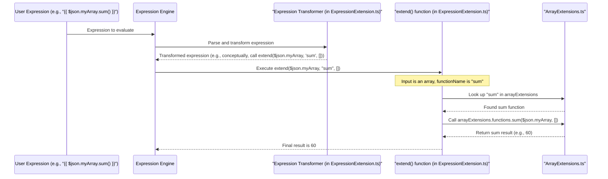

# Chapter 6: Expression Extensions

Welcome to Chapter 6! In [Chapter 5: Data Access Proxy (WorkflowDataProxy)](05_data_access_proxy__workflowdataproxy_.md), we saw how the `WorkflowDataProxy` makes data from all parts of your workflow accessible to expressions. Now, let's supercharge those expressions with **Expression Extensions**!

## What If Expressions Could Do More?

Imagine you're working with data in your workflow.
*   You have a string like `"  my important text  "`, and you need to clean it up (remove extra spaces) and make it uppercase.
*   You have a list of numbers, say `[10, 20, 30]`, and you need to find their sum.
*   You have a date string like `"2023-10-26"`, and you need to format it nicely as "October 26, 2023".

You could use a separate "Code" node to write JavaScript for these tasks. But wouldn't it be great if you could do these common transformations directly within your expressions? That's exactly what Expression Extensions allow!

**Expression Extensions** are custom helper functions that enhance the built-in capabilities of the [Chapter 4: Expression Engine](04_expression_engine_.md). They allow for more complex data manipulations directly within expressions. Think of them as specialized toolkits or plugins for your data:
*   If you have a string, you get string-specific tools (like `.toUpperCase()` or a custom `.removeExtraSpaces()`).
*   If you have an array, you get array tools (like a custom `.sum()`).
*   If you have a date, you get date tools (like `.toFormat('MMMM dd, yyyy')`).

This makes expressions more powerful and concise, reducing the need for separate code nodes for simple transformations.

## How Do They Work? It's Like Magic Tools!

When you use an expression like `{{ $json.myString.someCoolOperation() }}` or `{{ $json.myArray.calculateSomething() }}`, the `workflow` system intelligently figures out what `someCoolOperation` or `calculateSomething` means based on the type of data (`myString` or `myArray`).

Let's say `$json.myArray` contains `[10, 20, 30]`. If you write:
`{{ $json.myArray.sum() }}`

The system will:
1.  See that `$json.myArray` is an array.
2.  Look for an "array tool" (an extension function) called `sum`.
3.  Apply that tool to your array.
Result: `60`

If `$json.myText` contains `"  hello world  "`:
`{{ $json.myText.trim().toUpperCase() }}`
Here, `.trim()` and `.toUpperCase()` are standard JavaScript string methods. Expression Extensions build upon this idea by adding *more* useful methods. For example, if we had a custom extension `.toTitleCase()`:
`{{ $json.myText.trim().toTitleCase() }}`
Result: `"Hello World"`

## Examples of Expression Extensions in Action

The `workflow` project comes with a rich set of built-in extensions for common data types.

### Array Extensions (from `src/Extensions/ArrayExtensions.ts`)

These give you tools for working with lists of data.

*   **`.sum()`**: Calculates the sum of numbers in an array.
    *   Expression: `{{ [1, 2, 3, 4].sum() }}`
    *   Result: `10`

*   **`.average()`**: Calculates the average of numbers in an array.
    *   Expression: `{{ [10, 20, 30].average() }}`
    *   Result: `20`

*   **`.unique()`**: Removes duplicate values from an array.
    *   Expression: `{{ ["apple", "banana", "apple"].unique() }}`
    *   Result: `["apple", "banana"]`

*   **`.first()` / `.last()`**: Gets the first or last item.
    *   Expression: `{{ ["a", "b", "c"].first() }}`
    *   Result: `"a"`

*   **`.isEmpty()`**: Checks if an array is empty.
    *   Expression: `{{ [].isEmpty() }}`
    *   Result: `true`

### String Extensions (from `src/Extensions/StringExtensions.ts`)

These provide handy functions for text manipulation.

*   **`.toTitleCase()`**: Converts a string to title case.
    *   Expression: `{{ "hello world".toTitleCase() }}`
    *   Result: `"Hello World"`

*   **`.removeTags()`**: Removes HTML/XML tags from a string.
    *   Expression: `{{ "<b>Important</b> text".removeTags() }}`
    *   Result: `"Important text"`

*   **`.toDateTime()`**: Converts a string to a DateTime object (which then has its own extensions like `.toFormat()`).
    *   Expression: `{{ "2023-01-15".toDateTime().toFormat("MMMM dd, yyyy") }}`
    *   Result: `"January 15, 2023"` (This uses a Date extension after the string conversion)

*   **`.isEmail()`**: Checks if a string is a valid email format.
    *   Expression: `{{ "test@example.com".isEmail() }}`
    *   Result: `true`

### Number, Date, Object, and Boolean Extensions

Similar extensions exist for other data types, providing specialized tools:
*   **Number Extensions (`src/Extensions/NumberExtensions.ts`)**: e.g., `toFixed(2)` (standard JS, but fits the pattern), or custom ones for formatting.
*   **Date Extensions (`src/Extensions/DateExtensions.ts`)**: e.g., `toFormat('yyyy-MM-dd')`, `plus({days: 1})`. (These work on Luxon DateTime objects, often obtained via `$now` or a `.toDateTime()` conversion).
*   **Object Extensions (`src/Extensions/ObjectExtensions.ts`)**: e.g., `keys()`, `values()`, `hasKey('myKey')`.
*   **Boolean Extensions (`src/Extensions/BooleanExtensions.ts`)**: e.g., `toggle()`, `toString()`.

### General Extended Functions (`src/Extensions/ExtendedFunctions.ts`)

Some functions aren't tied to a specific data type but provide general utility.
*   **`$ifEmpty(value, defaultValue)`**: Returns `defaultValue` if `value` is empty (null, undefined, empty string, empty array, or empty object). Otherwise, returns `value`.
    *   Expression: `{{ $ifEmpty($json.optionalField, "Not set") }}`
    *   If `$json.optionalField` is `null`, Result: `"Not set"`
    *   If `$json.optionalField` is `"Data"`, Result: `"Data"`

## Under the Hood: How Does it Find the Right Tool?

When you write an expression like `{{ $json.myArray.sum() }}`, how does the system know to use the array's `sum` tool?

1.  **Parsing and Transformation**: The [Chapter 4: Expression Engine](04_expression_engine_.md) parses your expression. When it sees something like `.sum()`, the `workflow` system, specifically code in `src/Extensions/ExpressionExtension.ts`, cleverly rewrites this. Conceptually, `{{ $json.myArray.sum() }}` becomes something like `{{ callSpecialHelper($json.myArray, "sum", []) }}`. This transformation (`extendTransform` function in `ExpressionExtension.ts`) uses Abstract Syntax Tree (AST) manipulation with tools like `recast`.

2.  **The `extend` Function**: At runtime, this `callSpecialHelper` (actually a function named `extend` in `src/Extensions/ExpressionExtension.ts`) is invoked.
    *   It receives the value (e.g., your array `$json.myArray`).
    *   It receives the function name (e.g., `"sum"`).
    *   It receives any arguments you passed (e.g., `[]` if no arguments).

3.  **Finding the Tool**: The `extend` function then checks the type of the input value.
    *   Is it an Array? It looks into `arrayExtensions`.
    *   Is it a String? It looks into `stringExtensions`.
    *   And so on for other types.

4.  **Executing the Tool**: If it finds a matching function (like `sum` for Arrays), it calls that specific function with your value and arguments.



### Code Glimpse: Registering and Finding Extensions

Let's look at how these extensions are organized.

**`src/Extensions/ExpressionExtension.ts`**: This file is central.
It defines a list of all available extension types:
```typescript
// Simplified from src/Extensions/ExpressionExtension.ts
import { arrayExtensions } from './ArrayExtensions';
import { stringExtensions } from './StringExtensions';
// ... other imports for date, number, object, boolean extensions

export const EXTENSION_OBJECTS: ExtensionMap[] = [
	arrayExtensions,
	// dateExtensions,
	// numberExtensions,
	// objectExtensions,
	stringExtensions,
	// booleanExtensions,
];
```
This `EXTENSION_OBJECTS` array is like a catalog of all the "toolkits" available.

The `extend` function uses this catalog:
```typescript
// Simplified concept of the 'extend' function in ExpressionExtension.ts
export function extend(input: unknown, functionName: string, args: unknown[]) {
	let foundFunctionDefinition;

	if (Array.isArray(input)) {
		foundFunctionDefinition = arrayExtensions.functions[functionName];
	} else if (typeof input === 'string') {
		foundFunctionDefinition = stringExtensions.functions[functionName];
	} // ... and so on for other types

	if (foundFunctionDefinition) {
		return foundFunctionDefinition(input, args); // Call the actual extension function
	} else {
		// Handle cases where the function isn't found for the type
		throw new Error(`Function ${functionName} not found for this data type.`);
	}
}
```
This `extend` function is the dispatcher that finds and calls the correct helper.

**`src/Extensions/ArrayExtensions.ts`**: This file defines tools for arrays.
```typescript
// Simplified from src/Extensions/ArrayExtensions.ts
import type { ExtensionMap } from './Extensions'; // Defines the structure

// The actual sum function
function sum(value: unknown[]): number {
	// (Error checking: ensure all items are numbers)
	// ...
	return value.reduce((p: number, c: unknown) => p + (c as number), 0);
}
// Add documentation for the 'sum' function (used by UI/docs)
sum.doc = { /* ... name, description, examples ... */ };

// Export all array-specific functions
export const arrayExtensions: ExtensionMap = {
	typeName: 'Array', // Identifies this toolkit is for Arrays
	functions: {
		sum,           // Make sum available as .sum()
		// average,
		// unique,
		// ... other array functions
	},
};
```
Each extension file (like `ArrayExtensions.ts`, `StringExtensions.ts`) exports an object (e.g., `arrayExtensions`) that declares its `typeName` and a map of its `functions`.

This structured approach allows `workflow` to easily add new extensions or for users to potentially create their own custom extensions in the future.

## Why Are These Extensions So Helpful?

*   **Conciseness**: `{{ $json.myArray.sum() }}` is much shorter and clearer than writing multi-line code in a separate node.
*   **Readability**: Expressions become more self-explanatory.
*   **Power**: You can perform many common data manipulations without leaving the expression editor.
*   **Reduced Complexity**: Fewer nodes are needed for simple tasks, making workflows cleaner.
*   **Consistency**: Provides a standardized way to perform common operations.

Each extension function also includes documentation (`.doc` property), which can be used by the UI to provide hints and auto-completion, making them easier to discover and use. If an extension is used incorrectly (e.g., wrong arguments), it will throw an `ExpressionExtensionError`, which is a type of structured error we'll discuss more in [Chapter 7: Structured Error Handling](07_structured_error_handling_.md).

## Conclusion

Expression Extensions are like having a versatile Swiss Army knife for your data, right inside your expressions. They provide a rich set of helper functions tailored to different data types (strings, arrays, numbers, dates, etc.), allowing you to perform common data transformations and calculations with ease and clarity.

By understanding how the `extend` mechanism in `src/Extensions/ExpressionExtension.ts` dynamically dispatches to specific functions defined in files like `src/Extensions/ArrayExtensions.ts` or `src/Extensions/StringExtensions.ts`, you can appreciate the power and flexibility these extensions bring to your workflow automation. They truly make the [Chapter 4: Expression Engine](04_expression_engine_.md) a more potent tool for dynamic data handling.

Next, we'll look at how `workflow` handles things when they don't go as planned in [Chapter 7: Structured Error Handling](07_structured_error_handling_.md).

---

Generated by [AI Codebase Knowledge Builder](https://github.com/The-Pocket/Tutorial-Codebase-Knowledge)