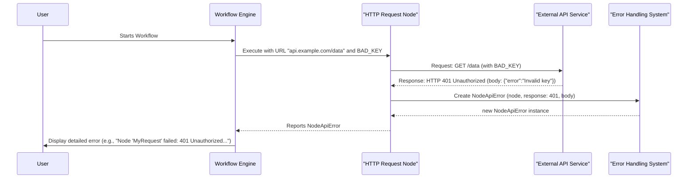

# Chapter 7: Structured Error Handling

Welcome to Chapter 7! In [Chapter 6: Expression Extensions](06_expression_extensions_.md), we saw how to add powerful custom functions to our expressions, making data manipulation even more convenient. But what happens when things don't go as planned? Whether it's an issue with an external service or a problem in our workflow's logic, errors are a fact of life. This chapter introduces **Structured Error Handling**, a systematic way the `workflow` project manages and reports these problems.

## The Problem: "Something Went Wrong!" - But What?

Imagine your workflow tries to fetch data from an online weather service using an HTTP Request node.
*   What if your internet is down?
*   What if the weather service is temporarily offline?
*   What if you accidentally typed the wrong API key in the node's settings?
*   What if an expression you used to build the request URL has a typo, like `={{ $json..city }}` instead of `={{ $json.city }}`?

If the system just said "Error!" for all these situations, debugging would be a nightmare! You wouldn't know *what* went wrong, *where* it happened, or *why*. This is where structured error handling comes to the rescue.

## Structured Error Handling: A Clearer Way to Report Problems

**Structured Error Handling** in the `workflow` project provides a systematic way to define, categorize, and manage errors that can occur during workflow execution. Think of it like having a sophisticated hospital diagnosis system instead of just saying "the patient is sick." Different illnesses (errors) have specific names, symptoms (details), and codes, helping doctors (you, the workflow designer) understand the problem and find a cure.

This system uses:
1.  **Base Error Classes**: These define common properties for all errors, like a general patient intake form.
2.  **Specific Error Types**: These inherit from the base classes and add detailed information for particular issues, like a specialist's diagnosis report.

This approach makes debugging much easier and allows the system (and potentially your workflows) to provide better feedback or even react intelligently to different kinds of problems.

## Key Idea 1: Base Error Classes - The Foundation

At the foundation of our error handling system are a couple of general-purpose error classes.

### `BaseError` (`src/errors/base/base.error.ts`)

This is the most fundamental error class. Most other errors in the system are built on top of this one. It establishes common properties that almost every error might have.

```typescript
// Simplified from src/errors/base/base.error.ts
export abstract class BaseError extends Error {
	level: ErrorLevel; // e.g., 'error', 'warning', 'info'
	shouldReport: boolean; // Should this error be sent to a tracking system?
	description: string | null | undefined; // A more detailed explanation
	// ... other properties like tags, cause
}
```
*   `message`: The main error message (this comes from the built-in `Error` class).
*   `level`: How severe is the error? A `'warning'` might be less critical than an `'error'`.
*   `description`: A longer explanation of what happened.

### `ExecutionBaseError` (`src/errors/abstract/execution-base.error.ts`)

This class extends `BaseError` and is specifically for errors that occur while a workflow is actively running (executing).

```typescript
// Simplified from src/errors/abstract/execution-base.error.ts
export abstract class ExecutionBaseError extends ApplicationError { // ApplicationError extends BaseError
	timestamp: number; // When did the error occur?
	context: IDataObject = {}; // Extra details specific to this error instance
	// ... other properties like functionality, description
}
```
*   `timestamp`: Records the exact time the error happened.
*   `context`: An object to store additional useful information related to this specific error occurrence (e.g., which item in a list was being processed).

These base classes ensure that all errors reported by the system have a consistent set of basic information.

## Key Idea 2: Specific Error Types - Detailed Reports

Building on these base classes, the `workflow` project defines many specific error types for different situations. This is where the real power for debugging comes in. Each specific error type can carry extra details relevant to that particular kind of problem.

Let's look at a couple of important ones:

### `NodeApiError` (`src/errors/node-api.error.ts`)

This error is used when a node (often an HTTP Request node) interacts with an external API or service, and that service reports a problem.

Imagine our "HTTP Request" node tries to call `https://api.example.com/data` but the API key is invalid. The API might return an HTTP `401 Unauthorized` error. A `NodeApiError` would capture this.

```typescript
// Simplified from src/errors/node-api.error.ts
export class NodeApiError extends NodeError { // NodeError extends ExecutionBaseError
	httpCode: string | null = null; // e.g., "401", "404", "503"

	constructor(
		node: INode, // Which node encountered the error?
		errorResponse: JsonObject, // What did the API respond with?
		options: NodeApiErrorOptions = {},
	) {
		super(node, errorResponse); // Calls parent constructor
		this.httpCode = options.httpCode || /* logic to find code from errorResponse */;
		this.message = /* logic to set a user-friendly message based on httpCode */;
		this.description = /* logic to extract detailed error from API response */;
		// ... sets other context like itemIndex, runIndex
	}
}
```
A `NodeApiError` instance might contain:
*   `message`: "Authorization failed - please check your credentials"
*   `httpCode`: `"401"`
*   `description`: (Could be the raw error message from the API, e.g., `{"error": "Invalid API Key"}`)
*   `context.node.name`: "My HTTP Request Node"
*   `context.itemIndex`: (If processing multiple items, which one failed)

This tells you exactly which node failed, why (401 error), and gives you the API's own error message. Much better than just "Error!"

The `NodeApiError` constructor is quite smart. It tries to parse the `errorResponse` from the API to find the HTTP status code and a meaningful message, even looking for common error patterns in JSON or XML responses. You can see `POSSIBLE_ERROR_MESSAGE_KEYS` and `STATUS_CODE_MESSAGES` in `src/errors/node-api.error.ts` that help with this.

### `ExpressionError` (`src/errors/expression.error.ts`)

This error occurs if there's a problem with an expression, like those we learned about in [Chapter 4: Expression Engine](04_expression_engine_.md) and [Chapter 6: Expression Extensions](06_expression_extensions_.md).

Suppose you have an expression in a parameter: `URL: ={{ $json..oopsWrongSyntax }}`. This syntax is invalid.

```typescript
// Simplified from src/errors/expression.error.ts
export class ExpressionError extends ExecutionBaseError {
	constructor(message: string, options?: ExpressionErrorOptions) {
		super(message, { /* ... base options ... */ });
		// Store specific details from options into this.context
		if (options?.itemIndex !== undefined) this.context.itemIndex = options.itemIndex;
		if (options?.parameter !== undefined) this.context.parameter = options.parameter;
		if (options?.type !== undefined) this.context.type = options.type; // e.g., 'syntax_error'
		// ... and other options like descriptionKey, nodeCause
	}
}
```
An `ExpressionError` instance might contain:
*   `message`: "Error in expression" (or more specific, like "SyntaxError: Unexpected token '.'")
*   `context.itemIndex`: `0` (if it was the first item)
*   `context.parameter`: `"url"` (the name of the parameter where the faulty expression was)
*   `context.nodeCause`: (Name of the node where the expression is)
*   `context.type`: Could be something like `'internal'` or a more specific error type from the expression evaluation.

This helps you quickly find the problematic expression and fix it. Similarly, if you used an extension incorrectly, like `{{ $json.myArray.nonExistentFunction() }}`, you might get an `ExpressionExtensionError` (from `src/errors/expression-extension.error.ts`), which is another specialized type.

### Many More Specific Errors!

The `workflow` project defines many other specific error types in `src/errors/index.ts`. For example:
*   `NodeOperationError`: For general errors during a node's operation that aren't API-specific.
*   `WorkflowOperationError`: For problems related to the workflow itself (e.g., saving, loading).
*   `CredentialAccessError`: If there's an issue accessing required credentials.

Each is designed to provide context-rich information for its specific domain.

## How These Errors Help You (Benefits)

This structured approach to error handling offers several key advantages:

1.  **Faster Debugging**: When an error occurs, the specific type and its detailed context (like `httpCode` in `NodeApiError` or `parameter` in `ExpressionError`) immediately point you towards the source and nature of the problem.
2.  **Clearer User Feedback**: The UI can use the information in these structured errors to display much more helpful messages to you. Instead of a generic "Failed," it can say "HTTP Request Node 'FetchUserData' failed: 404 Not Found for URL X."
3.  **Improved System Stability**: By categorizing errors, the system can potentially handle certain types of errors more gracefully (e.g., automatically retrying on a temporary `503 Service Unavailable` error from an API).
4.  **Better Maintainability**: For developers working on the `workflow` project or custom nodes, this system provides a clear framework for reporting and handling errors consistently.

## Under the Hood: How an Error Gets Reported

Let's trace a simplified example of how a `NodeApiError` might be generated and reported:



1.  The workflow starts and tells the "HTTP Request Node" to execute.
2.  The node makes a call to an "External API Service" with an invalid API key.
3.  The External API responds with an HTTP `401 Unauthorized` status and a JSON body like `{"error":"Invalid key"}`.
4.  The "HTTP Request Node" catches this problematic response. Instead of just crashing, it creates a new `NodeApiError` instance. It passes itself (the node object), the API's response, and other relevant details (like `itemIndex`) to the `NodeApiError` constructor.
5.  The `NodeApiError` constructor analyzes the API response, extracts the `httpCode` ("401"), and sets a helpful `message` and `description`.
6.  The node then signals to the Workflow Engine that it encountered this `NodeApiError`.
7.  The Workflow Engine can then log this detailed error or display it to the user.

This structured process ensures that valuable diagnostic information isn't lost.

## Conclusion

Structured Error Handling is like having a very articulate and detailed diagnostic system for your workflows. Instead of vague complaints, you get specific reports when things go awry. By using a hierarchy of error classes (`BaseError`, `ExecutionBaseError`) and specialized types like `NodeApiError` and `ExpressionError`, the `workflow` project captures rich contextual information about each problem. This makes troubleshooting far more efficient, allows for clearer user feedback, and contributes to a more robust and understandable automation platform.

Understanding these error structures can greatly help you diagnose and fix issues when building and running your workflows! This concludes our journey through the core concepts of the `workflow` project. We hope these chapters have given you a solid foundation!

---

Generated by [AI Codebase Knowledge Builder](https://github.com/The-Pocket/Tutorial-Codebase-Knowledge)