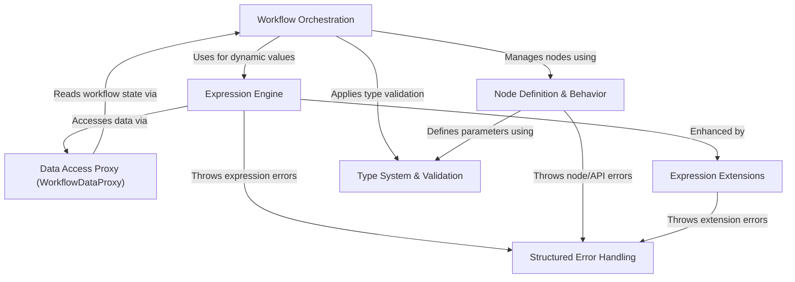

# Tutorial: workflow

The project, `workflow`, helps users build and run **automated processes**, similar to a *digital assembly line*. These processes, called *workflows*, are made up of connected steps (*nodes*). Each node performs a specific action, like getting data from a website or sending an email. The system uses a powerful *expression engine* to let nodes dynamically access and manipulate data as the workflow runs, making them flexible and smart. It also includes robust ways to define what each node does, how data is structured and validated, and how errors are handled.

**Source Repository:** [None](None)

## Chapters

1. [Workflow Orchestration
](01_workflow_orchestration_.md)
2. [Node Definition & Behavior
](02_node_definition___behavior_.md)
3. [Type System & Validation
](03_type_system___validation_.md)
4. [Expression Engine
](04_expression_engine_.md)
5. [Data Access Proxy (WorkflowDataProxy)
](05_data_access_proxy__workflowdataproxy__.md)
6. [Expression Extensions
](06_expression_extensions_.md)
7. [Structured Error Handling
](07_structured_error_handling_.md)

---

Generated by [AI Codebase Knowledge Builder](https://github.com/The-Pocket/Tutorial-Codebase-Knowledge)